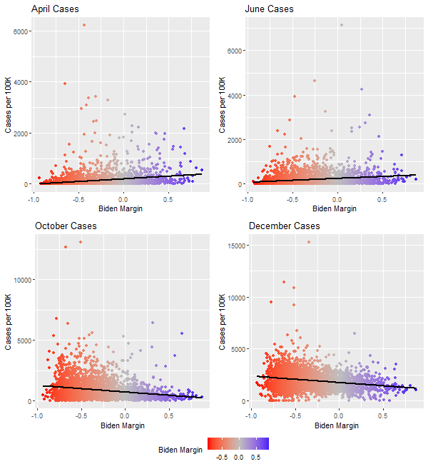
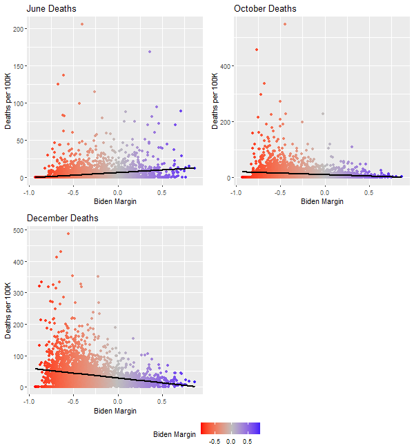

# Partisanship & COVID-19

#### Introduction

In November, my Statistics 20 class was assigned a cool final project: take a COVID-19 dataset and dig around for cool trends. The dataset[^1] comprised state-level COVID-19 cases, deaths, and a litany of related variables (ICUs, lockdown status). I snuck in an extra variable: the results of the 2020 election.

A previous [study](https://doi.org/10.1101/2020.10.16.20213892) found that Democrat-led states had more successful pandemic responses than Republican-led states. A later [study](https://doi.org/10.1101/2020.10.08.20209619) confirmed that, since June 8th, states with Republican governors were less successful in preventing the spread of COVID-19. The likely explanation is that redder states were less likely to practice. One [study](https://doi.org/10.1038/s41562-020-00977-7) found that Fox News consumption correlated with reduced physical distancing. A more recent [study](https://www.eurekalert.org/pub_releases/2020-12/aaft-pph121120.php) found that partisanship was the strongest predictor of how mobile someone was. These differences in distancing were associated in increased fatality rates.

None of these studies, however, took advantage of the 2020 election results. These are interesting data points. Time [reported](https://time.com/5910256/covid-19-presidential-election-outcome/) that—unsettlingly—the counties with the most COVID cases were also the biggest fans of President Trump at the polls. I wanted to study the relationship between partisanship as measured by the election as the rate of COVID cases.

#### Inspiration

For the class project, I wanted to plot and correlate partisanship with measures of COVID spread. The dataset only had cases/deaths from all of June and all of October, so I used those numbers. I pulled election results from [here](https://github.com/tonmcg/US_County_Level_Election_Results_08-20) and subtracted Trump's proportion of votes from that of Biden's. I called this the "Biden margin" (e.g. DC had a Biden margin of 89%).

Below, I plotted case rate against the death rate (which means being in the top-right is very bad) and colored the points according to Biden's margin of victory. The plots speak for themselves: in June, blue states suffered from higher death rates, and red states tended to have more cases; by October, the data points aligned, and the states with both the most deaths and the cases were red.

So what changed between June and October? I plotted the difference in cases and deaths between June and October against Biden's margin. Here, partisanship is significantly correlated with both the increase in cases (r=0.483) and the increase in deaths (-0.589). All of this suggests that, from June to October, partisanship significantly influenced state success in containing COVID-19.

But these data faced some important limitations. First, state-level data is highly aggregated, which can [exaggerate](https://doi.org/10.1111/j.1538-4632.1976.tb00549.x) county-level effects while also making it difficult to establish significance. Second, the cases and deaths data were limited to June and October totals, which is a problem if we want to examine more recent  trends or specific days. A good visual for a class project, but not a thorough analysis.

#### Dataset

I decided to build my own dataset with county-level features. To test the strength of the partisanship-COVID relationship, I wanted to control for [significant predictors](https://www.medrxiv.org/content/medrxiv/early/2020/04/22/2020.04.17.20069708.full.pdf[) of COVID cases, such as race, density, and geographic location. I also wanted to control for mask use and social mobility, which are potential mediators of the relationship. I compiled[^2] the following data sources:

- Population density from [2010 U.S. Census](https://github.com/camillol/cs424p3/blob/master/data/Population-Density%20By%20County.csv).

- Demographics (race, income, age, etc.) from [2010 U.S. Census]( https://github.com/ykzeng/covid-19/tree/master/data).

- COVID cases and deaths compiled from [New York Times data](https://www.soothsawyer.com/covid19-ultimate-data-set-by-ryan-smith/?github=5_31_2020).

- County mask usage from a [New York Times survey](https://github.com/nytimes/covid-19-data/blob/master/mask-use/mask-use-by-county.csv) 

- Testing rates collected by [John Hopkins University](https://coronavirus.jhu.edu/testing/states-comparison).
- Mobility data collected by [Descartes Labs](https://github.com/descarteslabs/DL-COVID-19).

- Population-weighted geographic centers from the [2010 U.S. Census](https://github.com/btskinner/spatial/blob/master/data/county_centers.csv).

- 2016 and 2020 presidential election results scraped from [news sources](https://github.com/tonmcg/US_County_Level_Election_Results_08-20).
- 2020 state-level election results I compiled.

After merging the datasets, I had complete features for 3,111 counties, which is over [95%](https://en.wikipedia.org/wiki/County_(United_States)) of all countries. Below are summary statistics for each feature, with the day-by-day COVID cases/deaths omitted for brevity.

| Feature             |      Mean |        SD |      |      Min |       Q3 |       Q1 |   Median |         Max |
| :------------------ | --------: | --------: | :--- | -------: | -------: | -------: | -------: | ----------: |
| fips                |  30646.73 |  14984.50 |      |  1001.00 | 46004.00 | 19038.00 | 29207.00 |    56045.00 |
| population          | 105269.60 | 334973.14 |      |   169.00 | 68740.50 | 11134.00 | 26183.00 | 10039107.00 |
| total_deaths        |    909.69 |   2485.67 |      |     0.00 |   707.50 |   123.00 |   285.00 |    68164.00 |
| icus                |     23.84 |     84.52 |      |     0.00 |    12.00 |     0.00 |     0.00 |     2126.00 |
| 60older             |  21484.42 |  61663.05 |      |    29.00 | 16229.00 |  2863.00 |  6341.00 |  1800341.00 |
| density             |    261.62 |   1732.79 |      |     0.10 |   115.20 |    17.70 |    45.70 |    69468.40 |
| lattitude           |     38.25 |      4.87 |      |    19.67 |    41.68 |    34.68 |    38.32 |       48.87 |
| maskuse             |      0.51 |      0.15 |      |     0.12 |     0.61 |     0.39 |     0.50 |        0.89 |
| 65older             |     16.81 |      4.26 |      |     3.60 |    19.10 |    14.00 |    16.50 |       49.30 |
| female              |     49.99 |      2.18 |      |    30.10 |    51.10 |    49.60 |    50.40 |       57.00 |
| black               |      9.22 |     14.55 |      |     0.00 |    10.80 |     0.60 |     2.30 |       85.40 |
| asian               |      1.26 |      2.46 |      |     0.00 |     1.10 |     0.40 |     0.60 |       43.30 |
| hispanic            |      8.71 |     13.40 |      |     0.20 |     8.80 |     1.80 |     3.60 |       95.60 |
| white               |     78.01 |     19.57 |      |     3.20 |    93.80 |    66.55 |    85.40 |       98.60 |
| bachelors           |     19.24 |      8.72 |      |     4.20 |    22.70 |    13.30 |    17.10 |       72.00 |
| distance_to_work    |     22.97 |      5.35 |      |     7.00 |    26.30 |    19.30 |    22.60 |       42.50 |
| household_size      |      2.52 |      0.24 |      |     1.71 |     2.63 |     2.37 |     2.50 |        4.07 |
| per_capita_income   |  23062.36 |   5466.79 |      |  9412.00 | 25470.50 | 19509.50 | 22335.00 |    61290.00 |
| median_household    |  45143.11 |  11736.48 |      | 19344.00 | 50054.00 | 37762.00 | 43333.00 |   120332.00 |
| poverty             |     15.88 |      6.38 |      |     0.00 |    19.40 |    11.40 |    15.10 |       48.40 |
| tests               |  67026.15 |  25552.31 |      | 29706.00 | 80854.00 | 46166.00 | 65614.00 |   178514.00 |
| per_dem_2016        |      0.32 |      0.15 |      |     0.03 |     0.40 |     0.20 |     0.28 |        0.93 |
| per_gop_2016        |      0.64 |      0.16 |      |     0.04 |     0.75 |     0.55 |     0.67 |        0.95 |
| total_votes_2016    |  41757.85 | 113420.85 |      |    64.00 | 28807.00 |  4834.50 | 10948.00 |  2652072.00 |
| per_dem_2020        |      0.33 |      0.16 |      |     0.03 |     0.42 |     0.21 |     0.30 |        0.92 |
| per_gop_2020        |      0.65 |      0.16 |      |     0.05 |     0.77 |     0.56 |     0.68 |        0.96 |
| total_votes_2020    |  50800.07 | 150286.51 |      |    66.00 | 33673.00 |  5359.50 | 12553.00 |  4263443.00 |
| per_point_diff_2020 |      0.32 |      0.32 |      |    -0.87 |     0.57 |     0.14 |     0.38 |        0.93 |
| mobility            |      5.18 |     17.21 |      |     0.03 |     6.30 |     1.98 |     3.56 |      602.65 |
| state_margin        |     -0.06 |      0.17 |      |    -0.45 |    -0.19 |    -0.06 |     0.03 |        0.37 |

#### Exploratory Data Analysis

The goal of the exploratory data analysis was to validate the state-level analysis and identify new trends. I isolated the COVID cases and deaths over four months: April, June, October, and December. These months roughly represent different of the pandemic. Based on previous literature, we would expect June to be the "turning point" where bluer states began to outperform red states.

I calculated a new "Biden Margin" by subtracting the GOP percent from the democratic percent in each county. I plotted these against COVID cases below. The trend is generally validated—while blue states had more cases in April (r=0.21), that trend began in reverse in June (r=0.27), with an stronger, opposite relationship in December (r=-0.28).

A similar story holds for the death rates, which are plotted below (April is omitted due to lack of data). From June (r=0.18) to October (r=-0.16) to December (r=-0.26), the relationship between partisanship and COVID deaths reversed. By December, *every single county* with more than 150 deaths per 100,000 was a red state. The differences are stark.

Two further observations are in order:

First, 2016 election results are not as strongly correlated with December cases (-0.27 v. -0.28) or deaths (-0.24 vs. -0.26). It suggests that even over the last four years, partisanship has changed.

Second, state-level election results are less predictive of December cases (-0.21 v. -0.28) and much less predictive of deaths (-0.06 vs. -0.26). This validates that county-level granularity boosts predictive power.

Next, I looked at the impact of mobility and mask use on cases in December. Mobility is measured in kilometers and is a measure of how far an average person travels per day. Mask use is measured by the percent of people who reported wearing masks "all the time" on a survey. As one might expect, mobility has a slight positive correlation with case rates (r=0.04) while mask use has a significant negative correlation with (r=-0.24). More importantly, mask use seems to be more correlated with Biden's margin, which suggests that it could be a mediator.

#### Regression

I defined the variables as follows:

- `dec_cases` refers to COVID cases per 100,000 in December
- `dec_deaths` refers to COVID deaths per 100,000 in December
- `tests` were state-level tests per 100,000
- `density` was residents per square mile.
- `income` was the median household income.
- `elderly` was the proportion of residents aged 60 and older.
- `black` , `white`, `asian`, and `hispanic` were the proportion of the respective races.
- `latitude` was the geographic latitude of the state.
- `work_distance` was the miles driven to work, on average.
- `household_size` was the average residents per households.
- `county_margin` was the Democratic margin at the county level while `state_margin` was the Democratic margin at the state level.
- `maskuse` and `mobility` were outlined above.
- `icu_rate` is the number of ICUs per 100,000.

I used the following regression models:

1. `dec_cases` ~ `county_margin` + `tests` + `density` + `income` + `elderly` + `black` + `white` + `asian` + `hispanic` + `lattitude` + `work_distance` + `household_size`
2. `dec_cases` ~ `county_margin` + `state_margin` + `county_margin` * `state_margin`
3. `dec_cases` ~ `county_margin` + `maskuse` + `mobility` 
4. `dec_deaths` ~ `county_margin` + `tests` + `density` + `income` + `elderly` + `black` + `white` + `asian` + `hispanic` + `lattitude` + `work_distance` + `household_size`
5. `dec_deaths` ~ `county_margin` + `state_margin` + `county_margin` * `state_margin`
6. `dec_deaths` ~ `county_margin` + `maskuse` + `mobility` + `icu_rate`

The results were as follows:

<table class="mtable" style="border-collapse: collapse; border-style: none; margin: 2ex auto;">
<tr style="border-style: none;"><td colspan="1" style="padding-top: 1px; padding-bottom: 1px; padding-left: 0.5ex; padding-right: 0.5ex; margin-top: 0px; margin-bottom: 0px; border-style: none; border-width: 0px; text-align: left; border-top: 1px solid;"></td><td colspan="3" style="padding-top: 1px; padding-bottom: 1px; padding-left: 0.5ex; padding-right: 0.5ex; margin-top: 0px; margin-bottom: 0px; border-style: none; border-width: 0px; text-align: center; border-top: 1px solid;">Model 1</td><td colspan="3" style="padding-top: 1px; padding-bottom: 1px; padding-left: 0.5ex; padding-right: 0.5ex; margin-top: 0px; margin-bottom: 0px; border-style: none; border-width: 0px; text-align: center; border-top: 1px solid;">Model 2</td><td colspan="3" style="padding-top: 1px; padding-bottom: 1px; padding-left: 0.5ex; padding-right: 0.5ex; margin-top: 0px; margin-bottom: 0px; border-style: none; border-width: 0px; text-align: center; border-top: 1px solid;">Model 3</td><td colspan="3" style="padding-top: 1px; padding-bottom: 1px; padding-left: 0.5ex; padding-right: 0.5ex; margin-top: 0px; margin-bottom: 0px; border-style: none; border-width: 0px; text-align: center; border-top: 1px solid;">Model 4</td><td colspan="3" style="padding-top: 1px; padding-bottom: 1px; padding-left: 0.5ex; padding-right: 0.5ex; margin-top: 0px; margin-bottom: 0px; border-style: none; border-width: 0px; text-align: center; border-top: 1px solid;">Model 5</td><td colspan="3" style="padding-top: 1px; padding-bottom: 1px; padding-left: 0.5ex; padding-right: 0.5ex; margin-top: 0px; margin-bottom: 0px; border-style: none; border-width: 0px; text-align: center; border-top: 1px solid;">Model 6</td></tr>
<tr style="border-style: none;"><td style="padding-top: 1px; padding-bottom: 1px; padding-left: 0.3em; padding-right: 0.5ex; margin-top: 0px; margin-bottom: 0px; border-style: none; border-width: 0px; text-align: left;"></td><td colspan="3" style="padding-top: 1px; padding-bottom: 1px; padding-left: 0.5ex; padding-right: 0.5ex; margin-top: 0px; margin-bottom: 0px; border-style: none; border-width: 0px; text-align: center; border-top: 1px solid;">dec_cases</td><td colspan="3" style="padding-top: 1px; padding-bottom: 1px; padding-left: 0.5ex; padding-right: 0.5ex; margin-top: 0px; margin-bottom: 0px; border-style: none; border-width: 0px; text-align: center; border-top: 1px solid;">dec_cases</td><td colspan="3" style="padding-top: 1px; padding-bottom: 1px; padding-left: 0.5ex; padding-right: 0.5ex; margin-top: 0px; margin-bottom: 0px; border-style: none; border-width: 0px; text-align: center; border-top: 1px solid;">dec_cases</td><td colspan="3" style="padding-top: 1px; padding-bottom: 1px; padding-left: 0.5ex; padding-right: 0.5ex; margin-top: 0px; margin-bottom: 0px; border-style: none; border-width: 0px; text-align: center; border-top: 1px solid;">dec_deaths</td><td colspan="3" style="padding-top: 1px; padding-bottom: 1px; padding-left: 0.5ex; padding-right: 0.5ex; margin-top: 0px; margin-bottom: 0px; border-style: none; border-width: 0px; text-align: center; border-top: 1px solid;">dec_deaths</td><td colspan="3" style="padding-top: 1px; padding-bottom: 1px; padding-left: 0.5ex; padding-right: 0.5ex; margin-top: 0px; margin-bottom: 0px; border-style: none; border-width: 0px; text-align: center; border-top: 1px solid;">dec_deaths</td></tr>
<tr style="border-style: none;"><td style="padding-top: 1px; padding-bottom: 1px; padding-left: 0.3em; padding-right: 0.5ex; margin-top: 0px; margin-bottom: 0px; border-style: none; border-width: 0px; text-align: left; border-top: 1px solid;">(Intercept)</td><td style="padding-top: 1px; padding-bottom: 1px; padding-left: 0.5ex; padding-right: 0.5ex; margin-top: 0px; margin-bottom: 0px; border-style: none; border-width: 0px; text-align: right; margin-right: 0px; padding-right: 0px; padding-left: 0.3em; border-top: 1px solid;">4176</td><td style="padding-top: 1px; padding-bottom: 1px; padding-left: 0.5ex; padding-right: 0.5ex; margin-top: 0px; margin-bottom: 0px; border-style: none; border-width: 0px; text-align: center; margin-left: 0px; margin-right: 0px; padding-right: 0px; padding-left: 0px; width: 1px; border-top: 1px solid;">.</td><td style="padding-top: 1px; padding-bottom: 1px; padding-left: 0.5ex; padding-right: 0.5ex; margin-top: 0px; margin-bottom: 0px; border-style: none; border-width: 0px; text-align: left; margin-left: 0px; padding-left: 0px; padding-right: 0.3em; border-top: 1px solid;">900***</td><td style="padding-top: 1px; padding-bottom: 1px; padding-left: 0.5ex; padding-right: 0.5ex; margin-top: 0px; margin-bottom: 0px; border-style: none; border-width: 0px; text-align: right; margin-right: 0px; padding-right: 0px; padding-left: 0.3em; border-top: 1px solid;">1767</td><td style="padding-top: 1px; padding-bottom: 1px; padding-left: 0.5ex; padding-right: 0.5ex; margin-top: 0px; margin-bottom: 0px; border-style: none; border-width: 0px; text-align: center; margin-left: 0px; margin-right: 0px; padding-right: 0px; padding-left: 0px; width: 1px; border-top: 1px solid;">.</td><td style="padding-top: 1px; padding-bottom: 1px; padding-left: 0.5ex; padding-right: 0.5ex; margin-top: 0px; margin-bottom: 0px; border-style: none; border-width: 0px; text-align: left; margin-left: 0px; padding-left: 0px; padding-right: 0.3em; border-top: 1px solid;">711***</td><td style="padding-top: 1px; padding-bottom: 1px; padding-left: 0.5ex; padding-right: 0.5ex; margin-top: 0px; margin-bottom: 0px; border-style: none; border-width: 0px; text-align: right; margin-right: 0px; padding-right: 0px; padding-left: 0.3em; border-top: 1px solid;">2169</td><td style="padding-top: 1px; padding-bottom: 1px; padding-left: 0.5ex; padding-right: 0.5ex; margin-top: 0px; margin-bottom: 0px; border-style: none; border-width: 0px; text-align: center; margin-left: 0px; margin-right: 0px; padding-right: 0px; padding-left: 0px; width: 1px; border-top: 1px solid;">.</td><td style="padding-top: 1px; padding-bottom: 1px; padding-left: 0.5ex; padding-right: 0.5ex; margin-top: 0px; margin-bottom: 0px; border-style: none; border-width: 0px; text-align: left; margin-left: 0px; padding-left: 0px; padding-right: 0.3em; border-top: 1px solid;">403***</td><td style="padding-top: 1px; padding-bottom: 1px; padding-left: 0.5ex; padding-right: 0.5ex; margin-top: 0px; margin-bottom: 0px; border-style: none; border-width: 0px; text-align: right; margin-right: 0px; padding-right: 0px; padding-left: 0.3em; border-top: 1px solid;">-27</td><td style="padding-top: 1px; padding-bottom: 1px; padding-left: 0.5ex; padding-right: 0.5ex; margin-top: 0px; margin-bottom: 0px; border-style: none; border-width: 0px; text-align: center; margin-left: 0px; margin-right: 0px; padding-right: 0px; padding-left: 0px; width: 1px; border-top: 1px solid;">.</td><td style="padding-top: 1px; padding-bottom: 1px; padding-left: 0.5ex; padding-right: 0.5ex; margin-top: 0px; margin-bottom: 0px; border-style: none; border-width: 0px; text-align: left; margin-left: 0px; padding-left: 0px; padding-right: 0.3em; border-top: 1px solid;">957</td><td style="padding-top: 1px; padding-bottom: 1px; padding-left: 0.5ex; padding-right: 0.5ex; margin-top: 0px; margin-bottom: 0px; border-style: none; border-width: 0px; text-align: right; margin-right: 0px; padding-right: 0px; padding-left: 0.3em; border-top: 1px solid;">28</td><td style="padding-top: 1px; padding-bottom: 1px; padding-left: 0.5ex; padding-right: 0.5ex; margin-top: 0px; margin-bottom: 0px; border-style: none; border-width: 0px; text-align: center; margin-left: 0px; margin-right: 0px; padding-right: 0px; padding-left: 0px; width: 1px; border-top: 1px solid;">.</td><td style="padding-top: 1px; padding-bottom: 1px; padding-left: 0.5ex; padding-right: 0.5ex; margin-top: 0px; margin-bottom: 0px; border-style: none; border-width: 0px; text-align: left; margin-left: 0px; padding-left: 0px; padding-right: 0.3em; border-top: 1px solid;">092***</td><td style="padding-top: 1px; padding-bottom: 1px; padding-left: 0.5ex; padding-right: 0.5ex; margin-top: 0px; margin-bottom: 0px; border-style: none; border-width: 0px; text-align: right; margin-right: 0px; padding-right: 0px; padding-left: 0.3em; border-top: 1px solid;">47</td><td style="padding-top: 1px; padding-bottom: 1px; padding-left: 0.5ex; padding-right: 0.5ex; margin-top: 0px; margin-bottom: 0px; border-style: none; border-width: 0px; text-align: center; margin-left: 0px; margin-right: 0px; padding-right: 0px; padding-left: 0px; width: 1px; border-top: 1px solid;">.</td><td style="padding-top: 1px; padding-bottom: 1px; padding-left: 0.5ex; padding-right: 0.5ex; margin-top: 0px; margin-bottom: 0px; border-style: none; border-width: 0px; text-align: left; margin-left: 0px; padding-left: 0px; padding-right: 0.3em; border-top: 1px solid;">270***</td></tr>
<tr style="border-style: none;"><td style="padding-top: 1px; padding-bottom: 1px; padding-left: 0.3em; padding-right: 0.5ex; margin-top: 0px; margin-bottom: 0px; border-style: none; border-width: 0px; text-align: left;"></td><td style="padding-top: 1px; padding-bottom: 1px; padding-left: 0.5ex; padding-right: 0.5ex; margin-top: 0px; margin-bottom: 0px; border-style: none; border-width: 0px; text-align: right; margin-right: 0px; padding-right: 0px; padding-left: 0.3em;">(509</td><td style="padding-top: 1px; padding-bottom: 1px; padding-left: 0.5ex; padding-right: 0.5ex; margin-top: 0px; margin-bottom: 0px; border-style: none; border-width: 0px; text-align: center; margin-left: 0px; margin-right: 0px; padding-right: 0px; padding-left: 0px; width: 1px;">.</td><td style="padding-top: 1px; padding-bottom: 1px; padding-left: 0.5ex; padding-right: 0.5ex; margin-top: 0px; margin-bottom: 0px; border-style: none; border-width: 0px; text-align: left; margin-left: 0px; padding-left: 0px; padding-right: 0.3em;">255)</td><td style="padding-top: 1px; padding-bottom: 1px; padding-left: 0.5ex; padding-right: 0.5ex; margin-top: 0px; margin-bottom: 0px; border-style: none; border-width: 0px; text-align: right; margin-right: 0px; padding-right: 0px; padding-left: 0.3em;">(21</td><td style="padding-top: 1px; padding-bottom: 1px; padding-left: 0.5ex; padding-right: 0.5ex; margin-top: 0px; margin-bottom: 0px; border-style: none; border-width: 0px; text-align: center; margin-left: 0px; margin-right: 0px; padding-right: 0px; padding-left: 0px; width: 1px;">.</td><td style="padding-top: 1px; padding-bottom: 1px; padding-left: 0.5ex; padding-right: 0.5ex; margin-top: 0px; margin-bottom: 0px; border-style: none; border-width: 0px; text-align: left; margin-left: 0px; padding-left: 0px; padding-right: 0.3em;">662)</td><td style="padding-top: 1px; padding-bottom: 1px; padding-left: 0.5ex; padding-right: 0.5ex; margin-top: 0px; margin-bottom: 0px; border-style: none; border-width: 0px; text-align: right; margin-right: 0px; padding-right: 0px; padding-left: 0.3em;">(78</td><td style="padding-top: 1px; padding-bottom: 1px; padding-left: 0.5ex; padding-right: 0.5ex; margin-top: 0px; margin-bottom: 0px; border-style: none; border-width: 0px; text-align: center; margin-left: 0px; margin-right: 0px; padding-right: 0px; padding-left: 0px; width: 1px;">.</td><td style="padding-top: 1px; padding-bottom: 1px; padding-left: 0.5ex; padding-right: 0.5ex; margin-top: 0px; margin-bottom: 0px; border-style: none; border-width: 0px; text-align: left; margin-left: 0px; padding-left: 0px; padding-right: 0.3em;">697)</td><td style="padding-top: 1px; padding-bottom: 1px; padding-left: 0.5ex; padding-right: 0.5ex; margin-top: 0px; margin-bottom: 0px; border-style: none; border-width: 0px; text-align: right; margin-right: 0px; padding-right: 0px; padding-left: 0.3em;">(19</td><td style="padding-top: 1px; padding-bottom: 1px; padding-left: 0.5ex; padding-right: 0.5ex; margin-top: 0px; margin-bottom: 0px; border-style: none; border-width: 0px; text-align: center; margin-left: 0px; margin-right: 0px; padding-right: 0px; padding-left: 0px; width: 1px;">.</td><td style="padding-top: 1px; padding-bottom: 1px; padding-left: 0.5ex; padding-right: 0.5ex; margin-top: 0px; margin-bottom: 0px; border-style: none; border-width: 0px; text-align: left; margin-left: 0px; padding-left: 0px; padding-right: 0.3em;">855)</td><td style="padding-top: 1px; padding-bottom: 1px; padding-left: 0.5ex; padding-right: 0.5ex; margin-top: 0px; margin-bottom: 0px; border-style: none; border-width: 0px; text-align: right; margin-right: 0px; padding-right: 0px; padding-left: 0.3em;">(0</td><td style="padding-top: 1px; padding-bottom: 1px; padding-left: 0.5ex; padding-right: 0.5ex; margin-top: 0px; margin-bottom: 0px; border-style: none; border-width: 0px; text-align: center; margin-left: 0px; margin-right: 0px; padding-right: 0px; padding-left: 0px; width: 1px;">.</td><td style="padding-top: 1px; padding-bottom: 1px; padding-left: 0.5ex; padding-right: 0.5ex; margin-top: 0px; margin-bottom: 0px; border-style: none; border-width: 0px; text-align: left; margin-left: 0px; padding-left: 0px; padding-right: 0.3em;">874)</td><td style="padding-top: 1px; padding-bottom: 1px; padding-left: 0.5ex; padding-right: 0.5ex; margin-top: 0px; margin-bottom: 0px; border-style: none; border-width: 0px; text-align: right; margin-right: 0px; padding-right: 0px; padding-left: 0.3em;">(3</td><td style="padding-top: 1px; padding-bottom: 1px; padding-left: 0.5ex; padding-right: 0.5ex; margin-top: 0px; margin-bottom: 0px; border-style: none; border-width: 0px; text-align: center; margin-left: 0px; margin-right: 0px; padding-right: 0px; padding-left: 0px; width: 1px;">.</td><td style="padding-top: 1px; padding-bottom: 1px; padding-left: 0.5ex; padding-right: 0.5ex; margin-top: 0px; margin-bottom: 0px; border-style: none; border-width: 0px; text-align: left; margin-left: 0px; padding-left: 0px; padding-right: 0.3em;">258)</td></tr>
<tr style="border-style: none;"><td style="padding-top: 1px; padding-bottom: 1px; padding-left: 0.3em; padding-right: 0.5ex; margin-top: 0px; margin-bottom: 0px; border-style: none; border-width: 0px; text-align: left;">county_margin</td><td style="padding-top: 1px; padding-bottom: 1px; padding-left: 0.5ex; padding-right: 0.5ex; margin-top: 0px; margin-bottom: 0px; border-style: none; border-width: 0px; text-align: right; margin-right: 0px; padding-right: 0px; padding-left: 0.3em;">-901</td><td style="padding-top: 1px; padding-bottom: 1px; padding-left: 0.5ex; padding-right: 0.5ex; margin-top: 0px; margin-bottom: 0px; border-style: none; border-width: 0px; text-align: center; margin-left: 0px; margin-right: 0px; padding-right: 0px; padding-left: 0px; width: 1px;">.</td><td style="padding-top: 1px; padding-bottom: 1px; padding-left: 0.5ex; padding-right: 0.5ex; margin-top: 0px; margin-bottom: 0px; border-style: none; border-width: 0px; text-align: left; margin-left: 0px; padding-left: 0px; padding-right: 0.3em;">999***</td><td style="padding-top: 1px; padding-bottom: 1px; padding-left: 0.5ex; padding-right: 0.5ex; margin-top: 0px; margin-bottom: 0px; border-style: none; border-width: 0px; text-align: right; margin-right: 0px; padding-right: 0px; padding-left: 0.3em;">-659</td><td style="padding-top: 1px; padding-bottom: 1px; padding-left: 0.5ex; padding-right: 0.5ex; margin-top: 0px; margin-bottom: 0px; border-style: none; border-width: 0px; text-align: center; margin-left: 0px; margin-right: 0px; padding-right: 0px; padding-left: 0px; width: 1px;">.</td><td style="padding-top: 1px; padding-bottom: 1px; padding-left: 0.5ex; padding-right: 0.5ex; margin-top: 0px; margin-bottom: 0px; border-style: none; border-width: 0px; text-align: left; margin-left: 0px; padding-left: 0px; padding-right: 0.3em;">195***</td><td style="padding-top: 1px; padding-bottom: 1px; padding-left: 0.5ex; padding-right: 0.5ex; margin-top: 0px; margin-bottom: 0px; border-style: none; border-width: 0px; text-align: right; margin-right: 0px; padding-right: 0px; padding-left: 0.3em;">-571</td><td style="padding-top: 1px; padding-bottom: 1px; padding-left: 0.5ex; padding-right: 0.5ex; margin-top: 0px; margin-bottom: 0px; border-style: none; border-width: 0px; text-align: center; margin-left: 0px; margin-right: 0px; padding-right: 0px; padding-left: 0px; width: 1px;">.</td><td style="padding-top: 1px; padding-bottom: 1px; padding-left: 0.5ex; padding-right: 0.5ex; margin-top: 0px; margin-bottom: 0px; border-style: none; border-width: 0px; text-align: left; margin-left: 0px; padding-left: 0px; padding-right: 0.3em;">862***</td><td style="padding-top: 1px; padding-bottom: 1px; padding-left: 0.5ex; padding-right: 0.5ex; margin-top: 0px; margin-bottom: 0px; border-style: none; border-width: 0px; text-align: right; margin-right: 0px; padding-right: 0px; padding-left: 0.3em;">-33</td><td style="padding-top: 1px; padding-bottom: 1px; padding-left: 0.5ex; padding-right: 0.5ex; margin-top: 0px; margin-bottom: 0px; border-style: none; border-width: 0px; text-align: center; margin-left: 0px; margin-right: 0px; padding-right: 0px; padding-left: 0px; width: 1px;">.</td><td style="padding-top: 1px; padding-bottom: 1px; padding-left: 0.5ex; padding-right: 0.5ex; margin-top: 0px; margin-bottom: 0px; border-style: none; border-width: 0px; text-align: left; margin-left: 0px; padding-left: 0px; padding-right: 0.3em;">656***</td><td style="padding-top: 1px; padding-bottom: 1px; padding-left: 0.5ex; padding-right: 0.5ex; margin-top: 0px; margin-bottom: 0px; border-style: none; border-width: 0px; text-align: right; margin-right: 0px; padding-right: 0px; padding-left: 0.3em;">-32</td><td style="padding-top: 1px; padding-bottom: 1px; padding-left: 0.5ex; padding-right: 0.5ex; margin-top: 0px; margin-bottom: 0px; border-style: none; border-width: 0px; text-align: center; margin-left: 0px; margin-right: 0px; padding-right: 0px; padding-left: 0px; width: 1px;">.</td><td style="padding-top: 1px; padding-bottom: 1px; padding-left: 0.5ex; padding-right: 0.5ex; margin-top: 0px; margin-bottom: 0px; border-style: none; border-width: 0px; text-align: left; margin-left: 0px; padding-left: 0px; padding-right: 0.3em;">376***</td><td style="padding-top: 1px; padding-bottom: 1px; padding-left: 0.5ex; padding-right: 0.5ex; margin-top: 0px; margin-bottom: 0px; border-style: none; border-width: 0px; text-align: right; margin-right: 0px; padding-right: 0px; padding-left: 0.3em;">-18</td><td style="padding-top: 1px; padding-bottom: 1px; padding-left: 0.5ex; padding-right: 0.5ex; margin-top: 0px; margin-bottom: 0px; border-style: none; border-width: 0px; text-align: center; margin-left: 0px; margin-right: 0px; padding-right: 0px; padding-left: 0px; width: 1px;">.</td><td style="padding-top: 1px; padding-bottom: 1px; padding-left: 0.5ex; padding-right: 0.5ex; margin-top: 0px; margin-bottom: 0px; border-style: none; border-width: 0px; text-align: left; margin-left: 0px; padding-left: 0px; padding-right: 0.3em;">652***</td></tr>
<tr style="border-style: none;"><td style="padding-top: 1px; padding-bottom: 1px; padding-left: 0.3em; padding-right: 0.5ex; margin-top: 0px; margin-bottom: 0px; border-style: none; border-width: 0px; text-align: left;"></td><td style="padding-top: 1px; padding-bottom: 1px; padding-left: 0.5ex; padding-right: 0.5ex; margin-top: 0px; margin-bottom: 0px; border-style: none; border-width: 0px; text-align: right; margin-right: 0px; padding-right: 0px; padding-left: 0.3em;">(84</td><td style="padding-top: 1px; padding-bottom: 1px; padding-left: 0.5ex; padding-right: 0.5ex; margin-top: 0px; margin-bottom: 0px; border-style: none; border-width: 0px; text-align: center; margin-left: 0px; margin-right: 0px; padding-right: 0px; padding-left: 0px; width: 1px;">.</td><td style="padding-top: 1px; padding-bottom: 1px; padding-left: 0.5ex; padding-right: 0.5ex; margin-top: 0px; margin-bottom: 0px; border-style: none; border-width: 0px; text-align: left; margin-left: 0px; padding-left: 0px; padding-right: 0.3em;">331)</td><td style="padding-top: 1px; padding-bottom: 1px; padding-left: 0.5ex; padding-right: 0.5ex; margin-top: 0px; margin-bottom: 0px; border-style: none; border-width: 0px; text-align: right; margin-right: 0px; padding-right: 0px; padding-left: 0.3em;">(55</td><td style="padding-top: 1px; padding-bottom: 1px; padding-left: 0.5ex; padding-right: 0.5ex; margin-top: 0px; margin-bottom: 0px; border-style: none; border-width: 0px; text-align: center; margin-left: 0px; margin-right: 0px; padding-right: 0px; padding-left: 0px; width: 1px;">.</td><td style="padding-top: 1px; padding-bottom: 1px; padding-left: 0.5ex; padding-right: 0.5ex; margin-top: 0px; margin-bottom: 0px; border-style: none; border-width: 0px; text-align: left; margin-left: 0px; padding-left: 0px; padding-right: 0.3em;">691)</td><td style="padding-top: 1px; padding-bottom: 1px; padding-left: 0.5ex; padding-right: 0.5ex; margin-top: 0px; margin-bottom: 0px; border-style: none; border-width: 0px; text-align: right; margin-right: 0px; padding-right: 0px; padding-left: 0.3em;">(59</td><td style="padding-top: 1px; padding-bottom: 1px; padding-left: 0.5ex; padding-right: 0.5ex; margin-top: 0px; margin-bottom: 0px; border-style: none; border-width: 0px; text-align: center; margin-left: 0px; margin-right: 0px; padding-right: 0px; padding-left: 0px; width: 1px;">.</td><td style="padding-top: 1px; padding-bottom: 1px; padding-left: 0.5ex; padding-right: 0.5ex; margin-top: 0px; margin-bottom: 0px; border-style: none; border-width: 0px; text-align: left; margin-left: 0px; padding-left: 0px; padding-right: 0.3em;">377)</td><td style="padding-top: 1px; padding-bottom: 1px; padding-left: 0.5ex; padding-right: 0.5ex; margin-top: 0px; margin-bottom: 0px; border-style: none; border-width: 0px; text-align: right; margin-right: 0px; padding-right: 0px; padding-left: 0.3em;">(3</td><td style="padding-top: 1px; padding-bottom: 1px; padding-left: 0.5ex; padding-right: 0.5ex; margin-top: 0px; margin-bottom: 0px; border-style: none; border-width: 0px; text-align: center; margin-left: 0px; margin-right: 0px; padding-right: 0px; padding-left: 0px; width: 1px;">.</td><td style="padding-top: 1px; padding-bottom: 1px; padding-left: 0.5ex; padding-right: 0.5ex; margin-top: 0px; margin-bottom: 0px; border-style: none; border-width: 0px; text-align: left; margin-left: 0px; padding-left: 0px; padding-right: 0.3em;">288)</td><td style="padding-top: 1px; padding-bottom: 1px; padding-left: 0.5ex; padding-right: 0.5ex; margin-top: 0px; margin-bottom: 0px; border-style: none; border-width: 0px; text-align: right; margin-right: 0px; padding-right: 0px; padding-left: 0.3em;">(2</td><td style="padding-top: 1px; padding-bottom: 1px; padding-left: 0.5ex; padding-right: 0.5ex; margin-top: 0px; margin-bottom: 0px; border-style: none; border-width: 0px; text-align: center; margin-left: 0px; margin-right: 0px; padding-right: 0px; padding-left: 0px; width: 1px;">.</td><td style="padding-top: 1px; padding-bottom: 1px; padding-left: 0.5ex; padding-right: 0.5ex; margin-top: 0px; margin-bottom: 0px; border-style: none; border-width: 0px; text-align: left; margin-left: 0px; padding-left: 0px; padding-right: 0.3em;">248)</td><td style="padding-top: 1px; padding-bottom: 1px; padding-left: 0.5ex; padding-right: 0.5ex; margin-top: 0px; margin-bottom: 0px; border-style: none; border-width: 0px; text-align: right; margin-right: 0px; padding-right: 0px; padding-left: 0.3em;">(2</td><td style="padding-top: 1px; padding-bottom: 1px; padding-left: 0.5ex; padding-right: 0.5ex; margin-top: 0px; margin-bottom: 0px; border-style: none; border-width: 0px; text-align: center; margin-left: 0px; margin-right: 0px; padding-right: 0px; padding-left: 0px; width: 1px;">.</td><td style="padding-top: 1px; padding-bottom: 1px; padding-left: 0.5ex; padding-right: 0.5ex; margin-top: 0px; margin-bottom: 0px; border-style: none; border-width: 0px; text-align: left; margin-left: 0px; padding-left: 0px; padding-right: 0.3em;">456)</td></tr>
<tr style="border-style: none;"><td style="padding-top: 1px; padding-bottom: 1px; padding-left: 0.3em; padding-right: 0.5ex; margin-top: 0px; margin-bottom: 0px; border-style: none; border-width: 0px; text-align: left;">tests</td><td style="padding-top: 1px; padding-bottom: 1px; padding-left: 0.5ex; padding-right: 0.5ex; margin-top: 0px; margin-bottom: 0px; border-style: none; border-width: 0px; text-align: right; margin-right: 0px; padding-right: 0px; padding-left: 0.3em;">0</td><td style="padding-top: 1px; padding-bottom: 1px; padding-left: 0.5ex; padding-right: 0.5ex; margin-top: 0px; margin-bottom: 0px; border-style: none; border-width: 0px; text-align: center; margin-left: 0px; margin-right: 0px; padding-right: 0px; padding-left: 0px; width: 1px;">.</td><td style="padding-top: 1px; padding-bottom: 1px; padding-left: 0.5ex; padding-right: 0.5ex; margin-top: 0px; margin-bottom: 0px; border-style: none; border-width: 0px; text-align: left; margin-left: 0px; padding-left: 0px; padding-right: 0.3em;">003***</td><td style="padding-top: 1px; padding-bottom: 1px; padding-left: 0.5ex; padding-right: 0.5ex; margin-top: 0px; margin-bottom: 0px; border-style: none; border-width: 0px; text-align: right; margin-right: 0px; padding-right: 0px; padding-left: 0.3em;"></td><td style="padding-top: 1px; padding-bottom: 1px; padding-left: 0.5ex; padding-right: 0.5ex; margin-top: 0px; margin-bottom: 0px; border-style: none; border-width: 0px; text-align: center; margin-left: 0px; margin-right: 0px; padding-right: 0px; padding-left: 0px; width: 1px;"></td><td style="padding-top: 1px; padding-bottom: 1px; padding-left: 0.5ex; padding-right: 0.5ex; margin-top: 0px; margin-bottom: 0px; border-style: none; border-width: 0px; text-align: left; margin-left: 0px; padding-left: 0px; padding-right: 0.3em;"></td><td style="padding-top: 1px; padding-bottom: 1px; padding-left: 0.5ex; padding-right: 0.5ex; margin-top: 0px; margin-bottom: 0px; border-style: none; border-width: 0px; text-align: right; margin-right: 0px; padding-right: 0px; padding-left: 0.3em;"></td><td style="padding-top: 1px; padding-bottom: 1px; padding-left: 0.5ex; padding-right: 0.5ex; margin-top: 0px; margin-bottom: 0px; border-style: none; border-width: 0px; text-align: center; margin-left: 0px; margin-right: 0px; padding-right: 0px; padding-left: 0px; width: 1px;"></td><td style="padding-top: 1px; padding-bottom: 1px; padding-left: 0.5ex; padding-right: 0.5ex; margin-top: 0px; margin-bottom: 0px; border-style: none; border-width: 0px; text-align: left; margin-left: 0px; padding-left: 0px; padding-right: 0.3em;"></td><td style="padding-top: 1px; padding-bottom: 1px; padding-left: 0.5ex; padding-right: 0.5ex; margin-top: 0px; margin-bottom: 0px; border-style: none; border-width: 0px; text-align: right; margin-right: 0px; padding-right: 0px; padding-left: 0.3em;">-0</td><td style="padding-top: 1px; padding-bottom: 1px; padding-left: 0.5ex; padding-right: 0.5ex; margin-top: 0px; margin-bottom: 0px; border-style: none; border-width: 0px; text-align: center; margin-left: 0px; margin-right: 0px; padding-right: 0px; padding-left: 0px; width: 1px;">.</td><td style="padding-top: 1px; padding-bottom: 1px; padding-left: 0.5ex; padding-right: 0.5ex; margin-top: 0px; margin-bottom: 0px; border-style: none; border-width: 0px; text-align: left; margin-left: 0px; padding-left: 0px; padding-right: 0.3em;">000</td><td style="padding-top: 1px; padding-bottom: 1px; padding-left: 0.5ex; padding-right: 0.5ex; margin-top: 0px; margin-bottom: 0px; border-style: none; border-width: 0px; text-align: right; margin-right: 0px; padding-right: 0px; padding-left: 0.3em;"></td><td style="padding-top: 1px; padding-bottom: 1px; padding-left: 0.5ex; padding-right: 0.5ex; margin-top: 0px; margin-bottom: 0px; border-style: none; border-width: 0px; text-align: center; margin-left: 0px; margin-right: 0px; padding-right: 0px; padding-left: 0px; width: 1px;"></td><td style="padding-top: 1px; padding-bottom: 1px; padding-left: 0.5ex; padding-right: 0.5ex; margin-top: 0px; margin-bottom: 0px; border-style: none; border-width: 0px; text-align: left; margin-left: 0px; padding-left: 0px; padding-right: 0.3em;"></td><td style="padding-top: 1px; padding-bottom: 1px; padding-left: 0.5ex; padding-right: 0.5ex; margin-top: 0px; margin-bottom: 0px; border-style: none; border-width: 0px; text-align: right; margin-right: 0px; padding-right: 0px; padding-left: 0.3em;"></td><td style="padding-top: 1px; padding-bottom: 1px; padding-left: 0.5ex; padding-right: 0.5ex; margin-top: 0px; margin-bottom: 0px; border-style: none; border-width: 0px; text-align: center; margin-left: 0px; margin-right: 0px; padding-right: 0px; padding-left: 0px; width: 1px;"></td><td style="padding-top: 1px; padding-bottom: 1px; padding-left: 0.5ex; padding-right: 0.5ex; margin-top: 0px; margin-bottom: 0px; border-style: none; border-width: 0px; text-align: left; margin-left: 0px; padding-left: 0px; padding-right: 0.3em;"></td></tr>
<tr style="border-style: none;"><td style="padding-top: 1px; padding-bottom: 1px; padding-left: 0.3em; padding-right: 0.5ex; margin-top: 0px; margin-bottom: 0px; border-style: none; border-width: 0px; text-align: left;"></td><td style="padding-top: 1px; padding-bottom: 1px; padding-left: 0.5ex; padding-right: 0.5ex; margin-top: 0px; margin-bottom: 0px; border-style: none; border-width: 0px; text-align: right; margin-right: 0px; padding-right: 0px; padding-left: 0.3em;">(0</td><td style="padding-top: 1px; padding-bottom: 1px; padding-left: 0.5ex; padding-right: 0.5ex; margin-top: 0px; margin-bottom: 0px; border-style: none; border-width: 0px; text-align: center; margin-left: 0px; margin-right: 0px; padding-right: 0px; padding-left: 0px; width: 1px;">.</td><td style="padding-top: 1px; padding-bottom: 1px; padding-left: 0.5ex; padding-right: 0.5ex; margin-top: 0px; margin-bottom: 0px; border-style: none; border-width: 0px; text-align: left; margin-left: 0px; padding-left: 0px; padding-right: 0.3em;">001)</td><td style="padding-top: 1px; padding-bottom: 1px; padding-left: 0.5ex; padding-right: 0.5ex; margin-top: 0px; margin-bottom: 0px; border-style: none; border-width: 0px; text-align: right; margin-right: 0px; padding-right: 0px; padding-left: 0.3em;"></td><td style="padding-top: 1px; padding-bottom: 1px; padding-left: 0.5ex; padding-right: 0.5ex; margin-top: 0px; margin-bottom: 0px; border-style: none; border-width: 0px; text-align: center; margin-left: 0px; margin-right: 0px; padding-right: 0px; padding-left: 0px; width: 1px;"></td><td style="padding-top: 1px; padding-bottom: 1px; padding-left: 0.5ex; padding-right: 0.5ex; margin-top: 0px; margin-bottom: 0px; border-style: none; border-width: 0px; text-align: left; margin-left: 0px; padding-left: 0px; padding-right: 0.3em;"></td><td style="padding-top: 1px; padding-bottom: 1px; padding-left: 0.5ex; padding-right: 0.5ex; margin-top: 0px; margin-bottom: 0px; border-style: none; border-width: 0px; text-align: right; margin-right: 0px; padding-right: 0px; padding-left: 0.3em;"></td><td style="padding-top: 1px; padding-bottom: 1px; padding-left: 0.5ex; padding-right: 0.5ex; margin-top: 0px; margin-bottom: 0px; border-style: none; border-width: 0px; text-align: center; margin-left: 0px; margin-right: 0px; padding-right: 0px; padding-left: 0px; width: 1px;"></td><td style="padding-top: 1px; padding-bottom: 1px; padding-left: 0.5ex; padding-right: 0.5ex; margin-top: 0px; margin-bottom: 0px; border-style: none; border-width: 0px; text-align: left; margin-left: 0px; padding-left: 0px; padding-right: 0.3em;"></td><td style="padding-top: 1px; padding-bottom: 1px; padding-left: 0.5ex; padding-right: 0.5ex; margin-top: 0px; margin-bottom: 0px; border-style: none; border-width: 0px; text-align: right; margin-right: 0px; padding-right: 0px; padding-left: 0.3em;">(0</td><td style="padding-top: 1px; padding-bottom: 1px; padding-left: 0.5ex; padding-right: 0.5ex; margin-top: 0px; margin-bottom: 0px; border-style: none; border-width: 0px; text-align: center; margin-left: 0px; margin-right: 0px; padding-right: 0px; padding-left: 0px; width: 1px;">.</td><td style="padding-top: 1px; padding-bottom: 1px; padding-left: 0.5ex; padding-right: 0.5ex; margin-top: 0px; margin-bottom: 0px; border-style: none; border-width: 0px; text-align: left; margin-left: 0px; padding-left: 0px; padding-right: 0.3em;">000)</td><td style="padding-top: 1px; padding-bottom: 1px; padding-left: 0.5ex; padding-right: 0.5ex; margin-top: 0px; margin-bottom: 0px; border-style: none; border-width: 0px; text-align: right; margin-right: 0px; padding-right: 0px; padding-left: 0.3em;"></td><td style="padding-top: 1px; padding-bottom: 1px; padding-left: 0.5ex; padding-right: 0.5ex; margin-top: 0px; margin-bottom: 0px; border-style: none; border-width: 0px; text-align: center; margin-left: 0px; margin-right: 0px; padding-right: 0px; padding-left: 0px; width: 1px;"></td><td style="padding-top: 1px; padding-bottom: 1px; padding-left: 0.5ex; padding-right: 0.5ex; margin-top: 0px; margin-bottom: 0px; border-style: none; border-width: 0px; text-align: left; margin-left: 0px; padding-left: 0px; padding-right: 0.3em;"></td><td style="padding-top: 1px; padding-bottom: 1px; padding-left: 0.5ex; padding-right: 0.5ex; margin-top: 0px; margin-bottom: 0px; border-style: none; border-width: 0px; text-align: right; margin-right: 0px; padding-right: 0px; padding-left: 0.3em;"></td><td style="padding-top: 1px; padding-bottom: 1px; padding-left: 0.5ex; padding-right: 0.5ex; margin-top: 0px; margin-bottom: 0px; border-style: none; border-width: 0px; text-align: center; margin-left: 0px; margin-right: 0px; padding-right: 0px; padding-left: 0px; width: 1px;"></td><td style="padding-top: 1px; padding-bottom: 1px; padding-left: 0.5ex; padding-right: 0.5ex; margin-top: 0px; margin-bottom: 0px; border-style: none; border-width: 0px; text-align: left; margin-left: 0px; padding-left: 0px; padding-right: 0.3em;"></td></tr>
<tr style="border-style: none;"><td style="padding-top: 1px; padding-bottom: 1px; padding-left: 0.3em; padding-right: 0.5ex; margin-top: 0px; margin-bottom: 0px; border-style: none; border-width: 0px; text-align: left;">density</td><td style="padding-top: 1px; padding-bottom: 1px; padding-left: 0.5ex; padding-right: 0.5ex; margin-top: 0px; margin-bottom: 0px; border-style: none; border-width: 0px; text-align: right; margin-right: 0px; padding-right: 0px; padding-left: 0.3em;">0</td><td style="padding-top: 1px; padding-bottom: 1px; padding-left: 0.5ex; padding-right: 0.5ex; margin-top: 0px; margin-bottom: 0px; border-style: none; border-width: 0px; text-align: center; margin-left: 0px; margin-right: 0px; padding-right: 0px; padding-left: 0px; width: 1px;">.</td><td style="padding-top: 1px; padding-bottom: 1px; padding-left: 0.5ex; padding-right: 0.5ex; margin-top: 0px; margin-bottom: 0px; border-style: none; border-width: 0px; text-align: left; margin-left: 0px; padding-left: 0px; padding-right: 0.3em;">006</td><td style="padding-top: 1px; padding-bottom: 1px; padding-left: 0.5ex; padding-right: 0.5ex; margin-top: 0px; margin-bottom: 0px; border-style: none; border-width: 0px; text-align: right; margin-right: 0px; padding-right: 0px; padding-left: 0.3em;"></td><td style="padding-top: 1px; padding-bottom: 1px; padding-left: 0.5ex; padding-right: 0.5ex; margin-top: 0px; margin-bottom: 0px; border-style: none; border-width: 0px; text-align: center; margin-left: 0px; margin-right: 0px; padding-right: 0px; padding-left: 0px; width: 1px;"></td><td style="padding-top: 1px; padding-bottom: 1px; padding-left: 0.5ex; padding-right: 0.5ex; margin-top: 0px; margin-bottom: 0px; border-style: none; border-width: 0px; text-align: left; margin-left: 0px; padding-left: 0px; padding-right: 0.3em;"></td><td style="padding-top: 1px; padding-bottom: 1px; padding-left: 0.5ex; padding-right: 0.5ex; margin-top: 0px; margin-bottom: 0px; border-style: none; border-width: 0px; text-align: right; margin-right: 0px; padding-right: 0px; padding-left: 0.3em;"></td><td style="padding-top: 1px; padding-bottom: 1px; padding-left: 0.5ex; padding-right: 0.5ex; margin-top: 0px; margin-bottom: 0px; border-style: none; border-width: 0px; text-align: center; margin-left: 0px; margin-right: 0px; padding-right: 0px; padding-left: 0px; width: 1px;"></td><td style="padding-top: 1px; padding-bottom: 1px; padding-left: 0.5ex; padding-right: 0.5ex; margin-top: 0px; margin-bottom: 0px; border-style: none; border-width: 0px; text-align: left; margin-left: 0px; padding-left: 0px; padding-right: 0.3em;"></td><td style="padding-top: 1px; padding-bottom: 1px; padding-left: 0.5ex; padding-right: 0.5ex; margin-top: 0px; margin-bottom: 0px; border-style: none; border-width: 0px; text-align: right; margin-right: 0px; padding-right: 0px; padding-left: 0.3em;">0</td><td style="padding-top: 1px; padding-bottom: 1px; padding-left: 0.5ex; padding-right: 0.5ex; margin-top: 0px; margin-bottom: 0px; border-style: none; border-width: 0px; text-align: center; margin-left: 0px; margin-right: 0px; padding-right: 0px; padding-left: 0px; width: 1px;">.</td><td style="padding-top: 1px; padding-bottom: 1px; padding-left: 0.5ex; padding-right: 0.5ex; margin-top: 0px; margin-bottom: 0px; border-style: none; border-width: 0px; text-align: left; margin-left: 0px; padding-left: 0px; padding-right: 0.3em;">000</td><td style="padding-top: 1px; padding-bottom: 1px; padding-left: 0.5ex; padding-right: 0.5ex; margin-top: 0px; margin-bottom: 0px; border-style: none; border-width: 0px; text-align: right; margin-right: 0px; padding-right: 0px; padding-left: 0.3em;"></td><td style="padding-top: 1px; padding-bottom: 1px; padding-left: 0.5ex; padding-right: 0.5ex; margin-top: 0px; margin-bottom: 0px; border-style: none; border-width: 0px; text-align: center; margin-left: 0px; margin-right: 0px; padding-right: 0px; padding-left: 0px; width: 1px;"></td><td style="padding-top: 1px; padding-bottom: 1px; padding-left: 0.5ex; padding-right: 0.5ex; margin-top: 0px; margin-bottom: 0px; border-style: none; border-width: 0px; text-align: left; margin-left: 0px; padding-left: 0px; padding-right: 0.3em;"></td><td style="padding-top: 1px; padding-bottom: 1px; padding-left: 0.5ex; padding-right: 0.5ex; margin-top: 0px; margin-bottom: 0px; border-style: none; border-width: 0px; text-align: right; margin-right: 0px; padding-right: 0px; padding-left: 0.3em;"></td><td style="padding-top: 1px; padding-bottom: 1px; padding-left: 0.5ex; padding-right: 0.5ex; margin-top: 0px; margin-bottom: 0px; border-style: none; border-width: 0px; text-align: center; margin-left: 0px; margin-right: 0px; padding-right: 0px; padding-left: 0px; width: 1px;"></td><td style="padding-top: 1px; padding-bottom: 1px; padding-left: 0.5ex; padding-right: 0.5ex; margin-top: 0px; margin-bottom: 0px; border-style: none; border-width: 0px; text-align: left; margin-left: 0px; padding-left: 0px; padding-right: 0.3em;"></td></tr>
<tr style="border-style: none;"><td style="padding-top: 1px; padding-bottom: 1px; padding-left: 0.3em; padding-right: 0.5ex; margin-top: 0px; margin-bottom: 0px; border-style: none; border-width: 0px; text-align: left;"></td><td style="padding-top: 1px; padding-bottom: 1px; padding-left: 0.5ex; padding-right: 0.5ex; margin-top: 0px; margin-bottom: 0px; border-style: none; border-width: 0px; text-align: right; margin-right: 0px; padding-right: 0px; padding-left: 0.3em;">(0</td><td style="padding-top: 1px; padding-bottom: 1px; padding-left: 0.5ex; padding-right: 0.5ex; margin-top: 0px; margin-bottom: 0px; border-style: none; border-width: 0px; text-align: center; margin-left: 0px; margin-right: 0px; padding-right: 0px; padding-left: 0px; width: 1px;">.</td><td style="padding-top: 1px; padding-bottom: 1px; padding-left: 0.5ex; padding-right: 0.5ex; margin-top: 0px; margin-bottom: 0px; border-style: none; border-width: 0px; text-align: left; margin-left: 0px; padding-left: 0px; padding-right: 0.3em;">009)</td><td style="padding-top: 1px; padding-bottom: 1px; padding-left: 0.5ex; padding-right: 0.5ex; margin-top: 0px; margin-bottom: 0px; border-style: none; border-width: 0px; text-align: right; margin-right: 0px; padding-right: 0px; padding-left: 0.3em;"></td><td style="padding-top: 1px; padding-bottom: 1px; padding-left: 0.5ex; padding-right: 0.5ex; margin-top: 0px; margin-bottom: 0px; border-style: none; border-width: 0px; text-align: center; margin-left: 0px; margin-right: 0px; padding-right: 0px; padding-left: 0px; width: 1px;"></td><td style="padding-top: 1px; padding-bottom: 1px; padding-left: 0.5ex; padding-right: 0.5ex; margin-top: 0px; margin-bottom: 0px; border-style: none; border-width: 0px; text-align: left; margin-left: 0px; padding-left: 0px; padding-right: 0.3em;"></td><td style="padding-top: 1px; padding-bottom: 1px; padding-left: 0.5ex; padding-right: 0.5ex; margin-top: 0px; margin-bottom: 0px; border-style: none; border-width: 0px; text-align: right; margin-right: 0px; padding-right: 0px; padding-left: 0.3em;"></td><td style="padding-top: 1px; padding-bottom: 1px; padding-left: 0.5ex; padding-right: 0.5ex; margin-top: 0px; margin-bottom: 0px; border-style: none; border-width: 0px; text-align: center; margin-left: 0px; margin-right: 0px; padding-right: 0px; padding-left: 0px; width: 1px;"></td><td style="padding-top: 1px; padding-bottom: 1px; padding-left: 0.5ex; padding-right: 0.5ex; margin-top: 0px; margin-bottom: 0px; border-style: none; border-width: 0px; text-align: left; margin-left: 0px; padding-left: 0px; padding-right: 0.3em;"></td><td style="padding-top: 1px; padding-bottom: 1px; padding-left: 0.5ex; padding-right: 0.5ex; margin-top: 0px; margin-bottom: 0px; border-style: none; border-width: 0px; text-align: right; margin-right: 0px; padding-right: 0px; padding-left: 0.3em;">(0</td><td style="padding-top: 1px; padding-bottom: 1px; padding-left: 0.5ex; padding-right: 0.5ex; margin-top: 0px; margin-bottom: 0px; border-style: none; border-width: 0px; text-align: center; margin-left: 0px; margin-right: 0px; padding-right: 0px; padding-left: 0px; width: 1px;">.</td><td style="padding-top: 1px; padding-bottom: 1px; padding-left: 0.5ex; padding-right: 0.5ex; margin-top: 0px; margin-bottom: 0px; border-style: none; border-width: 0px; text-align: left; margin-left: 0px; padding-left: 0px; padding-right: 0.3em;">000)</td><td style="padding-top: 1px; padding-bottom: 1px; padding-left: 0.5ex; padding-right: 0.5ex; margin-top: 0px; margin-bottom: 0px; border-style: none; border-width: 0px; text-align: right; margin-right: 0px; padding-right: 0px; padding-left: 0.3em;"></td><td style="padding-top: 1px; padding-bottom: 1px; padding-left: 0.5ex; padding-right: 0.5ex; margin-top: 0px; margin-bottom: 0px; border-style: none; border-width: 0px; text-align: center; margin-left: 0px; margin-right: 0px; padding-right: 0px; padding-left: 0px; width: 1px;"></td><td style="padding-top: 1px; padding-bottom: 1px; padding-left: 0.5ex; padding-right: 0.5ex; margin-top: 0px; margin-bottom: 0px; border-style: none; border-width: 0px; text-align: left; margin-left: 0px; padding-left: 0px; padding-right: 0.3em;"></td><td style="padding-top: 1px; padding-bottom: 1px; padding-left: 0.5ex; padding-right: 0.5ex; margin-top: 0px; margin-bottom: 0px; border-style: none; border-width: 0px; text-align: right; margin-right: 0px; padding-right: 0px; padding-left: 0.3em;"></td><td style="padding-top: 1px; padding-bottom: 1px; padding-left: 0.5ex; padding-right: 0.5ex; margin-top: 0px; margin-bottom: 0px; border-style: none; border-width: 0px; text-align: center; margin-left: 0px; margin-right: 0px; padding-right: 0px; padding-left: 0px; width: 1px;"></td><td style="padding-top: 1px; padding-bottom: 1px; padding-left: 0.5ex; padding-right: 0.5ex; margin-top: 0px; margin-bottom: 0px; border-style: none; border-width: 0px; text-align: left; margin-left: 0px; padding-left: 0px; padding-right: 0.3em;"></td></tr>
<tr style="border-style: none;"><td style="padding-top: 1px; padding-bottom: 1px; padding-left: 0.3em; padding-right: 0.5ex; margin-top: 0px; margin-bottom: 0px; border-style: none; border-width: 0px; text-align: left;">income</td><td style="padding-top: 1px; padding-bottom: 1px; padding-left: 0.5ex; padding-right: 0.5ex; margin-top: 0px; margin-bottom: 0px; border-style: none; border-width: 0px; text-align: right; margin-right: 0px; padding-right: 0px; padding-left: 0.3em;">-0</td><td style="padding-top: 1px; padding-bottom: 1px; padding-left: 0.5ex; padding-right: 0.5ex; margin-top: 0px; margin-bottom: 0px; border-style: none; border-width: 0px; text-align: center; margin-left: 0px; margin-right: 0px; padding-right: 0px; padding-left: 0px; width: 1px;">.</td><td style="padding-top: 1px; padding-bottom: 1px; padding-left: 0.5ex; padding-right: 0.5ex; margin-top: 0px; margin-bottom: 0px; border-style: none; border-width: 0px; text-align: left; margin-left: 0px; padding-left: 0px; padding-right: 0.3em;">007***</td><td style="padding-top: 1px; padding-bottom: 1px; padding-left: 0.5ex; padding-right: 0.5ex; margin-top: 0px; margin-bottom: 0px; border-style: none; border-width: 0px; text-align: right; margin-right: 0px; padding-right: 0px; padding-left: 0.3em;"></td><td style="padding-top: 1px; padding-bottom: 1px; padding-left: 0.5ex; padding-right: 0.5ex; margin-top: 0px; margin-bottom: 0px; border-style: none; border-width: 0px; text-align: center; margin-left: 0px; margin-right: 0px; padding-right: 0px; padding-left: 0px; width: 1px;"></td><td style="padding-top: 1px; padding-bottom: 1px; padding-left: 0.5ex; padding-right: 0.5ex; margin-top: 0px; margin-bottom: 0px; border-style: none; border-width: 0px; text-align: left; margin-left: 0px; padding-left: 0px; padding-right: 0.3em;"></td><td style="padding-top: 1px; padding-bottom: 1px; padding-left: 0.5ex; padding-right: 0.5ex; margin-top: 0px; margin-bottom: 0px; border-style: none; border-width: 0px; text-align: right; margin-right: 0px; padding-right: 0px; padding-left: 0.3em;"></td><td style="padding-top: 1px; padding-bottom: 1px; padding-left: 0.5ex; padding-right: 0.5ex; margin-top: 0px; margin-bottom: 0px; border-style: none; border-width: 0px; text-align: center; margin-left: 0px; margin-right: 0px; padding-right: 0px; padding-left: 0px; width: 1px;"></td><td style="padding-top: 1px; padding-bottom: 1px; padding-left: 0.5ex; padding-right: 0.5ex; margin-top: 0px; margin-bottom: 0px; border-style: none; border-width: 0px; text-align: left; margin-left: 0px; padding-left: 0px; padding-right: 0.3em;"></td><td style="padding-top: 1px; padding-bottom: 1px; padding-left: 0.5ex; padding-right: 0.5ex; margin-top: 0px; margin-bottom: 0px; border-style: none; border-width: 0px; text-align: right; margin-right: 0px; padding-right: 0px; padding-left: 0.3em;">-0</td><td style="padding-top: 1px; padding-bottom: 1px; padding-left: 0.5ex; padding-right: 0.5ex; margin-top: 0px; margin-bottom: 0px; border-style: none; border-width: 0px; text-align: center; margin-left: 0px; margin-right: 0px; padding-right: 0px; padding-left: 0px; width: 1px;">.</td><td style="padding-top: 1px; padding-bottom: 1px; padding-left: 0.5ex; padding-right: 0.5ex; margin-top: 0px; margin-bottom: 0px; border-style: none; border-width: 0px; text-align: left; margin-left: 0px; padding-left: 0px; padding-right: 0.3em;">000</td><td style="padding-top: 1px; padding-bottom: 1px; padding-left: 0.5ex; padding-right: 0.5ex; margin-top: 0px; margin-bottom: 0px; border-style: none; border-width: 0px; text-align: right; margin-right: 0px; padding-right: 0px; padding-left: 0.3em;"></td><td style="padding-top: 1px; padding-bottom: 1px; padding-left: 0.5ex; padding-right: 0.5ex; margin-top: 0px; margin-bottom: 0px; border-style: none; border-width: 0px; text-align: center; margin-left: 0px; margin-right: 0px; padding-right: 0px; padding-left: 0px; width: 1px;"></td><td style="padding-top: 1px; padding-bottom: 1px; padding-left: 0.5ex; padding-right: 0.5ex; margin-top: 0px; margin-bottom: 0px; border-style: none; border-width: 0px; text-align: left; margin-left: 0px; padding-left: 0px; padding-right: 0.3em;"></td><td style="padding-top: 1px; padding-bottom: 1px; padding-left: 0.5ex; padding-right: 0.5ex; margin-top: 0px; margin-bottom: 0px; border-style: none; border-width: 0px; text-align: right; margin-right: 0px; padding-right: 0px; padding-left: 0.3em;"></td><td style="padding-top: 1px; padding-bottom: 1px; padding-left: 0.5ex; padding-right: 0.5ex; margin-top: 0px; margin-bottom: 0px; border-style: none; border-width: 0px; text-align: center; margin-left: 0px; margin-right: 0px; padding-right: 0px; padding-left: 0px; width: 1px;"></td><td style="padding-top: 1px; padding-bottom: 1px; padding-left: 0.5ex; padding-right: 0.5ex; margin-top: 0px; margin-bottom: 0px; border-style: none; border-width: 0px; text-align: left; margin-left: 0px; padding-left: 0px; padding-right: 0.3em;"></td></tr>
<tr style="border-style: none;"><td style="padding-top: 1px; padding-bottom: 1px; padding-left: 0.3em; padding-right: 0.5ex; margin-top: 0px; margin-bottom: 0px; border-style: none; border-width: 0px; text-align: left;"></td><td style="padding-top: 1px; padding-bottom: 1px; padding-left: 0.5ex; padding-right: 0.5ex; margin-top: 0px; margin-bottom: 0px; border-style: none; border-width: 0px; text-align: right; margin-right: 0px; padding-right: 0px; padding-left: 0.3em;">(0</td><td style="padding-top: 1px; padding-bottom: 1px; padding-left: 0.5ex; padding-right: 0.5ex; margin-top: 0px; margin-bottom: 0px; border-style: none; border-width: 0px; text-align: center; margin-left: 0px; margin-right: 0px; padding-right: 0px; padding-left: 0px; width: 1px;">.</td><td style="padding-top: 1px; padding-bottom: 1px; padding-left: 0.5ex; padding-right: 0.5ex; margin-top: 0px; margin-bottom: 0px; border-style: none; border-width: 0px; text-align: left; margin-left: 0px; padding-left: 0px; padding-right: 0.3em;">002)</td><td style="padding-top: 1px; padding-bottom: 1px; padding-left: 0.5ex; padding-right: 0.5ex; margin-top: 0px; margin-bottom: 0px; border-style: none; border-width: 0px; text-align: right; margin-right: 0px; padding-right: 0px; padding-left: 0.3em;"></td><td style="padding-top: 1px; padding-bottom: 1px; padding-left: 0.5ex; padding-right: 0.5ex; margin-top: 0px; margin-bottom: 0px; border-style: none; border-width: 0px; text-align: center; margin-left: 0px; margin-right: 0px; padding-right: 0px; padding-left: 0px; width: 1px;"></td><td style="padding-top: 1px; padding-bottom: 1px; padding-left: 0.5ex; padding-right: 0.5ex; margin-top: 0px; margin-bottom: 0px; border-style: none; border-width: 0px; text-align: left; margin-left: 0px; padding-left: 0px; padding-right: 0.3em;"></td><td style="padding-top: 1px; padding-bottom: 1px; padding-left: 0.5ex; padding-right: 0.5ex; margin-top: 0px; margin-bottom: 0px; border-style: none; border-width: 0px; text-align: right; margin-right: 0px; padding-right: 0px; padding-left: 0.3em;"></td><td style="padding-top: 1px; padding-bottom: 1px; padding-left: 0.5ex; padding-right: 0.5ex; margin-top: 0px; margin-bottom: 0px; border-style: none; border-width: 0px; text-align: center; margin-left: 0px; margin-right: 0px; padding-right: 0px; padding-left: 0px; width: 1px;"></td><td style="padding-top: 1px; padding-bottom: 1px; padding-left: 0.5ex; padding-right: 0.5ex; margin-top: 0px; margin-bottom: 0px; border-style: none; border-width: 0px; text-align: left; margin-left: 0px; padding-left: 0px; padding-right: 0.3em;"></td><td style="padding-top: 1px; padding-bottom: 1px; padding-left: 0.5ex; padding-right: 0.5ex; margin-top: 0px; margin-bottom: 0px; border-style: none; border-width: 0px; text-align: right; margin-right: 0px; padding-right: 0px; padding-left: 0.3em;">(0</td><td style="padding-top: 1px; padding-bottom: 1px; padding-left: 0.5ex; padding-right: 0.5ex; margin-top: 0px; margin-bottom: 0px; border-style: none; border-width: 0px; text-align: center; margin-left: 0px; margin-right: 0px; padding-right: 0px; padding-left: 0px; width: 1px;">.</td><td style="padding-top: 1px; padding-bottom: 1px; padding-left: 0.5ex; padding-right: 0.5ex; margin-top: 0px; margin-bottom: 0px; border-style: none; border-width: 0px; text-align: left; margin-left: 0px; padding-left: 0px; padding-right: 0.3em;">000)</td><td style="padding-top: 1px; padding-bottom: 1px; padding-left: 0.5ex; padding-right: 0.5ex; margin-top: 0px; margin-bottom: 0px; border-style: none; border-width: 0px; text-align: right; margin-right: 0px; padding-right: 0px; padding-left: 0.3em;"></td><td style="padding-top: 1px; padding-bottom: 1px; padding-left: 0.5ex; padding-right: 0.5ex; margin-top: 0px; margin-bottom: 0px; border-style: none; border-width: 0px; text-align: center; margin-left: 0px; margin-right: 0px; padding-right: 0px; padding-left: 0px; width: 1px;"></td><td style="padding-top: 1px; padding-bottom: 1px; padding-left: 0.5ex; padding-right: 0.5ex; margin-top: 0px; margin-bottom: 0px; border-style: none; border-width: 0px; text-align: left; margin-left: 0px; padding-left: 0px; padding-right: 0.3em;"></td><td style="padding-top: 1px; padding-bottom: 1px; padding-left: 0.5ex; padding-right: 0.5ex; margin-top: 0px; margin-bottom: 0px; border-style: none; border-width: 0px; text-align: right; margin-right: 0px; padding-right: 0px; padding-left: 0.3em;"></td><td style="padding-top: 1px; padding-bottom: 1px; padding-left: 0.5ex; padding-right: 0.5ex; margin-top: 0px; margin-bottom: 0px; border-style: none; border-width: 0px; text-align: center; margin-left: 0px; margin-right: 0px; padding-right: 0px; padding-left: 0px; width: 1px;"></td><td style="padding-top: 1px; padding-bottom: 1px; padding-left: 0.5ex; padding-right: 0.5ex; margin-top: 0px; margin-bottom: 0px; border-style: none; border-width: 0px; text-align: left; margin-left: 0px; padding-left: 0px; padding-right: 0.3em;"></td></tr>
<tr style="border-style: none;"><td style="padding-top: 1px; padding-bottom: 1px; padding-left: 0.3em; padding-right: 0.5ex; margin-top: 0px; margin-bottom: 0px; border-style: none; border-width: 0px; text-align: left;">elderly</td><td style="padding-top: 1px; padding-bottom: 1px; padding-left: 0.5ex; padding-right: 0.5ex; margin-top: 0px; margin-bottom: 0px; border-style: none; border-width: 0px; text-align: right; margin-right: 0px; padding-right: 0px; padding-left: 0.3em;">-2539</td><td style="padding-top: 1px; padding-bottom: 1px; padding-left: 0.5ex; padding-right: 0.5ex; margin-top: 0px; margin-bottom: 0px; border-style: none; border-width: 0px; text-align: center; margin-left: 0px; margin-right: 0px; padding-right: 0px; padding-left: 0px; width: 1px;">.</td><td style="padding-top: 1px; padding-bottom: 1px; padding-left: 0.5ex; padding-right: 0.5ex; margin-top: 0px; margin-bottom: 0px; border-style: none; border-width: 0px; text-align: left; margin-left: 0px; padding-left: 0px; padding-right: 0.3em;">767***</td><td style="padding-top: 1px; padding-bottom: 1px; padding-left: 0.5ex; padding-right: 0.5ex; margin-top: 0px; margin-bottom: 0px; border-style: none; border-width: 0px; text-align: right; margin-right: 0px; padding-right: 0px; padding-left: 0.3em;"></td><td style="padding-top: 1px; padding-bottom: 1px; padding-left: 0.5ex; padding-right: 0.5ex; margin-top: 0px; margin-bottom: 0px; border-style: none; border-width: 0px; text-align: center; margin-left: 0px; margin-right: 0px; padding-right: 0px; padding-left: 0px; width: 1px;"></td><td style="padding-top: 1px; padding-bottom: 1px; padding-left: 0.5ex; padding-right: 0.5ex; margin-top: 0px; margin-bottom: 0px; border-style: none; border-width: 0px; text-align: left; margin-left: 0px; padding-left: 0px; padding-right: 0.3em;"></td><td style="padding-top: 1px; padding-bottom: 1px; padding-left: 0.5ex; padding-right: 0.5ex; margin-top: 0px; margin-bottom: 0px; border-style: none; border-width: 0px; text-align: right; margin-right: 0px; padding-right: 0px; padding-left: 0.3em;"></td><td style="padding-top: 1px; padding-bottom: 1px; padding-left: 0.5ex; padding-right: 0.5ex; margin-top: 0px; margin-bottom: 0px; border-style: none; border-width: 0px; text-align: center; margin-left: 0px; margin-right: 0px; padding-right: 0px; padding-left: 0px; width: 1px;"></td><td style="padding-top: 1px; padding-bottom: 1px; padding-left: 0.5ex; padding-right: 0.5ex; margin-top: 0px; margin-bottom: 0px; border-style: none; border-width: 0px; text-align: left; margin-left: 0px; padding-left: 0px; padding-right: 0.3em;"></td><td style="padding-top: 1px; padding-bottom: 1px; padding-left: 0.5ex; padding-right: 0.5ex; margin-top: 0px; margin-bottom: 0px; border-style: none; border-width: 0px; text-align: right; margin-right: 0px; padding-right: 0px; padding-left: 0.3em;">112</td><td style="padding-top: 1px; padding-bottom: 1px; padding-left: 0.5ex; padding-right: 0.5ex; margin-top: 0px; margin-bottom: 0px; border-style: none; border-width: 0px; text-align: center; margin-left: 0px; margin-right: 0px; padding-right: 0px; padding-left: 0px; width: 1px;">.</td><td style="padding-top: 1px; padding-bottom: 1px; padding-left: 0.5ex; padding-right: 0.5ex; margin-top: 0px; margin-bottom: 0px; border-style: none; border-width: 0px; text-align: left; margin-left: 0px; padding-left: 0px; padding-right: 0.3em;">753***</td><td style="padding-top: 1px; padding-bottom: 1px; padding-left: 0.5ex; padding-right: 0.5ex; margin-top: 0px; margin-bottom: 0px; border-style: none; border-width: 0px; text-align: right; margin-right: 0px; padding-right: 0px; padding-left: 0.3em;"></td><td style="padding-top: 1px; padding-bottom: 1px; padding-left: 0.5ex; padding-right: 0.5ex; margin-top: 0px; margin-bottom: 0px; border-style: none; border-width: 0px; text-align: center; margin-left: 0px; margin-right: 0px; padding-right: 0px; padding-left: 0px; width: 1px;"></td><td style="padding-top: 1px; padding-bottom: 1px; padding-left: 0.5ex; padding-right: 0.5ex; margin-top: 0px; margin-bottom: 0px; border-style: none; border-width: 0px; text-align: left; margin-left: 0px; padding-left: 0px; padding-right: 0.3em;"></td><td style="padding-top: 1px; padding-bottom: 1px; padding-left: 0.5ex; padding-right: 0.5ex; margin-top: 0px; margin-bottom: 0px; border-style: none; border-width: 0px; text-align: right; margin-right: 0px; padding-right: 0px; padding-left: 0.3em;"></td><td style="padding-top: 1px; padding-bottom: 1px; padding-left: 0.5ex; padding-right: 0.5ex; margin-top: 0px; margin-bottom: 0px; border-style: none; border-width: 0px; text-align: center; margin-left: 0px; margin-right: 0px; padding-right: 0px; padding-left: 0px; width: 1px;"></td><td style="padding-top: 1px; padding-bottom: 1px; padding-left: 0.5ex; padding-right: 0.5ex; margin-top: 0px; margin-bottom: 0px; border-style: none; border-width: 0px; text-align: left; margin-left: 0px; padding-left: 0px; padding-right: 0.3em;"></td></tr>
<tr style="border-style: none;"><td style="padding-top: 1px; padding-bottom: 1px; padding-left: 0.3em; padding-right: 0.5ex; margin-top: 0px; margin-bottom: 0px; border-style: none; border-width: 0px; text-align: left;"></td><td style="padding-top: 1px; padding-bottom: 1px; padding-left: 0.5ex; padding-right: 0.5ex; margin-top: 0px; margin-bottom: 0px; border-style: none; border-width: 0px; text-align: right; margin-right: 0px; padding-right: 0px; padding-left: 0.3em;">(398</td><td style="padding-top: 1px; padding-bottom: 1px; padding-left: 0.5ex; padding-right: 0.5ex; margin-top: 0px; margin-bottom: 0px; border-style: none; border-width: 0px; text-align: center; margin-left: 0px; margin-right: 0px; padding-right: 0px; padding-left: 0px; width: 1px;">.</td><td style="padding-top: 1px; padding-bottom: 1px; padding-left: 0.5ex; padding-right: 0.5ex; margin-top: 0px; margin-bottom: 0px; border-style: none; border-width: 0px; text-align: left; margin-left: 0px; padding-left: 0px; padding-right: 0.3em;">869)</td><td style="padding-top: 1px; padding-bottom: 1px; padding-left: 0.5ex; padding-right: 0.5ex; margin-top: 0px; margin-bottom: 0px; border-style: none; border-width: 0px; text-align: right; margin-right: 0px; padding-right: 0px; padding-left: 0.3em;"></td><td style="padding-top: 1px; padding-bottom: 1px; padding-left: 0.5ex; padding-right: 0.5ex; margin-top: 0px; margin-bottom: 0px; border-style: none; border-width: 0px; text-align: center; margin-left: 0px; margin-right: 0px; padding-right: 0px; padding-left: 0px; width: 1px;"></td><td style="padding-top: 1px; padding-bottom: 1px; padding-left: 0.5ex; padding-right: 0.5ex; margin-top: 0px; margin-bottom: 0px; border-style: none; border-width: 0px; text-align: left; margin-left: 0px; padding-left: 0px; padding-right: 0.3em;"></td><td style="padding-top: 1px; padding-bottom: 1px; padding-left: 0.5ex; padding-right: 0.5ex; margin-top: 0px; margin-bottom: 0px; border-style: none; border-width: 0px; text-align: right; margin-right: 0px; padding-right: 0px; padding-left: 0.3em;"></td><td style="padding-top: 1px; padding-bottom: 1px; padding-left: 0.5ex; padding-right: 0.5ex; margin-top: 0px; margin-bottom: 0px; border-style: none; border-width: 0px; text-align: center; margin-left: 0px; margin-right: 0px; padding-right: 0px; padding-left: 0px; width: 1px;"></td><td style="padding-top: 1px; padding-bottom: 1px; padding-left: 0.5ex; padding-right: 0.5ex; margin-top: 0px; margin-bottom: 0px; border-style: none; border-width: 0px; text-align: left; margin-left: 0px; padding-left: 0px; padding-right: 0.3em;"></td><td style="padding-top: 1px; padding-bottom: 1px; padding-left: 0.5ex; padding-right: 0.5ex; margin-top: 0px; margin-bottom: 0px; border-style: none; border-width: 0px; text-align: right; margin-right: 0px; padding-right: 0px; padding-left: 0.3em;">(15</td><td style="padding-top: 1px; padding-bottom: 1px; padding-left: 0.5ex; padding-right: 0.5ex; margin-top: 0px; margin-bottom: 0px; border-style: none; border-width: 0px; text-align: center; margin-left: 0px; margin-right: 0px; padding-right: 0px; padding-left: 0px; width: 1px;">.</td><td style="padding-top: 1px; padding-bottom: 1px; padding-left: 0.5ex; padding-right: 0.5ex; margin-top: 0px; margin-bottom: 0px; border-style: none; border-width: 0px; text-align: left; margin-left: 0px; padding-left: 0px; padding-right: 0.3em;">552)</td><td style="padding-top: 1px; padding-bottom: 1px; padding-left: 0.5ex; padding-right: 0.5ex; margin-top: 0px; margin-bottom: 0px; border-style: none; border-width: 0px; text-align: right; margin-right: 0px; padding-right: 0px; padding-left: 0.3em;"></td><td style="padding-top: 1px; padding-bottom: 1px; padding-left: 0.5ex; padding-right: 0.5ex; margin-top: 0px; margin-bottom: 0px; border-style: none; border-width: 0px; text-align: center; margin-left: 0px; margin-right: 0px; padding-right: 0px; padding-left: 0px; width: 1px;"></td><td style="padding-top: 1px; padding-bottom: 1px; padding-left: 0.5ex; padding-right: 0.5ex; margin-top: 0px; margin-bottom: 0px; border-style: none; border-width: 0px; text-align: left; margin-left: 0px; padding-left: 0px; padding-right: 0.3em;"></td><td style="padding-top: 1px; padding-bottom: 1px; padding-left: 0.5ex; padding-right: 0.5ex; margin-top: 0px; margin-bottom: 0px; border-style: none; border-width: 0px; text-align: right; margin-right: 0px; padding-right: 0px; padding-left: 0.3em;"></td><td style="padding-top: 1px; padding-bottom: 1px; padding-left: 0.5ex; padding-right: 0.5ex; margin-top: 0px; margin-bottom: 0px; border-style: none; border-width: 0px; text-align: center; margin-left: 0px; margin-right: 0px; padding-right: 0px; padding-left: 0px; width: 1px;"></td><td style="padding-top: 1px; padding-bottom: 1px; padding-left: 0.5ex; padding-right: 0.5ex; margin-top: 0px; margin-bottom: 0px; border-style: none; border-width: 0px; text-align: left; margin-left: 0px; padding-left: 0px; padding-right: 0.3em;"></td></tr>
<tr style="border-style: none;"><td style="padding-top: 1px; padding-bottom: 1px; padding-left: 0.3em; padding-right: 0.5ex; margin-top: 0px; margin-bottom: 0px; border-style: none; border-width: 0px; text-align: left;">black</td><td style="padding-top: 1px; padding-bottom: 1px; padding-left: 0.5ex; padding-right: 0.5ex; margin-top: 0px; margin-bottom: 0px; border-style: none; border-width: 0px; text-align: right; margin-right: 0px; padding-right: 0px; padding-left: 0.3em;">-5</td><td style="padding-top: 1px; padding-bottom: 1px; padding-left: 0.5ex; padding-right: 0.5ex; margin-top: 0px; margin-bottom: 0px; border-style: none; border-width: 0px; text-align: center; margin-left: 0px; margin-right: 0px; padding-right: 0px; padding-left: 0px; width: 1px;">.</td><td style="padding-top: 1px; padding-bottom: 1px; padding-left: 0.5ex; padding-right: 0.5ex; margin-top: 0px; margin-bottom: 0px; border-style: none; border-width: 0px; text-align: left; margin-left: 0px; padding-left: 0px; padding-right: 0.3em;">231</td><td style="padding-top: 1px; padding-bottom: 1px; padding-left: 0.5ex; padding-right: 0.5ex; margin-top: 0px; margin-bottom: 0px; border-style: none; border-width: 0px; text-align: right; margin-right: 0px; padding-right: 0px; padding-left: 0.3em;"></td><td style="padding-top: 1px; padding-bottom: 1px; padding-left: 0.5ex; padding-right: 0.5ex; margin-top: 0px; margin-bottom: 0px; border-style: none; border-width: 0px; text-align: center; margin-left: 0px; margin-right: 0px; padding-right: 0px; padding-left: 0px; width: 1px;"></td><td style="padding-top: 1px; padding-bottom: 1px; padding-left: 0.5ex; padding-right: 0.5ex; margin-top: 0px; margin-bottom: 0px; border-style: none; border-width: 0px; text-align: left; margin-left: 0px; padding-left: 0px; padding-right: 0.3em;"></td><td style="padding-top: 1px; padding-bottom: 1px; padding-left: 0.5ex; padding-right: 0.5ex; margin-top: 0px; margin-bottom: 0px; border-style: none; border-width: 0px; text-align: right; margin-right: 0px; padding-right: 0px; padding-left: 0.3em;"></td><td style="padding-top: 1px; padding-bottom: 1px; padding-left: 0.5ex; padding-right: 0.5ex; margin-top: 0px; margin-bottom: 0px; border-style: none; border-width: 0px; text-align: center; margin-left: 0px; margin-right: 0px; padding-right: 0px; padding-left: 0px; width: 1px;"></td><td style="padding-top: 1px; padding-bottom: 1px; padding-left: 0.5ex; padding-right: 0.5ex; margin-top: 0px; margin-bottom: 0px; border-style: none; border-width: 0px; text-align: left; margin-left: 0px; padding-left: 0px; padding-right: 0.3em;"></td><td style="padding-top: 1px; padding-bottom: 1px; padding-left: 0.5ex; padding-right: 0.5ex; margin-top: 0px; margin-bottom: 0px; border-style: none; border-width: 0px; text-align: right; margin-right: 0px; padding-right: 0px; padding-left: 0.3em;">0</td><td style="padding-top: 1px; padding-bottom: 1px; padding-left: 0.5ex; padding-right: 0.5ex; margin-top: 0px; margin-bottom: 0px; border-style: none; border-width: 0px; text-align: center; margin-left: 0px; margin-right: 0px; padding-right: 0px; padding-left: 0px; width: 1px;">.</td><td style="padding-top: 1px; padding-bottom: 1px; padding-left: 0.5ex; padding-right: 0.5ex; margin-top: 0px; margin-bottom: 0px; border-style: none; border-width: 0px; text-align: left; margin-left: 0px; padding-left: 0px; padding-right: 0.3em;">328*</td><td style="padding-top: 1px; padding-bottom: 1px; padding-left: 0.5ex; padding-right: 0.5ex; margin-top: 0px; margin-bottom: 0px; border-style: none; border-width: 0px; text-align: right; margin-right: 0px; padding-right: 0px; padding-left: 0.3em;"></td><td style="padding-top: 1px; padding-bottom: 1px; padding-left: 0.5ex; padding-right: 0.5ex; margin-top: 0px; margin-bottom: 0px; border-style: none; border-width: 0px; text-align: center; margin-left: 0px; margin-right: 0px; padding-right: 0px; padding-left: 0px; width: 1px;"></td><td style="padding-top: 1px; padding-bottom: 1px; padding-left: 0.5ex; padding-right: 0.5ex; margin-top: 0px; margin-bottom: 0px; border-style: none; border-width: 0px; text-align: left; margin-left: 0px; padding-left: 0px; padding-right: 0.3em;"></td><td style="padding-top: 1px; padding-bottom: 1px; padding-left: 0.5ex; padding-right: 0.5ex; margin-top: 0px; margin-bottom: 0px; border-style: none; border-width: 0px; text-align: right; margin-right: 0px; padding-right: 0px; padding-left: 0.3em;"></td><td style="padding-top: 1px; padding-bottom: 1px; padding-left: 0.5ex; padding-right: 0.5ex; margin-top: 0px; margin-bottom: 0px; border-style: none; border-width: 0px; text-align: center; margin-left: 0px; margin-right: 0px; padding-right: 0px; padding-left: 0px; width: 1px;"></td><td style="padding-top: 1px; padding-bottom: 1px; padding-left: 0.5ex; padding-right: 0.5ex; margin-top: 0px; margin-bottom: 0px; border-style: none; border-width: 0px; text-align: left; margin-left: 0px; padding-left: 0px; padding-right: 0.3em;"></td></tr>
<tr style="border-style: none;"><td style="padding-top: 1px; padding-bottom: 1px; padding-left: 0.3em; padding-right: 0.5ex; margin-top: 0px; margin-bottom: 0px; border-style: none; border-width: 0px; text-align: left;"></td><td style="padding-top: 1px; padding-bottom: 1px; padding-left: 0.5ex; padding-right: 0.5ex; margin-top: 0px; margin-bottom: 0px; border-style: none; border-width: 0px; text-align: right; margin-right: 0px; padding-right: 0px; padding-left: 0.3em;">(3</td><td style="padding-top: 1px; padding-bottom: 1px; padding-left: 0.5ex; padding-right: 0.5ex; margin-top: 0px; margin-bottom: 0px; border-style: none; border-width: 0px; text-align: center; margin-left: 0px; margin-right: 0px; padding-right: 0px; padding-left: 0px; width: 1px;">.</td><td style="padding-top: 1px; padding-bottom: 1px; padding-left: 0.5ex; padding-right: 0.5ex; margin-top: 0px; margin-bottom: 0px; border-style: none; border-width: 0px; text-align: left; margin-left: 0px; padding-left: 0px; padding-right: 0.3em;">267)</td><td style="padding-top: 1px; padding-bottom: 1px; padding-left: 0.5ex; padding-right: 0.5ex; margin-top: 0px; margin-bottom: 0px; border-style: none; border-width: 0px; text-align: right; margin-right: 0px; padding-right: 0px; padding-left: 0.3em;"></td><td style="padding-top: 1px; padding-bottom: 1px; padding-left: 0.5ex; padding-right: 0.5ex; margin-top: 0px; margin-bottom: 0px; border-style: none; border-width: 0px; text-align: center; margin-left: 0px; margin-right: 0px; padding-right: 0px; padding-left: 0px; width: 1px;"></td><td style="padding-top: 1px; padding-bottom: 1px; padding-left: 0.5ex; padding-right: 0.5ex; margin-top: 0px; margin-bottom: 0px; border-style: none; border-width: 0px; text-align: left; margin-left: 0px; padding-left: 0px; padding-right: 0.3em;"></td><td style="padding-top: 1px; padding-bottom: 1px; padding-left: 0.5ex; padding-right: 0.5ex; margin-top: 0px; margin-bottom: 0px; border-style: none; border-width: 0px; text-align: right; margin-right: 0px; padding-right: 0px; padding-left: 0.3em;"></td><td style="padding-top: 1px; padding-bottom: 1px; padding-left: 0.5ex; padding-right: 0.5ex; margin-top: 0px; margin-bottom: 0px; border-style: none; border-width: 0px; text-align: center; margin-left: 0px; margin-right: 0px; padding-right: 0px; padding-left: 0px; width: 1px;"></td><td style="padding-top: 1px; padding-bottom: 1px; padding-left: 0.5ex; padding-right: 0.5ex; margin-top: 0px; margin-bottom: 0px; border-style: none; border-width: 0px; text-align: left; margin-left: 0px; padding-left: 0px; padding-right: 0.3em;"></td><td style="padding-top: 1px; padding-bottom: 1px; padding-left: 0.5ex; padding-right: 0.5ex; margin-top: 0px; margin-bottom: 0px; border-style: none; border-width: 0px; text-align: right; margin-right: 0px; padding-right: 0px; padding-left: 0.3em;">(0</td><td style="padding-top: 1px; padding-bottom: 1px; padding-left: 0.5ex; padding-right: 0.5ex; margin-top: 0px; margin-bottom: 0px; border-style: none; border-width: 0px; text-align: center; margin-left: 0px; margin-right: 0px; padding-right: 0px; padding-left: 0px; width: 1px;">.</td><td style="padding-top: 1px; padding-bottom: 1px; padding-left: 0.5ex; padding-right: 0.5ex; margin-top: 0px; margin-bottom: 0px; border-style: none; border-width: 0px; text-align: left; margin-left: 0px; padding-left: 0px; padding-right: 0.3em;">127)</td><td style="padding-top: 1px; padding-bottom: 1px; padding-left: 0.5ex; padding-right: 0.5ex; margin-top: 0px; margin-bottom: 0px; border-style: none; border-width: 0px; text-align: right; margin-right: 0px; padding-right: 0px; padding-left: 0.3em;"></td><td style="padding-top: 1px; padding-bottom: 1px; padding-left: 0.5ex; padding-right: 0.5ex; margin-top: 0px; margin-bottom: 0px; border-style: none; border-width: 0px; text-align: center; margin-left: 0px; margin-right: 0px; padding-right: 0px; padding-left: 0px; width: 1px;"></td><td style="padding-top: 1px; padding-bottom: 1px; padding-left: 0.5ex; padding-right: 0.5ex; margin-top: 0px; margin-bottom: 0px; border-style: none; border-width: 0px; text-align: left; margin-left: 0px; padding-left: 0px; padding-right: 0.3em;"></td><td style="padding-top: 1px; padding-bottom: 1px; padding-left: 0.5ex; padding-right: 0.5ex; margin-top: 0px; margin-bottom: 0px; border-style: none; border-width: 0px; text-align: right; margin-right: 0px; padding-right: 0px; padding-left: 0.3em;"></td><td style="padding-top: 1px; padding-bottom: 1px; padding-left: 0.5ex; padding-right: 0.5ex; margin-top: 0px; margin-bottom: 0px; border-style: none; border-width: 0px; text-align: center; margin-left: 0px; margin-right: 0px; padding-right: 0px; padding-left: 0px; width: 1px;"></td><td style="padding-top: 1px; padding-bottom: 1px; padding-left: 0.5ex; padding-right: 0.5ex; margin-top: 0px; margin-bottom: 0px; border-style: none; border-width: 0px; text-align: left; margin-left: 0px; padding-left: 0px; padding-right: 0.3em;"></td></tr>
<tr style="border-style: none;"><td style="padding-top: 1px; padding-bottom: 1px; padding-left: 0.3em; padding-right: 0.5ex; margin-top: 0px; margin-bottom: 0px; border-style: none; border-width: 0px; text-align: left;">white</td><td style="padding-top: 1px; padding-bottom: 1px; padding-left: 0.5ex; padding-right: 0.5ex; margin-top: 0px; margin-bottom: 0px; border-style: none; border-width: 0px; text-align: right; margin-right: 0px; padding-right: 0px; padding-left: 0.3em;">-8</td><td style="padding-top: 1px; padding-bottom: 1px; padding-left: 0.5ex; padding-right: 0.5ex; margin-top: 0px; margin-bottom: 0px; border-style: none; border-width: 0px; text-align: center; margin-left: 0px; margin-right: 0px; padding-right: 0px; padding-left: 0px; width: 1px;">.</td><td style="padding-top: 1px; padding-bottom: 1px; padding-left: 0.5ex; padding-right: 0.5ex; margin-top: 0px; margin-bottom: 0px; border-style: none; border-width: 0px; text-align: left; margin-left: 0px; padding-left: 0px; padding-right: 0.3em;">200*</td><td style="padding-top: 1px; padding-bottom: 1px; padding-left: 0.5ex; padding-right: 0.5ex; margin-top: 0px; margin-bottom: 0px; border-style: none; border-width: 0px; text-align: right; margin-right: 0px; padding-right: 0px; padding-left: 0.3em;"></td><td style="padding-top: 1px; padding-bottom: 1px; padding-left: 0.5ex; padding-right: 0.5ex; margin-top: 0px; margin-bottom: 0px; border-style: none; border-width: 0px; text-align: center; margin-left: 0px; margin-right: 0px; padding-right: 0px; padding-left: 0px; width: 1px;"></td><td style="padding-top: 1px; padding-bottom: 1px; padding-left: 0.5ex; padding-right: 0.5ex; margin-top: 0px; margin-bottom: 0px; border-style: none; border-width: 0px; text-align: left; margin-left: 0px; padding-left: 0px; padding-right: 0.3em;"></td><td style="padding-top: 1px; padding-bottom: 1px; padding-left: 0.5ex; padding-right: 0.5ex; margin-top: 0px; margin-bottom: 0px; border-style: none; border-width: 0px; text-align: right; margin-right: 0px; padding-right: 0px; padding-left: 0.3em;"></td><td style="padding-top: 1px; padding-bottom: 1px; padding-left: 0.5ex; padding-right: 0.5ex; margin-top: 0px; margin-bottom: 0px; border-style: none; border-width: 0px; text-align: center; margin-left: 0px; margin-right: 0px; padding-right: 0px; padding-left: 0px; width: 1px;"></td><td style="padding-top: 1px; padding-bottom: 1px; padding-left: 0.5ex; padding-right: 0.5ex; margin-top: 0px; margin-bottom: 0px; border-style: none; border-width: 0px; text-align: left; margin-left: 0px; padding-left: 0px; padding-right: 0.3em;"></td><td style="padding-top: 1px; padding-bottom: 1px; padding-left: 0.5ex; padding-right: 0.5ex; margin-top: 0px; margin-bottom: 0px; border-style: none; border-width: 0px; text-align: right; margin-right: 0px; padding-right: 0px; padding-left: 0.3em;">0</td><td style="padding-top: 1px; padding-bottom: 1px; padding-left: 0.5ex; padding-right: 0.5ex; margin-top: 0px; margin-bottom: 0px; border-style: none; border-width: 0px; text-align: center; margin-left: 0px; margin-right: 0px; padding-right: 0px; padding-left: 0px; width: 1px;">.</td><td style="padding-top: 1px; padding-bottom: 1px; padding-left: 0.5ex; padding-right: 0.5ex; margin-top: 0px; margin-bottom: 0px; border-style: none; border-width: 0px; text-align: left; margin-left: 0px; padding-left: 0px; padding-right: 0.3em;">092</td><td style="padding-top: 1px; padding-bottom: 1px; padding-left: 0.5ex; padding-right: 0.5ex; margin-top: 0px; margin-bottom: 0px; border-style: none; border-width: 0px; text-align: right; margin-right: 0px; padding-right: 0px; padding-left: 0.3em;"></td><td style="padding-top: 1px; padding-bottom: 1px; padding-left: 0.5ex; padding-right: 0.5ex; margin-top: 0px; margin-bottom: 0px; border-style: none; border-width: 0px; text-align: center; margin-left: 0px; margin-right: 0px; padding-right: 0px; padding-left: 0px; width: 1px;"></td><td style="padding-top: 1px; padding-bottom: 1px; padding-left: 0.5ex; padding-right: 0.5ex; margin-top: 0px; margin-bottom: 0px; border-style: none; border-width: 0px; text-align: left; margin-left: 0px; padding-left: 0px; padding-right: 0.3em;"></td><td style="padding-top: 1px; padding-bottom: 1px; padding-left: 0.5ex; padding-right: 0.5ex; margin-top: 0px; margin-bottom: 0px; border-style: none; border-width: 0px; text-align: right; margin-right: 0px; padding-right: 0px; padding-left: 0.3em;"></td><td style="padding-top: 1px; padding-bottom: 1px; padding-left: 0.5ex; padding-right: 0.5ex; margin-top: 0px; margin-bottom: 0px; border-style: none; border-width: 0px; text-align: center; margin-left: 0px; margin-right: 0px; padding-right: 0px; padding-left: 0px; width: 1px;"></td><td style="padding-top: 1px; padding-bottom: 1px; padding-left: 0.5ex; padding-right: 0.5ex; margin-top: 0px; margin-bottom: 0px; border-style: none; border-width: 0px; text-align: left; margin-left: 0px; padding-left: 0px; padding-right: 0.3em;"></td></tr>
<tr style="border-style: none;"><td style="padding-top: 1px; padding-bottom: 1px; padding-left: 0.3em; padding-right: 0.5ex; margin-top: 0px; margin-bottom: 0px; border-style: none; border-width: 0px; text-align: left;"></td><td style="padding-top: 1px; padding-bottom: 1px; padding-left: 0.5ex; padding-right: 0.5ex; margin-top: 0px; margin-bottom: 0px; border-style: none; border-width: 0px; text-align: right; margin-right: 0px; padding-right: 0px; padding-left: 0.3em;">(3</td><td style="padding-top: 1px; padding-bottom: 1px; padding-left: 0.5ex; padding-right: 0.5ex; margin-top: 0px; margin-bottom: 0px; border-style: none; border-width: 0px; text-align: center; margin-left: 0px; margin-right: 0px; padding-right: 0px; padding-left: 0px; width: 1px;">.</td><td style="padding-top: 1px; padding-bottom: 1px; padding-left: 0.5ex; padding-right: 0.5ex; margin-top: 0px; margin-bottom: 0px; border-style: none; border-width: 0px; text-align: left; margin-left: 0px; padding-left: 0px; padding-right: 0.3em;">268)</td><td style="padding-top: 1px; padding-bottom: 1px; padding-left: 0.5ex; padding-right: 0.5ex; margin-top: 0px; margin-bottom: 0px; border-style: none; border-width: 0px; text-align: right; margin-right: 0px; padding-right: 0px; padding-left: 0.3em;"></td><td style="padding-top: 1px; padding-bottom: 1px; padding-left: 0.5ex; padding-right: 0.5ex; margin-top: 0px; margin-bottom: 0px; border-style: none; border-width: 0px; text-align: center; margin-left: 0px; margin-right: 0px; padding-right: 0px; padding-left: 0px; width: 1px;"></td><td style="padding-top: 1px; padding-bottom: 1px; padding-left: 0.5ex; padding-right: 0.5ex; margin-top: 0px; margin-bottom: 0px; border-style: none; border-width: 0px; text-align: left; margin-left: 0px; padding-left: 0px; padding-right: 0.3em;"></td><td style="padding-top: 1px; padding-bottom: 1px; padding-left: 0.5ex; padding-right: 0.5ex; margin-top: 0px; margin-bottom: 0px; border-style: none; border-width: 0px; text-align: right; margin-right: 0px; padding-right: 0px; padding-left: 0.3em;"></td><td style="padding-top: 1px; padding-bottom: 1px; padding-left: 0.5ex; padding-right: 0.5ex; margin-top: 0px; margin-bottom: 0px; border-style: none; border-width: 0px; text-align: center; margin-left: 0px; margin-right: 0px; padding-right: 0px; padding-left: 0px; width: 1px;"></td><td style="padding-top: 1px; padding-bottom: 1px; padding-left: 0.5ex; padding-right: 0.5ex; margin-top: 0px; margin-bottom: 0px; border-style: none; border-width: 0px; text-align: left; margin-left: 0px; padding-left: 0px; padding-right: 0.3em;"></td><td style="padding-top: 1px; padding-bottom: 1px; padding-left: 0.5ex; padding-right: 0.5ex; margin-top: 0px; margin-bottom: 0px; border-style: none; border-width: 0px; text-align: right; margin-right: 0px; padding-right: 0px; padding-left: 0.3em;">(0</td><td style="padding-top: 1px; padding-bottom: 1px; padding-left: 0.5ex; padding-right: 0.5ex; margin-top: 0px; margin-bottom: 0px; border-style: none; border-width: 0px; text-align: center; margin-left: 0px; margin-right: 0px; padding-right: 0px; padding-left: 0px; width: 1px;">.</td><td style="padding-top: 1px; padding-bottom: 1px; padding-left: 0.5ex; padding-right: 0.5ex; margin-top: 0px; margin-bottom: 0px; border-style: none; border-width: 0px; text-align: left; margin-left: 0px; padding-left: 0px; padding-right: 0.3em;">127)</td><td style="padding-top: 1px; padding-bottom: 1px; padding-left: 0.5ex; padding-right: 0.5ex; margin-top: 0px; margin-bottom: 0px; border-style: none; border-width: 0px; text-align: right; margin-right: 0px; padding-right: 0px; padding-left: 0.3em;"></td><td style="padding-top: 1px; padding-bottom: 1px; padding-left: 0.5ex; padding-right: 0.5ex; margin-top: 0px; margin-bottom: 0px; border-style: none; border-width: 0px; text-align: center; margin-left: 0px; margin-right: 0px; padding-right: 0px; padding-left: 0px; width: 1px;"></td><td style="padding-top: 1px; padding-bottom: 1px; padding-left: 0.5ex; padding-right: 0.5ex; margin-top: 0px; margin-bottom: 0px; border-style: none; border-width: 0px; text-align: left; margin-left: 0px; padding-left: 0px; padding-right: 0.3em;"></td><td style="padding-top: 1px; padding-bottom: 1px; padding-left: 0.5ex; padding-right: 0.5ex; margin-top: 0px; margin-bottom: 0px; border-style: none; border-width: 0px; text-align: right; margin-right: 0px; padding-right: 0px; padding-left: 0.3em;"></td><td style="padding-top: 1px; padding-bottom: 1px; padding-left: 0.5ex; padding-right: 0.5ex; margin-top: 0px; margin-bottom: 0px; border-style: none; border-width: 0px; text-align: center; margin-left: 0px; margin-right: 0px; padding-right: 0px; padding-left: 0px; width: 1px;"></td><td style="padding-top: 1px; padding-bottom: 1px; padding-left: 0.5ex; padding-right: 0.5ex; margin-top: 0px; margin-bottom: 0px; border-style: none; border-width: 0px; text-align: left; margin-left: 0px; padding-left: 0px; padding-right: 0.3em;"></td></tr>
<tr style="border-style: none;"><td style="padding-top: 1px; padding-bottom: 1px; padding-left: 0.3em; padding-right: 0.5ex; margin-top: 0px; margin-bottom: 0px; border-style: none; border-width: 0px; text-align: left;">asian</td><td style="padding-top: 1px; padding-bottom: 1px; padding-left: 0.5ex; padding-right: 0.5ex; margin-top: 0px; margin-bottom: 0px; border-style: none; border-width: 0px; text-align: right; margin-right: 0px; padding-right: 0px; padding-left: 0.3em;">-8</td><td style="padding-top: 1px; padding-bottom: 1px; padding-left: 0.5ex; padding-right: 0.5ex; margin-top: 0px; margin-bottom: 0px; border-style: none; border-width: 0px; text-align: center; margin-left: 0px; margin-right: 0px; padding-right: 0px; padding-left: 0px; width: 1px;">.</td><td style="padding-top: 1px; padding-bottom: 1px; padding-left: 0.5ex; padding-right: 0.5ex; margin-top: 0px; margin-bottom: 0px; border-style: none; border-width: 0px; text-align: left; margin-left: 0px; padding-left: 0px; padding-right: 0.3em;">918</td><td style="padding-top: 1px; padding-bottom: 1px; padding-left: 0.5ex; padding-right: 0.5ex; margin-top: 0px; margin-bottom: 0px; border-style: none; border-width: 0px; text-align: right; margin-right: 0px; padding-right: 0px; padding-left: 0.3em;"></td><td style="padding-top: 1px; padding-bottom: 1px; padding-left: 0.5ex; padding-right: 0.5ex; margin-top: 0px; margin-bottom: 0px; border-style: none; border-width: 0px; text-align: center; margin-left: 0px; margin-right: 0px; padding-right: 0px; padding-left: 0px; width: 1px;"></td><td style="padding-top: 1px; padding-bottom: 1px; padding-left: 0.5ex; padding-right: 0.5ex; margin-top: 0px; margin-bottom: 0px; border-style: none; border-width: 0px; text-align: left; margin-left: 0px; padding-left: 0px; padding-right: 0.3em;"></td><td style="padding-top: 1px; padding-bottom: 1px; padding-left: 0.5ex; padding-right: 0.5ex; margin-top: 0px; margin-bottom: 0px; border-style: none; border-width: 0px; text-align: right; margin-right: 0px; padding-right: 0px; padding-left: 0.3em;"></td><td style="padding-top: 1px; padding-bottom: 1px; padding-left: 0.5ex; padding-right: 0.5ex; margin-top: 0px; margin-bottom: 0px; border-style: none; border-width: 0px; text-align: center; margin-left: 0px; margin-right: 0px; padding-right: 0px; padding-left: 0px; width: 1px;"></td><td style="padding-top: 1px; padding-bottom: 1px; padding-left: 0.5ex; padding-right: 0.5ex; margin-top: 0px; margin-bottom: 0px; border-style: none; border-width: 0px; text-align: left; margin-left: 0px; padding-left: 0px; padding-right: 0.3em;"></td><td style="padding-top: 1px; padding-bottom: 1px; padding-left: 0.5ex; padding-right: 0.5ex; margin-top: 0px; margin-bottom: 0px; border-style: none; border-width: 0px; text-align: right; margin-right: 0px; padding-right: 0px; padding-left: 0.3em;">0</td><td style="padding-top: 1px; padding-bottom: 1px; padding-left: 0.5ex; padding-right: 0.5ex; margin-top: 0px; margin-bottom: 0px; border-style: none; border-width: 0px; text-align: center; margin-left: 0px; margin-right: 0px; padding-right: 0px; padding-left: 0px; width: 1px;">.</td><td style="padding-top: 1px; padding-bottom: 1px; padding-left: 0.5ex; padding-right: 0.5ex; margin-top: 0px; margin-bottom: 0px; border-style: none; border-width: 0px; text-align: left; margin-left: 0px; padding-left: 0px; padding-right: 0.3em;">435</td><td style="padding-top: 1px; padding-bottom: 1px; padding-left: 0.5ex; padding-right: 0.5ex; margin-top: 0px; margin-bottom: 0px; border-style: none; border-width: 0px; text-align: right; margin-right: 0px; padding-right: 0px; padding-left: 0.3em;"></td><td style="padding-top: 1px; padding-bottom: 1px; padding-left: 0.5ex; padding-right: 0.5ex; margin-top: 0px; margin-bottom: 0px; border-style: none; border-width: 0px; text-align: center; margin-left: 0px; margin-right: 0px; padding-right: 0px; padding-left: 0px; width: 1px;"></td><td style="padding-top: 1px; padding-bottom: 1px; padding-left: 0.5ex; padding-right: 0.5ex; margin-top: 0px; margin-bottom: 0px; border-style: none; border-width: 0px; text-align: left; margin-left: 0px; padding-left: 0px; padding-right: 0.3em;"></td><td style="padding-top: 1px; padding-bottom: 1px; padding-left: 0.5ex; padding-right: 0.5ex; margin-top: 0px; margin-bottom: 0px; border-style: none; border-width: 0px; text-align: right; margin-right: 0px; padding-right: 0px; padding-left: 0.3em;"></td><td style="padding-top: 1px; padding-bottom: 1px; padding-left: 0.5ex; padding-right: 0.5ex; margin-top: 0px; margin-bottom: 0px; border-style: none; border-width: 0px; text-align: center; margin-left: 0px; margin-right: 0px; padding-right: 0px; padding-left: 0px; width: 1px;"></td><td style="padding-top: 1px; padding-bottom: 1px; padding-left: 0.5ex; padding-right: 0.5ex; margin-top: 0px; margin-bottom: 0px; border-style: none; border-width: 0px; text-align: left; margin-left: 0px; padding-left: 0px; padding-right: 0.3em;"></td></tr>
<tr style="border-style: none;"><td style="padding-top: 1px; padding-bottom: 1px; padding-left: 0.3em; padding-right: 0.5ex; margin-top: 0px; margin-bottom: 0px; border-style: none; border-width: 0px; text-align: left;"></td><td style="padding-top: 1px; padding-bottom: 1px; padding-left: 0.5ex; padding-right: 0.5ex; margin-top: 0px; margin-bottom: 0px; border-style: none; border-width: 0px; text-align: right; margin-right: 0px; padding-right: 0px; padding-left: 0.3em;">(8</td><td style="padding-top: 1px; padding-bottom: 1px; padding-left: 0.5ex; padding-right: 0.5ex; margin-top: 0px; margin-bottom: 0px; border-style: none; border-width: 0px; text-align: center; margin-left: 0px; margin-right: 0px; padding-right: 0px; padding-left: 0px; width: 1px;">.</td><td style="padding-top: 1px; padding-bottom: 1px; padding-left: 0.5ex; padding-right: 0.5ex; margin-top: 0px; margin-bottom: 0px; border-style: none; border-width: 0px; text-align: left; margin-left: 0px; padding-left: 0px; padding-right: 0.3em;">540)</td><td style="padding-top: 1px; padding-bottom: 1px; padding-left: 0.5ex; padding-right: 0.5ex; margin-top: 0px; margin-bottom: 0px; border-style: none; border-width: 0px; text-align: right; margin-right: 0px; padding-right: 0px; padding-left: 0.3em;"></td><td style="padding-top: 1px; padding-bottom: 1px; padding-left: 0.5ex; padding-right: 0.5ex; margin-top: 0px; margin-bottom: 0px; border-style: none; border-width: 0px; text-align: center; margin-left: 0px; margin-right: 0px; padding-right: 0px; padding-left: 0px; width: 1px;"></td><td style="padding-top: 1px; padding-bottom: 1px; padding-left: 0.5ex; padding-right: 0.5ex; margin-top: 0px; margin-bottom: 0px; border-style: none; border-width: 0px; text-align: left; margin-left: 0px; padding-left: 0px; padding-right: 0.3em;"></td><td style="padding-top: 1px; padding-bottom: 1px; padding-left: 0.5ex; padding-right: 0.5ex; margin-top: 0px; margin-bottom: 0px; border-style: none; border-width: 0px; text-align: right; margin-right: 0px; padding-right: 0px; padding-left: 0.3em;"></td><td style="padding-top: 1px; padding-bottom: 1px; padding-left: 0.5ex; padding-right: 0.5ex; margin-top: 0px; margin-bottom: 0px; border-style: none; border-width: 0px; text-align: center; margin-left: 0px; margin-right: 0px; padding-right: 0px; padding-left: 0px; width: 1px;"></td><td style="padding-top: 1px; padding-bottom: 1px; padding-left: 0.5ex; padding-right: 0.5ex; margin-top: 0px; margin-bottom: 0px; border-style: none; border-width: 0px; text-align: left; margin-left: 0px; padding-left: 0px; padding-right: 0.3em;"></td><td style="padding-top: 1px; padding-bottom: 1px; padding-left: 0.5ex; padding-right: 0.5ex; margin-top: 0px; margin-bottom: 0px; border-style: none; border-width: 0px; text-align: right; margin-right: 0px; padding-right: 0px; padding-left: 0.3em;">(0</td><td style="padding-top: 1px; padding-bottom: 1px; padding-left: 0.5ex; padding-right: 0.5ex; margin-top: 0px; margin-bottom: 0px; border-style: none; border-width: 0px; text-align: center; margin-left: 0px; margin-right: 0px; padding-right: 0px; padding-left: 0px; width: 1px;">.</td><td style="padding-top: 1px; padding-bottom: 1px; padding-left: 0.5ex; padding-right: 0.5ex; margin-top: 0px; margin-bottom: 0px; border-style: none; border-width: 0px; text-align: left; margin-left: 0px; padding-left: 0px; padding-right: 0.3em;">333)</td><td style="padding-top: 1px; padding-bottom: 1px; padding-left: 0.5ex; padding-right: 0.5ex; margin-top: 0px; margin-bottom: 0px; border-style: none; border-width: 0px; text-align: right; margin-right: 0px; padding-right: 0px; padding-left: 0.3em;"></td><td style="padding-top: 1px; padding-bottom: 1px; padding-left: 0.5ex; padding-right: 0.5ex; margin-top: 0px; margin-bottom: 0px; border-style: none; border-width: 0px; text-align: center; margin-left: 0px; margin-right: 0px; padding-right: 0px; padding-left: 0px; width: 1px;"></td><td style="padding-top: 1px; padding-bottom: 1px; padding-left: 0.5ex; padding-right: 0.5ex; margin-top: 0px; margin-bottom: 0px; border-style: none; border-width: 0px; text-align: left; margin-left: 0px; padding-left: 0px; padding-right: 0.3em;"></td><td style="padding-top: 1px; padding-bottom: 1px; padding-left: 0.5ex; padding-right: 0.5ex; margin-top: 0px; margin-bottom: 0px; border-style: none; border-width: 0px; text-align: right; margin-right: 0px; padding-right: 0px; padding-left: 0.3em;"></td><td style="padding-top: 1px; padding-bottom: 1px; padding-left: 0.5ex; padding-right: 0.5ex; margin-top: 0px; margin-bottom: 0px; border-style: none; border-width: 0px; text-align: center; margin-left: 0px; margin-right: 0px; padding-right: 0px; padding-left: 0px; width: 1px;"></td><td style="padding-top: 1px; padding-bottom: 1px; padding-left: 0.5ex; padding-right: 0.5ex; margin-top: 0px; margin-bottom: 0px; border-style: none; border-width: 0px; text-align: left; margin-left: 0px; padding-left: 0px; padding-right: 0.3em;"></td></tr>
<tr style="border-style: none;"><td style="padding-top: 1px; padding-bottom: 1px; padding-left: 0.3em; padding-right: 0.5ex; margin-top: 0px; margin-bottom: 0px; border-style: none; border-width: 0px; text-align: left;">hispanic</td><td style="padding-top: 1px; padding-bottom: 1px; padding-left: 0.5ex; padding-right: 0.5ex; margin-top: 0px; margin-bottom: 0px; border-style: none; border-width: 0px; text-align: right; margin-right: 0px; padding-right: 0px; padding-left: 0.3em;">-2</td><td style="padding-top: 1px; padding-bottom: 1px; padding-left: 0.5ex; padding-right: 0.5ex; margin-top: 0px; margin-bottom: 0px; border-style: none; border-width: 0px; text-align: center; margin-left: 0px; margin-right: 0px; padding-right: 0px; padding-left: 0px; width: 1px;">.</td><td style="padding-top: 1px; padding-bottom: 1px; padding-left: 0.5ex; padding-right: 0.5ex; margin-top: 0px; margin-bottom: 0px; border-style: none; border-width: 0px; text-align: left; margin-left: 0px; padding-left: 0px; padding-right: 0.3em;">903</td><td style="padding-top: 1px; padding-bottom: 1px; padding-left: 0.5ex; padding-right: 0.5ex; margin-top: 0px; margin-bottom: 0px; border-style: none; border-width: 0px; text-align: right; margin-right: 0px; padding-right: 0px; padding-left: 0.3em;"></td><td style="padding-top: 1px; padding-bottom: 1px; padding-left: 0.5ex; padding-right: 0.5ex; margin-top: 0px; margin-bottom: 0px; border-style: none; border-width: 0px; text-align: center; margin-left: 0px; margin-right: 0px; padding-right: 0px; padding-left: 0px; width: 1px;"></td><td style="padding-top: 1px; padding-bottom: 1px; padding-left: 0.5ex; padding-right: 0.5ex; margin-top: 0px; margin-bottom: 0px; border-style: none; border-width: 0px; text-align: left; margin-left: 0px; padding-left: 0px; padding-right: 0.3em;"></td><td style="padding-top: 1px; padding-bottom: 1px; padding-left: 0.5ex; padding-right: 0.5ex; margin-top: 0px; margin-bottom: 0px; border-style: none; border-width: 0px; text-align: right; margin-right: 0px; padding-right: 0px; padding-left: 0.3em;"></td><td style="padding-top: 1px; padding-bottom: 1px; padding-left: 0.5ex; padding-right: 0.5ex; margin-top: 0px; margin-bottom: 0px; border-style: none; border-width: 0px; text-align: center; margin-left: 0px; margin-right: 0px; padding-right: 0px; padding-left: 0px; width: 1px;"></td><td style="padding-top: 1px; padding-bottom: 1px; padding-left: 0.5ex; padding-right: 0.5ex; margin-top: 0px; margin-bottom: 0px; border-style: none; border-width: 0px; text-align: left; margin-left: 0px; padding-left: 0px; padding-right: 0.3em;"></td><td style="padding-top: 1px; padding-bottom: 1px; padding-left: 0.5ex; padding-right: 0.5ex; margin-top: 0px; margin-bottom: 0px; border-style: none; border-width: 0px; text-align: right; margin-right: 0px; padding-right: 0px; padding-left: 0.3em;">0</td><td style="padding-top: 1px; padding-bottom: 1px; padding-left: 0.5ex; padding-right: 0.5ex; margin-top: 0px; margin-bottom: 0px; border-style: none; border-width: 0px; text-align: center; margin-left: 0px; margin-right: 0px; padding-right: 0px; padding-left: 0px; width: 1px;">.</td><td style="padding-top: 1px; padding-bottom: 1px; padding-left: 0.5ex; padding-right: 0.5ex; margin-top: 0px; margin-bottom: 0px; border-style: none; border-width: 0px; text-align: left; margin-left: 0px; padding-left: 0px; padding-right: 0.3em;">471***</td><td style="padding-top: 1px; padding-bottom: 1px; padding-left: 0.5ex; padding-right: 0.5ex; margin-top: 0px; margin-bottom: 0px; border-style: none; border-width: 0px; text-align: right; margin-right: 0px; padding-right: 0px; padding-left: 0.3em;"></td><td style="padding-top: 1px; padding-bottom: 1px; padding-left: 0.5ex; padding-right: 0.5ex; margin-top: 0px; margin-bottom: 0px; border-style: none; border-width: 0px; text-align: center; margin-left: 0px; margin-right: 0px; padding-right: 0px; padding-left: 0px; width: 1px;"></td><td style="padding-top: 1px; padding-bottom: 1px; padding-left: 0.5ex; padding-right: 0.5ex; margin-top: 0px; margin-bottom: 0px; border-style: none; border-width: 0px; text-align: left; margin-left: 0px; padding-left: 0px; padding-right: 0.3em;"></td><td style="padding-top: 1px; padding-bottom: 1px; padding-left: 0.5ex; padding-right: 0.5ex; margin-top: 0px; margin-bottom: 0px; border-style: none; border-width: 0px; text-align: right; margin-right: 0px; padding-right: 0px; padding-left: 0.3em;"></td><td style="padding-top: 1px; padding-bottom: 1px; padding-left: 0.5ex; padding-right: 0.5ex; margin-top: 0px; margin-bottom: 0px; border-style: none; border-width: 0px; text-align: center; margin-left: 0px; margin-right: 0px; padding-right: 0px; padding-left: 0px; width: 1px;"></td><td style="padding-top: 1px; padding-bottom: 1px; padding-left: 0.5ex; padding-right: 0.5ex; margin-top: 0px; margin-bottom: 0px; border-style: none; border-width: 0px; text-align: left; margin-left: 0px; padding-left: 0px; padding-right: 0.3em;"></td></tr>
<tr style="border-style: none;"><td style="padding-top: 1px; padding-bottom: 1px; padding-left: 0.3em; padding-right: 0.5ex; margin-top: 0px; margin-bottom: 0px; border-style: none; border-width: 0px; text-align: left;"></td><td style="padding-top: 1px; padding-bottom: 1px; padding-left: 0.5ex; padding-right: 0.5ex; margin-top: 0px; margin-bottom: 0px; border-style: none; border-width: 0px; text-align: right; margin-right: 0px; padding-right: 0px; padding-left: 0.3em;">(3</td><td style="padding-top: 1px; padding-bottom: 1px; padding-left: 0.5ex; padding-right: 0.5ex; margin-top: 0px; margin-bottom: 0px; border-style: none; border-width: 0px; text-align: center; margin-left: 0px; margin-right: 0px; padding-right: 0px; padding-left: 0px; width: 1px;">.</td><td style="padding-top: 1px; padding-bottom: 1px; padding-left: 0.5ex; padding-right: 0.5ex; margin-top: 0px; margin-bottom: 0px; border-style: none; border-width: 0px; text-align: left; margin-left: 0px; padding-left: 0px; padding-right: 0.3em;">246)</td><td style="padding-top: 1px; padding-bottom: 1px; padding-left: 0.5ex; padding-right: 0.5ex; margin-top: 0px; margin-bottom: 0px; border-style: none; border-width: 0px; text-align: right; margin-right: 0px; padding-right: 0px; padding-left: 0.3em;"></td><td style="padding-top: 1px; padding-bottom: 1px; padding-left: 0.5ex; padding-right: 0.5ex; margin-top: 0px; margin-bottom: 0px; border-style: none; border-width: 0px; text-align: center; margin-left: 0px; margin-right: 0px; padding-right: 0px; padding-left: 0px; width: 1px;"></td><td style="padding-top: 1px; padding-bottom: 1px; padding-left: 0.5ex; padding-right: 0.5ex; margin-top: 0px; margin-bottom: 0px; border-style: none; border-width: 0px; text-align: left; margin-left: 0px; padding-left: 0px; padding-right: 0.3em;"></td><td style="padding-top: 1px; padding-bottom: 1px; padding-left: 0.5ex; padding-right: 0.5ex; margin-top: 0px; margin-bottom: 0px; border-style: none; border-width: 0px; text-align: right; margin-right: 0px; padding-right: 0px; padding-left: 0.3em;"></td><td style="padding-top: 1px; padding-bottom: 1px; padding-left: 0.5ex; padding-right: 0.5ex; margin-top: 0px; margin-bottom: 0px; border-style: none; border-width: 0px; text-align: center; margin-left: 0px; margin-right: 0px; padding-right: 0px; padding-left: 0px; width: 1px;"></td><td style="padding-top: 1px; padding-bottom: 1px; padding-left: 0.5ex; padding-right: 0.5ex; margin-top: 0px; margin-bottom: 0px; border-style: none; border-width: 0px; text-align: left; margin-left: 0px; padding-left: 0px; padding-right: 0.3em;"></td><td style="padding-top: 1px; padding-bottom: 1px; padding-left: 0.5ex; padding-right: 0.5ex; margin-top: 0px; margin-bottom: 0px; border-style: none; border-width: 0px; text-align: right; margin-right: 0px; padding-right: 0px; padding-left: 0.3em;">(0</td><td style="padding-top: 1px; padding-bottom: 1px; padding-left: 0.5ex; padding-right: 0.5ex; margin-top: 0px; margin-bottom: 0px; border-style: none; border-width: 0px; text-align: center; margin-left: 0px; margin-right: 0px; padding-right: 0px; padding-left: 0px; width: 1px;">.</td><td style="padding-top: 1px; padding-bottom: 1px; padding-left: 0.5ex; padding-right: 0.5ex; margin-top: 0px; margin-bottom: 0px; border-style: none; border-width: 0px; text-align: left; margin-left: 0px; padding-left: 0px; padding-right: 0.3em;">127)</td><td style="padding-top: 1px; padding-bottom: 1px; padding-left: 0.5ex; padding-right: 0.5ex; margin-top: 0px; margin-bottom: 0px; border-style: none; border-width: 0px; text-align: right; margin-right: 0px; padding-right: 0px; padding-left: 0.3em;"></td><td style="padding-top: 1px; padding-bottom: 1px; padding-left: 0.5ex; padding-right: 0.5ex; margin-top: 0px; margin-bottom: 0px; border-style: none; border-width: 0px; text-align: center; margin-left: 0px; margin-right: 0px; padding-right: 0px; padding-left: 0px; width: 1px;"></td><td style="padding-top: 1px; padding-bottom: 1px; padding-left: 0.5ex; padding-right: 0.5ex; margin-top: 0px; margin-bottom: 0px; border-style: none; border-width: 0px; text-align: left; margin-left: 0px; padding-left: 0px; padding-right: 0.3em;"></td><td style="padding-top: 1px; padding-bottom: 1px; padding-left: 0.5ex; padding-right: 0.5ex; margin-top: 0px; margin-bottom: 0px; border-style: none; border-width: 0px; text-align: right; margin-right: 0px; padding-right: 0px; padding-left: 0.3em;"></td><td style="padding-top: 1px; padding-bottom: 1px; padding-left: 0.5ex; padding-right: 0.5ex; margin-top: 0px; margin-bottom: 0px; border-style: none; border-width: 0px; text-align: center; margin-left: 0px; margin-right: 0px; padding-right: 0px; padding-left: 0px; width: 1px;"></td><td style="padding-top: 1px; padding-bottom: 1px; padding-left: 0.5ex; padding-right: 0.5ex; margin-top: 0px; margin-bottom: 0px; border-style: none; border-width: 0px; text-align: left; margin-left: 0px; padding-left: 0px; padding-right: 0.3em;"></td></tr>
<tr style="border-style: none;"><td style="padding-top: 1px; padding-bottom: 1px; padding-left: 0.3em; padding-right: 0.5ex; margin-top: 0px; margin-bottom: 0px; border-style: none; border-width: 0px; text-align: left;">lattitude</td><td style="padding-top: 1px; padding-bottom: 1px; padding-left: 0.5ex; padding-right: 0.5ex; margin-top: 0px; margin-bottom: 0px; border-style: none; border-width: 0px; text-align: right; margin-right: 0px; padding-right: 0px; padding-left: 0.3em;">1</td><td style="padding-top: 1px; padding-bottom: 1px; padding-left: 0.5ex; padding-right: 0.5ex; margin-top: 0px; margin-bottom: 0px; border-style: none; border-width: 0px; text-align: center; margin-left: 0px; margin-right: 0px; padding-right: 0px; padding-left: 0px; width: 1px;">.</td><td style="padding-top: 1px; padding-bottom: 1px; padding-left: 0.5ex; padding-right: 0.5ex; margin-top: 0px; margin-bottom: 0px; border-style: none; border-width: 0px; text-align: left; margin-left: 0px; padding-left: 0px; padding-right: 0.3em;">043</td><td style="padding-top: 1px; padding-bottom: 1px; padding-left: 0.5ex; padding-right: 0.5ex; margin-top: 0px; margin-bottom: 0px; border-style: none; border-width: 0px; text-align: right; margin-right: 0px; padding-right: 0px; padding-left: 0.3em;"></td><td style="padding-top: 1px; padding-bottom: 1px; padding-left: 0.5ex; padding-right: 0.5ex; margin-top: 0px; margin-bottom: 0px; border-style: none; border-width: 0px; text-align: center; margin-left: 0px; margin-right: 0px; padding-right: 0px; padding-left: 0px; width: 1px;"></td><td style="padding-top: 1px; padding-bottom: 1px; padding-left: 0.5ex; padding-right: 0.5ex; margin-top: 0px; margin-bottom: 0px; border-style: none; border-width: 0px; text-align: left; margin-left: 0px; padding-left: 0px; padding-right: 0.3em;"></td><td style="padding-top: 1px; padding-bottom: 1px; padding-left: 0.5ex; padding-right: 0.5ex; margin-top: 0px; margin-bottom: 0px; border-style: none; border-width: 0px; text-align: right; margin-right: 0px; padding-right: 0px; padding-left: 0.3em;"></td><td style="padding-top: 1px; padding-bottom: 1px; padding-left: 0.5ex; padding-right: 0.5ex; margin-top: 0px; margin-bottom: 0px; border-style: none; border-width: 0px; text-align: center; margin-left: 0px; margin-right: 0px; padding-right: 0px; padding-left: 0px; width: 1px;"></td><td style="padding-top: 1px; padding-bottom: 1px; padding-left: 0.5ex; padding-right: 0.5ex; margin-top: 0px; margin-bottom: 0px; border-style: none; border-width: 0px; text-align: left; margin-left: 0px; padding-left: 0px; padding-right: 0.3em;"></td><td style="padding-top: 1px; padding-bottom: 1px; padding-left: 0.5ex; padding-right: 0.5ex; margin-top: 0px; margin-bottom: 0px; border-style: none; border-width: 0px; text-align: right; margin-right: 0px; padding-right: 0px; padding-left: 0.3em;">1</td><td style="padding-top: 1px; padding-bottom: 1px; padding-left: 0.5ex; padding-right: 0.5ex; margin-top: 0px; margin-bottom: 0px; border-style: none; border-width: 0px; text-align: center; margin-left: 0px; margin-right: 0px; padding-right: 0px; padding-left: 0px; width: 1px;">.</td><td style="padding-top: 1px; padding-bottom: 1px; padding-left: 0.5ex; padding-right: 0.5ex; margin-top: 0px; margin-bottom: 0px; border-style: none; border-width: 0px; text-align: left; margin-left: 0px; padding-left: 0px; padding-right: 0.3em;">345***</td><td style="padding-top: 1px; padding-bottom: 1px; padding-left: 0.5ex; padding-right: 0.5ex; margin-top: 0px; margin-bottom: 0px; border-style: none; border-width: 0px; text-align: right; margin-right: 0px; padding-right: 0px; padding-left: 0.3em;"></td><td style="padding-top: 1px; padding-bottom: 1px; padding-left: 0.5ex; padding-right: 0.5ex; margin-top: 0px; margin-bottom: 0px; border-style: none; border-width: 0px; text-align: center; margin-left: 0px; margin-right: 0px; padding-right: 0px; padding-left: 0px; width: 1px;"></td><td style="padding-top: 1px; padding-bottom: 1px; padding-left: 0.5ex; padding-right: 0.5ex; margin-top: 0px; margin-bottom: 0px; border-style: none; border-width: 0px; text-align: left; margin-left: 0px; padding-left: 0px; padding-right: 0.3em;"></td><td style="padding-top: 1px; padding-bottom: 1px; padding-left: 0.5ex; padding-right: 0.5ex; margin-top: 0px; margin-bottom: 0px; border-style: none; border-width: 0px; text-align: right; margin-right: 0px; padding-right: 0px; padding-left: 0.3em;"></td><td style="padding-top: 1px; padding-bottom: 1px; padding-left: 0.5ex; padding-right: 0.5ex; margin-top: 0px; margin-bottom: 0px; border-style: none; border-width: 0px; text-align: center; margin-left: 0px; margin-right: 0px; padding-right: 0px; padding-left: 0px; width: 1px;"></td><td style="padding-top: 1px; padding-bottom: 1px; padding-left: 0.5ex; padding-right: 0.5ex; margin-top: 0px; margin-bottom: 0px; border-style: none; border-width: 0px; text-align: left; margin-left: 0px; padding-left: 0px; padding-right: 0.3em;"></td></tr>
<tr style="border-style: none;"><td style="padding-top: 1px; padding-bottom: 1px; padding-left: 0.3em; padding-right: 0.5ex; margin-top: 0px; margin-bottom: 0px; border-style: none; border-width: 0px; text-align: left;"></td><td style="padding-top: 1px; padding-bottom: 1px; padding-left: 0.5ex; padding-right: 0.5ex; margin-top: 0px; margin-bottom: 0px; border-style: none; border-width: 0px; text-align: right; margin-right: 0px; padding-right: 0px; padding-left: 0.3em;">(5</td><td style="padding-top: 1px; padding-bottom: 1px; padding-left: 0.5ex; padding-right: 0.5ex; margin-top: 0px; margin-bottom: 0px; border-style: none; border-width: 0px; text-align: center; margin-left: 0px; margin-right: 0px; padding-right: 0px; padding-left: 0px; width: 1px;">.</td><td style="padding-top: 1px; padding-bottom: 1px; padding-left: 0.5ex; padding-right: 0.5ex; margin-top: 0px; margin-bottom: 0px; border-style: none; border-width: 0px; text-align: left; margin-left: 0px; padding-left: 0px; padding-right: 0.3em;">066)</td><td style="padding-top: 1px; padding-bottom: 1px; padding-left: 0.5ex; padding-right: 0.5ex; margin-top: 0px; margin-bottom: 0px; border-style: none; border-width: 0px; text-align: right; margin-right: 0px; padding-right: 0px; padding-left: 0.3em;"></td><td style="padding-top: 1px; padding-bottom: 1px; padding-left: 0.5ex; padding-right: 0.5ex; margin-top: 0px; margin-bottom: 0px; border-style: none; border-width: 0px; text-align: center; margin-left: 0px; margin-right: 0px; padding-right: 0px; padding-left: 0px; width: 1px;"></td><td style="padding-top: 1px; padding-bottom: 1px; padding-left: 0.5ex; padding-right: 0.5ex; margin-top: 0px; margin-bottom: 0px; border-style: none; border-width: 0px; text-align: left; margin-left: 0px; padding-left: 0px; padding-right: 0.3em;"></td><td style="padding-top: 1px; padding-bottom: 1px; padding-left: 0.5ex; padding-right: 0.5ex; margin-top: 0px; margin-bottom: 0px; border-style: none; border-width: 0px; text-align: right; margin-right: 0px; padding-right: 0px; padding-left: 0.3em;"></td><td style="padding-top: 1px; padding-bottom: 1px; padding-left: 0.5ex; padding-right: 0.5ex; margin-top: 0px; margin-bottom: 0px; border-style: none; border-width: 0px; text-align: center; margin-left: 0px; margin-right: 0px; padding-right: 0px; padding-left: 0px; width: 1px;"></td><td style="padding-top: 1px; padding-bottom: 1px; padding-left: 0.5ex; padding-right: 0.5ex; margin-top: 0px; margin-bottom: 0px; border-style: none; border-width: 0px; text-align: left; margin-left: 0px; padding-left: 0px; padding-right: 0.3em;"></td><td style="padding-top: 1px; padding-bottom: 1px; padding-left: 0.5ex; padding-right: 0.5ex; margin-top: 0px; margin-bottom: 0px; border-style: none; border-width: 0px; text-align: right; margin-right: 0px; padding-right: 0px; padding-left: 0.3em;">(0</td><td style="padding-top: 1px; padding-bottom: 1px; padding-left: 0.5ex; padding-right: 0.5ex; margin-top: 0px; margin-bottom: 0px; border-style: none; border-width: 0px; text-align: center; margin-left: 0px; margin-right: 0px; padding-right: 0px; padding-left: 0px; width: 1px;">.</td><td style="padding-top: 1px; padding-bottom: 1px; padding-left: 0.5ex; padding-right: 0.5ex; margin-top: 0px; margin-bottom: 0px; border-style: none; border-width: 0px; text-align: left; margin-left: 0px; padding-left: 0px; padding-right: 0.3em;">198)</td><td style="padding-top: 1px; padding-bottom: 1px; padding-left: 0.5ex; padding-right: 0.5ex; margin-top: 0px; margin-bottom: 0px; border-style: none; border-width: 0px; text-align: right; margin-right: 0px; padding-right: 0px; padding-left: 0.3em;"></td><td style="padding-top: 1px; padding-bottom: 1px; padding-left: 0.5ex; padding-right: 0.5ex; margin-top: 0px; margin-bottom: 0px; border-style: none; border-width: 0px; text-align: center; margin-left: 0px; margin-right: 0px; padding-right: 0px; padding-left: 0px; width: 1px;"></td><td style="padding-top: 1px; padding-bottom: 1px; padding-left: 0.5ex; padding-right: 0.5ex; margin-top: 0px; margin-bottom: 0px; border-style: none; border-width: 0px; text-align: left; margin-left: 0px; padding-left: 0px; padding-right: 0.3em;"></td><td style="padding-top: 1px; padding-bottom: 1px; padding-left: 0.5ex; padding-right: 0.5ex; margin-top: 0px; margin-bottom: 0px; border-style: none; border-width: 0px; text-align: right; margin-right: 0px; padding-right: 0px; padding-left: 0.3em;"></td><td style="padding-top: 1px; padding-bottom: 1px; padding-left: 0.5ex; padding-right: 0.5ex; margin-top: 0px; margin-bottom: 0px; border-style: none; border-width: 0px; text-align: center; margin-left: 0px; margin-right: 0px; padding-right: 0px; padding-left: 0px; width: 1px;"></td><td style="padding-top: 1px; padding-bottom: 1px; padding-left: 0.5ex; padding-right: 0.5ex; margin-top: 0px; margin-bottom: 0px; border-style: none; border-width: 0px; text-align: left; margin-left: 0px; padding-left: 0px; padding-right: 0.3em;"></td></tr>
<tr style="border-style: none;"><td style="padding-top: 1px; padding-bottom: 1px; padding-left: 0.3em; padding-right: 0.5ex; margin-top: 0px; margin-bottom: 0px; border-style: none; border-width: 0px; text-align: left;">work_distance</td><td style="padding-top: 1px; padding-bottom: 1px; padding-left: 0.5ex; padding-right: 0.5ex; margin-top: 0px; margin-bottom: 0px; border-style: none; border-width: 0px; text-align: right; margin-right: 0px; padding-right: 0px; padding-left: 0.3em;">-8</td><td style="padding-top: 1px; padding-bottom: 1px; padding-left: 0.5ex; padding-right: 0.5ex; margin-top: 0px; margin-bottom: 0px; border-style: none; border-width: 0px; text-align: center; margin-left: 0px; margin-right: 0px; padding-right: 0px; padding-left: 0px; width: 1px;">.</td><td style="padding-top: 1px; padding-bottom: 1px; padding-left: 0.5ex; padding-right: 0.5ex; margin-top: 0px; margin-bottom: 0px; border-style: none; border-width: 0px; text-align: left; margin-left: 0px; padding-left: 0px; padding-right: 0.3em;">108*</td><td style="padding-top: 1px; padding-bottom: 1px; padding-left: 0.5ex; padding-right: 0.5ex; margin-top: 0px; margin-bottom: 0px; border-style: none; border-width: 0px; text-align: right; margin-right: 0px; padding-right: 0px; padding-left: 0.3em;"></td><td style="padding-top: 1px; padding-bottom: 1px; padding-left: 0.5ex; padding-right: 0.5ex; margin-top: 0px; margin-bottom: 0px; border-style: none; border-width: 0px; text-align: center; margin-left: 0px; margin-right: 0px; padding-right: 0px; padding-left: 0px; width: 1px;"></td><td style="padding-top: 1px; padding-bottom: 1px; padding-left: 0.5ex; padding-right: 0.5ex; margin-top: 0px; margin-bottom: 0px; border-style: none; border-width: 0px; text-align: left; margin-left: 0px; padding-left: 0px; padding-right: 0.3em;"></td><td style="padding-top: 1px; padding-bottom: 1px; padding-left: 0.5ex; padding-right: 0.5ex; margin-top: 0px; margin-bottom: 0px; border-style: none; border-width: 0px; text-align: right; margin-right: 0px; padding-right: 0px; padding-left: 0.3em;"></td><td style="padding-top: 1px; padding-bottom: 1px; padding-left: 0.5ex; padding-right: 0.5ex; margin-top: 0px; margin-bottom: 0px; border-style: none; border-width: 0px; text-align: center; margin-left: 0px; margin-right: 0px; padding-right: 0px; padding-left: 0px; width: 1px;"></td><td style="padding-top: 1px; padding-bottom: 1px; padding-left: 0.5ex; padding-right: 0.5ex; margin-top: 0px; margin-bottom: 0px; border-style: none; border-width: 0px; text-align: left; margin-left: 0px; padding-left: 0px; padding-right: 0.3em;"></td><td style="padding-top: 1px; padding-bottom: 1px; padding-left: 0.5ex; padding-right: 0.5ex; margin-top: 0px; margin-bottom: 0px; border-style: none; border-width: 0px; text-align: right; margin-right: 0px; padding-right: 0px; padding-left: 0.3em;">-1</td><td style="padding-top: 1px; padding-bottom: 1px; padding-left: 0.5ex; padding-right: 0.5ex; margin-top: 0px; margin-bottom: 0px; border-style: none; border-width: 0px; text-align: center; margin-left: 0px; margin-right: 0px; padding-right: 0px; padding-left: 0px; width: 1px;">.</td><td style="padding-top: 1px; padding-bottom: 1px; padding-left: 0.5ex; padding-right: 0.5ex; margin-top: 0px; margin-bottom: 0px; border-style: none; border-width: 0px; text-align: left; margin-left: 0px; padding-left: 0px; padding-right: 0.3em;">146***</td><td style="padding-top: 1px; padding-bottom: 1px; padding-left: 0.5ex; padding-right: 0.5ex; margin-top: 0px; margin-bottom: 0px; border-style: none; border-width: 0px; text-align: right; margin-right: 0px; padding-right: 0px; padding-left: 0.3em;"></td><td style="padding-top: 1px; padding-bottom: 1px; padding-left: 0.5ex; padding-right: 0.5ex; margin-top: 0px; margin-bottom: 0px; border-style: none; border-width: 0px; text-align: center; margin-left: 0px; margin-right: 0px; padding-right: 0px; padding-left: 0px; width: 1px;"></td><td style="padding-top: 1px; padding-bottom: 1px; padding-left: 0.5ex; padding-right: 0.5ex; margin-top: 0px; margin-bottom: 0px; border-style: none; border-width: 0px; text-align: left; margin-left: 0px; padding-left: 0px; padding-right: 0.3em;"></td><td style="padding-top: 1px; padding-bottom: 1px; padding-left: 0.5ex; padding-right: 0.5ex; margin-top: 0px; margin-bottom: 0px; border-style: none; border-width: 0px; text-align: right; margin-right: 0px; padding-right: 0px; padding-left: 0.3em;"></td><td style="padding-top: 1px; padding-bottom: 1px; padding-left: 0.5ex; padding-right: 0.5ex; margin-top: 0px; margin-bottom: 0px; border-style: none; border-width: 0px; text-align: center; margin-left: 0px; margin-right: 0px; padding-right: 0px; padding-left: 0px; width: 1px;"></td><td style="padding-top: 1px; padding-bottom: 1px; padding-left: 0.5ex; padding-right: 0.5ex; margin-top: 0px; margin-bottom: 0px; border-style: none; border-width: 0px; text-align: left; margin-left: 0px; padding-left: 0px; padding-right: 0.3em;"></td></tr>
<tr style="border-style: none;"><td style="padding-top: 1px; padding-bottom: 1px; padding-left: 0.3em; padding-right: 0.5ex; margin-top: 0px; margin-bottom: 0px; border-style: none; border-width: 0px; text-align: left;"></td><td style="padding-top: 1px; padding-bottom: 1px; padding-left: 0.5ex; padding-right: 0.5ex; margin-top: 0px; margin-bottom: 0px; border-style: none; border-width: 0px; text-align: right; margin-right: 0px; padding-right: 0px; padding-left: 0.3em;">(3</td><td style="padding-top: 1px; padding-bottom: 1px; padding-left: 0.5ex; padding-right: 0.5ex; margin-top: 0px; margin-bottom: 0px; border-style: none; border-width: 0px; text-align: center; margin-left: 0px; margin-right: 0px; padding-right: 0px; padding-left: 0px; width: 1px;">.</td><td style="padding-top: 1px; padding-bottom: 1px; padding-left: 0.5ex; padding-right: 0.5ex; margin-top: 0px; margin-bottom: 0px; border-style: none; border-width: 0px; text-align: left; margin-left: 0px; padding-left: 0px; padding-right: 0.3em;">647)</td><td style="padding-top: 1px; padding-bottom: 1px; padding-left: 0.5ex; padding-right: 0.5ex; margin-top: 0px; margin-bottom: 0px; border-style: none; border-width: 0px; text-align: right; margin-right: 0px; padding-right: 0px; padding-left: 0.3em;"></td><td style="padding-top: 1px; padding-bottom: 1px; padding-left: 0.5ex; padding-right: 0.5ex; margin-top: 0px; margin-bottom: 0px; border-style: none; border-width: 0px; text-align: center; margin-left: 0px; margin-right: 0px; padding-right: 0px; padding-left: 0px; width: 1px;"></td><td style="padding-top: 1px; padding-bottom: 1px; padding-left: 0.5ex; padding-right: 0.5ex; margin-top: 0px; margin-bottom: 0px; border-style: none; border-width: 0px; text-align: left; margin-left: 0px; padding-left: 0px; padding-right: 0.3em;"></td><td style="padding-top: 1px; padding-bottom: 1px; padding-left: 0.5ex; padding-right: 0.5ex; margin-top: 0px; margin-bottom: 0px; border-style: none; border-width: 0px; text-align: right; margin-right: 0px; padding-right: 0px; padding-left: 0.3em;"></td><td style="padding-top: 1px; padding-bottom: 1px; padding-left: 0.5ex; padding-right: 0.5ex; margin-top: 0px; margin-bottom: 0px; border-style: none; border-width: 0px; text-align: center; margin-left: 0px; margin-right: 0px; padding-right: 0px; padding-left: 0px; width: 1px;"></td><td style="padding-top: 1px; padding-bottom: 1px; padding-left: 0.5ex; padding-right: 0.5ex; margin-top: 0px; margin-bottom: 0px; border-style: none; border-width: 0px; text-align: left; margin-left: 0px; padding-left: 0px; padding-right: 0.3em;"></td><td style="padding-top: 1px; padding-bottom: 1px; padding-left: 0.5ex; padding-right: 0.5ex; margin-top: 0px; margin-bottom: 0px; border-style: none; border-width: 0px; text-align: right; margin-right: 0px; padding-right: 0px; padding-left: 0.3em;">(0</td><td style="padding-top: 1px; padding-bottom: 1px; padding-left: 0.5ex; padding-right: 0.5ex; margin-top: 0px; margin-bottom: 0px; border-style: none; border-width: 0px; text-align: center; margin-left: 0px; margin-right: 0px; padding-right: 0px; padding-left: 0px; width: 1px;">.</td><td style="padding-top: 1px; padding-bottom: 1px; padding-left: 0.5ex; padding-right: 0.5ex; margin-top: 0px; margin-bottom: 0px; border-style: none; border-width: 0px; text-align: left; margin-left: 0px; padding-left: 0px; padding-right: 0.3em;">142)</td><td style="padding-top: 1px; padding-bottom: 1px; padding-left: 0.5ex; padding-right: 0.5ex; margin-top: 0px; margin-bottom: 0px; border-style: none; border-width: 0px; text-align: right; margin-right: 0px; padding-right: 0px; padding-left: 0.3em;"></td><td style="padding-top: 1px; padding-bottom: 1px; padding-left: 0.5ex; padding-right: 0.5ex; margin-top: 0px; margin-bottom: 0px; border-style: none; border-width: 0px; text-align: center; margin-left: 0px; margin-right: 0px; padding-right: 0px; padding-left: 0px; width: 1px;"></td><td style="padding-top: 1px; padding-bottom: 1px; padding-left: 0.5ex; padding-right: 0.5ex; margin-top: 0px; margin-bottom: 0px; border-style: none; border-width: 0px; text-align: left; margin-left: 0px; padding-left: 0px; padding-right: 0.3em;"></td><td style="padding-top: 1px; padding-bottom: 1px; padding-left: 0.5ex; padding-right: 0.5ex; margin-top: 0px; margin-bottom: 0px; border-style: none; border-width: 0px; text-align: right; margin-right: 0px; padding-right: 0px; padding-left: 0.3em;"></td><td style="padding-top: 1px; padding-bottom: 1px; padding-left: 0.5ex; padding-right: 0.5ex; margin-top: 0px; margin-bottom: 0px; border-style: none; border-width: 0px; text-align: center; margin-left: 0px; margin-right: 0px; padding-right: 0px; padding-left: 0px; width: 1px;"></td><td style="padding-top: 1px; padding-bottom: 1px; padding-left: 0.5ex; padding-right: 0.5ex; margin-top: 0px; margin-bottom: 0px; border-style: none; border-width: 0px; text-align: left; margin-left: 0px; padding-left: 0px; padding-right: 0.3em;"></td></tr>
<tr style="border-style: none;"><td style="padding-top: 1px; padding-bottom: 1px; padding-left: 0.3em; padding-right: 0.5ex; margin-top: 0px; margin-bottom: 0px; border-style: none; border-width: 0px; text-align: left;">household_size</td><td style="padding-top: 1px; padding-bottom: 1px; padding-left: 0.5ex; padding-right: 0.5ex; margin-top: 0px; margin-bottom: 0px; border-style: none; border-width: 0px; text-align: right; margin-right: 0px; padding-right: 0px; padding-left: 0.3em;">-331</td><td style="padding-top: 1px; padding-bottom: 1px; padding-left: 0.5ex; padding-right: 0.5ex; margin-top: 0px; margin-bottom: 0px; border-style: none; border-width: 0px; text-align: center; margin-left: 0px; margin-right: 0px; padding-right: 0px; padding-left: 0px; width: 1px;">.</td><td style="padding-top: 1px; padding-bottom: 1px; padding-left: 0.5ex; padding-right: 0.5ex; margin-top: 0px; margin-bottom: 0px; border-style: none; border-width: 0px; text-align: left; margin-left: 0px; padding-left: 0px; padding-right: 0.3em;">163**</td><td style="padding-top: 1px; padding-bottom: 1px; padding-left: 0.5ex; padding-right: 0.5ex; margin-top: 0px; margin-bottom: 0px; border-style: none; border-width: 0px; text-align: right; margin-right: 0px; padding-right: 0px; padding-left: 0.3em;"></td><td style="padding-top: 1px; padding-bottom: 1px; padding-left: 0.5ex; padding-right: 0.5ex; margin-top: 0px; margin-bottom: 0px; border-style: none; border-width: 0px; text-align: center; margin-left: 0px; margin-right: 0px; padding-right: 0px; padding-left: 0px; width: 1px;"></td><td style="padding-top: 1px; padding-bottom: 1px; padding-left: 0.5ex; padding-right: 0.5ex; margin-top: 0px; margin-bottom: 0px; border-style: none; border-width: 0px; text-align: left; margin-left: 0px; padding-left: 0px; padding-right: 0.3em;"></td><td style="padding-top: 1px; padding-bottom: 1px; padding-left: 0.5ex; padding-right: 0.5ex; margin-top: 0px; margin-bottom: 0px; border-style: none; border-width: 0px; text-align: right; margin-right: 0px; padding-right: 0px; padding-left: 0.3em;"></td><td style="padding-top: 1px; padding-bottom: 1px; padding-left: 0.5ex; padding-right: 0.5ex; margin-top: 0px; margin-bottom: 0px; border-style: none; border-width: 0px; text-align: center; margin-left: 0px; margin-right: 0px; padding-right: 0px; padding-left: 0px; width: 1px;"></td><td style="padding-top: 1px; padding-bottom: 1px; padding-left: 0.5ex; padding-right: 0.5ex; margin-top: 0px; margin-bottom: 0px; border-style: none; border-width: 0px; text-align: left; margin-left: 0px; padding-left: 0px; padding-right: 0.3em;"></td><td style="padding-top: 1px; padding-bottom: 1px; padding-left: 0.5ex; padding-right: 0.5ex; margin-top: 0px; margin-bottom: 0px; border-style: none; border-width: 0px; text-align: right; margin-right: 0px; padding-right: 0px; padding-left: 0.3em;">-3</td><td style="padding-top: 1px; padding-bottom: 1px; padding-left: 0.5ex; padding-right: 0.5ex; margin-top: 0px; margin-bottom: 0px; border-style: none; border-width: 0px; text-align: center; margin-left: 0px; margin-right: 0px; padding-right: 0px; padding-left: 0px; width: 1px;">.</td><td style="padding-top: 1px; padding-bottom: 1px; padding-left: 0.5ex; padding-right: 0.5ex; margin-top: 0px; margin-bottom: 0px; border-style: none; border-width: 0px; text-align: left; margin-left: 0px; padding-left: 0px; padding-right: 0.3em;">358</td><td style="padding-top: 1px; padding-bottom: 1px; padding-left: 0.5ex; padding-right: 0.5ex; margin-top: 0px; margin-bottom: 0px; border-style: none; border-width: 0px; text-align: right; margin-right: 0px; padding-right: 0px; padding-left: 0.3em;"></td><td style="padding-top: 1px; padding-bottom: 1px; padding-left: 0.5ex; padding-right: 0.5ex; margin-top: 0px; margin-bottom: 0px; border-style: none; border-width: 0px; text-align: center; margin-left: 0px; margin-right: 0px; padding-right: 0px; padding-left: 0px; width: 1px;"></td><td style="padding-top: 1px; padding-bottom: 1px; padding-left: 0.5ex; padding-right: 0.5ex; margin-top: 0px; margin-bottom: 0px; border-style: none; border-width: 0px; text-align: left; margin-left: 0px; padding-left: 0px; padding-right: 0.3em;"></td><td style="padding-top: 1px; padding-bottom: 1px; padding-left: 0.5ex; padding-right: 0.5ex; margin-top: 0px; margin-bottom: 0px; border-style: none; border-width: 0px; text-align: right; margin-right: 0px; padding-right: 0px; padding-left: 0.3em;"></td><td style="padding-top: 1px; padding-bottom: 1px; padding-left: 0.5ex; padding-right: 0.5ex; margin-top: 0px; margin-bottom: 0px; border-style: none; border-width: 0px; text-align: center; margin-left: 0px; margin-right: 0px; padding-right: 0px; padding-left: 0px; width: 1px;"></td><td style="padding-top: 1px; padding-bottom: 1px; padding-left: 0.5ex; padding-right: 0.5ex; margin-top: 0px; margin-bottom: 0px; border-style: none; border-width: 0px; text-align: left; margin-left: 0px; padding-left: 0px; padding-right: 0.3em;"></td></tr>
<tr style="border-style: none;"><td style="padding-top: 1px; padding-bottom: 1px; padding-left: 0.3em; padding-right: 0.5ex; margin-top: 0px; margin-bottom: 0px; border-style: none; border-width: 0px; text-align: left;"></td><td style="padding-top: 1px; padding-bottom: 1px; padding-left: 0.5ex; padding-right: 0.5ex; margin-top: 0px; margin-bottom: 0px; border-style: none; border-width: 0px; text-align: right; margin-right: 0px; padding-right: 0px; padding-left: 0.3em;">(109</td><td style="padding-top: 1px; padding-bottom: 1px; padding-left: 0.5ex; padding-right: 0.5ex; margin-top: 0px; margin-bottom: 0px; border-style: none; border-width: 0px; text-align: center; margin-left: 0px; margin-right: 0px; padding-right: 0px; padding-left: 0px; width: 1px;">.</td><td style="padding-top: 1px; padding-bottom: 1px; padding-left: 0.5ex; padding-right: 0.5ex; margin-top: 0px; margin-bottom: 0px; border-style: none; border-width: 0px; text-align: left; margin-left: 0px; padding-left: 0px; padding-right: 0.3em;">645)</td><td style="padding-top: 1px; padding-bottom: 1px; padding-left: 0.5ex; padding-right: 0.5ex; margin-top: 0px; margin-bottom: 0px; border-style: none; border-width: 0px; text-align: right; margin-right: 0px; padding-right: 0px; padding-left: 0.3em;"></td><td style="padding-top: 1px; padding-bottom: 1px; padding-left: 0.5ex; padding-right: 0.5ex; margin-top: 0px; margin-bottom: 0px; border-style: none; border-width: 0px; text-align: center; margin-left: 0px; margin-right: 0px; padding-right: 0px; padding-left: 0px; width: 1px;"></td><td style="padding-top: 1px; padding-bottom: 1px; padding-left: 0.5ex; padding-right: 0.5ex; margin-top: 0px; margin-bottom: 0px; border-style: none; border-width: 0px; text-align: left; margin-left: 0px; padding-left: 0px; padding-right: 0.3em;"></td><td style="padding-top: 1px; padding-bottom: 1px; padding-left: 0.5ex; padding-right: 0.5ex; margin-top: 0px; margin-bottom: 0px; border-style: none; border-width: 0px; text-align: right; margin-right: 0px; padding-right: 0px; padding-left: 0.3em;"></td><td style="padding-top: 1px; padding-bottom: 1px; padding-left: 0.5ex; padding-right: 0.5ex; margin-top: 0px; margin-bottom: 0px; border-style: none; border-width: 0px; text-align: center; margin-left: 0px; margin-right: 0px; padding-right: 0px; padding-left: 0px; width: 1px;"></td><td style="padding-top: 1px; padding-bottom: 1px; padding-left: 0.5ex; padding-right: 0.5ex; margin-top: 0px; margin-bottom: 0px; border-style: none; border-width: 0px; text-align: left; margin-left: 0px; padding-left: 0px; padding-right: 0.3em;"></td><td style="padding-top: 1px; padding-bottom: 1px; padding-left: 0.5ex; padding-right: 0.5ex; margin-top: 0px; margin-bottom: 0px; border-style: none; border-width: 0px; text-align: right; margin-right: 0px; padding-right: 0px; padding-left: 0.3em;">(4</td><td style="padding-top: 1px; padding-bottom: 1px; padding-left: 0.5ex; padding-right: 0.5ex; margin-top: 0px; margin-bottom: 0px; border-style: none; border-width: 0px; text-align: center; margin-left: 0px; margin-right: 0px; padding-right: 0px; padding-left: 0px; width: 1px;">.</td><td style="padding-top: 1px; padding-bottom: 1px; padding-left: 0.5ex; padding-right: 0.5ex; margin-top: 0px; margin-bottom: 0px; border-style: none; border-width: 0px; text-align: left; margin-left: 0px; padding-left: 0px; padding-right: 0.3em;">275)</td><td style="padding-top: 1px; padding-bottom: 1px; padding-left: 0.5ex; padding-right: 0.5ex; margin-top: 0px; margin-bottom: 0px; border-style: none; border-width: 0px; text-align: right; margin-right: 0px; padding-right: 0px; padding-left: 0.3em;"></td><td style="padding-top: 1px; padding-bottom: 1px; padding-left: 0.5ex; padding-right: 0.5ex; margin-top: 0px; margin-bottom: 0px; border-style: none; border-width: 0px; text-align: center; margin-left: 0px; margin-right: 0px; padding-right: 0px; padding-left: 0px; width: 1px;"></td><td style="padding-top: 1px; padding-bottom: 1px; padding-left: 0.5ex; padding-right: 0.5ex; margin-top: 0px; margin-bottom: 0px; border-style: none; border-width: 0px; text-align: left; margin-left: 0px; padding-left: 0px; padding-right: 0.3em;"></td><td style="padding-top: 1px; padding-bottom: 1px; padding-left: 0.5ex; padding-right: 0.5ex; margin-top: 0px; margin-bottom: 0px; border-style: none; border-width: 0px; text-align: right; margin-right: 0px; padding-right: 0px; padding-left: 0.3em;"></td><td style="padding-top: 1px; padding-bottom: 1px; padding-left: 0.5ex; padding-right: 0.5ex; margin-top: 0px; margin-bottom: 0px; border-style: none; border-width: 0px; text-align: center; margin-left: 0px; margin-right: 0px; padding-right: 0px; padding-left: 0px; width: 1px;"></td><td style="padding-top: 1px; padding-bottom: 1px; padding-left: 0.5ex; padding-right: 0.5ex; margin-top: 0px; margin-bottom: 0px; border-style: none; border-width: 0px; text-align: left; margin-left: 0px; padding-left: 0px; padding-right: 0.3em;"></td></tr>
<tr style="border-style: none;"><td style="padding-top: 1px; padding-bottom: 1px; padding-left: 0.3em; padding-right: 0.5ex; margin-top: 0px; margin-bottom: 0px; border-style: none; border-width: 0px; text-align: left;">state_margin</td><td style="padding-top: 1px; padding-bottom: 1px; padding-left: 0.5ex; padding-right: 0.5ex; margin-top: 0px; margin-bottom: 0px; border-style: none; border-width: 0px; text-align: right; margin-right: 0px; padding-right: 0px; padding-left: 0.3em;"></td><td style="padding-top: 1px; padding-bottom: 1px; padding-left: 0.5ex; padding-right: 0.5ex; margin-top: 0px; margin-bottom: 0px; border-style: none; border-width: 0px; text-align: center; margin-left: 0px; margin-right: 0px; padding-right: 0px; padding-left: 0px; width: 1px;"></td><td style="padding-top: 1px; padding-bottom: 1px; padding-left: 0.5ex; padding-right: 0.5ex; margin-top: 0px; margin-bottom: 0px; border-style: none; border-width: 0px; text-align: left; margin-left: 0px; padding-left: 0px; padding-right: 0.3em;"></td><td style="padding-top: 1px; padding-bottom: 1px; padding-left: 0.5ex; padding-right: 0.5ex; margin-top: 0px; margin-bottom: 0px; border-style: none; border-width: 0px; text-align: right; margin-right: 0px; padding-right: 0px; padding-left: 0.3em;">-708</td><td style="padding-top: 1px; padding-bottom: 1px; padding-left: 0.5ex; padding-right: 0.5ex; margin-top: 0px; margin-bottom: 0px; border-style: none; border-width: 0px; text-align: center; margin-left: 0px; margin-right: 0px; padding-right: 0px; padding-left: 0px; width: 1px;">.</td><td style="padding-top: 1px; padding-bottom: 1px; padding-left: 0.5ex; padding-right: 0.5ex; margin-top: 0px; margin-bottom: 0px; border-style: none; border-width: 0px; text-align: left; margin-left: 0px; padding-left: 0px; padding-right: 0.3em;">425***</td><td style="padding-top: 1px; padding-bottom: 1px; padding-left: 0.5ex; padding-right: 0.5ex; margin-top: 0px; margin-bottom: 0px; border-style: none; border-width: 0px; text-align: right; margin-right: 0px; padding-right: 0px; padding-left: 0.3em;"></td><td style="padding-top: 1px; padding-bottom: 1px; padding-left: 0.5ex; padding-right: 0.5ex; margin-top: 0px; margin-bottom: 0px; border-style: none; border-width: 0px; text-align: center; margin-left: 0px; margin-right: 0px; padding-right: 0px; padding-left: 0px; width: 1px;"></td><td style="padding-top: 1px; padding-bottom: 1px; padding-left: 0.5ex; padding-right: 0.5ex; margin-top: 0px; margin-bottom: 0px; border-style: none; border-width: 0px; text-align: left; margin-left: 0px; padding-left: 0px; padding-right: 0.3em;"></td><td style="padding-top: 1px; padding-bottom: 1px; padding-left: 0.5ex; padding-right: 0.5ex; margin-top: 0px; margin-bottom: 0px; border-style: none; border-width: 0px; text-align: right; margin-right: 0px; padding-right: 0px; padding-left: 0.3em;"></td><td style="padding-top: 1px; padding-bottom: 1px; padding-left: 0.5ex; padding-right: 0.5ex; margin-top: 0px; margin-bottom: 0px; border-style: none; border-width: 0px; text-align: center; margin-left: 0px; margin-right: 0px; padding-right: 0px; padding-left: 0px; width: 1px;"></td><td style="padding-top: 1px; padding-bottom: 1px; padding-left: 0.5ex; padding-right: 0.5ex; margin-top: 0px; margin-bottom: 0px; border-style: none; border-width: 0px; text-align: left; margin-left: 0px; padding-left: 0px; padding-right: 0.3em;"></td><td style="padding-top: 1px; padding-bottom: 1px; padding-left: 0.5ex; padding-right: 0.5ex; margin-top: 0px; margin-bottom: 0px; border-style: none; border-width: 0px; text-align: right; margin-right: 0px; padding-right: 0px; padding-left: 0.3em;">0</td><td style="padding-top: 1px; padding-bottom: 1px; padding-left: 0.5ex; padding-right: 0.5ex; margin-top: 0px; margin-bottom: 0px; border-style: none; border-width: 0px; text-align: center; margin-left: 0px; margin-right: 0px; padding-right: 0px; padding-left: 0px; width: 1px;">.</td><td style="padding-top: 1px; padding-bottom: 1px; padding-left: 0.5ex; padding-right: 0.5ex; margin-top: 0px; margin-bottom: 0px; border-style: none; border-width: 0px; text-align: left; margin-left: 0px; padding-left: 0px; padding-right: 0.3em;">145</td><td style="padding-top: 1px; padding-bottom: 1px; padding-left: 0.5ex; padding-right: 0.5ex; margin-top: 0px; margin-bottom: 0px; border-style: none; border-width: 0px; text-align: right; margin-right: 0px; padding-right: 0px; padding-left: 0.3em;"></td><td style="padding-top: 1px; padding-bottom: 1px; padding-left: 0.5ex; padding-right: 0.5ex; margin-top: 0px; margin-bottom: 0px; border-style: none; border-width: 0px; text-align: center; margin-left: 0px; margin-right: 0px; padding-right: 0px; padding-left: 0px; width: 1px;"></td><td style="padding-top: 1px; padding-bottom: 1px; padding-left: 0.5ex; padding-right: 0.5ex; margin-top: 0px; margin-bottom: 0px; border-style: none; border-width: 0px; text-align: left; margin-left: 0px; padding-left: 0px; padding-right: 0.3em;"></td></tr>
<tr style="border-style: none;"><td style="padding-top: 1px; padding-bottom: 1px; padding-left: 0.3em; padding-right: 0.5ex; margin-top: 0px; margin-bottom: 0px; border-style: none; border-width: 0px; text-align: left;"></td><td style="padding-top: 1px; padding-bottom: 1px; padding-left: 0.5ex; padding-right: 0.5ex; margin-top: 0px; margin-bottom: 0px; border-style: none; border-width: 0px; text-align: right; margin-right: 0px; padding-right: 0px; padding-left: 0.3em;"></td><td style="padding-top: 1px; padding-bottom: 1px; padding-left: 0.5ex; padding-right: 0.5ex; margin-top: 0px; margin-bottom: 0px; border-style: none; border-width: 0px; text-align: center; margin-left: 0px; margin-right: 0px; padding-right: 0px; padding-left: 0px; width: 1px;"></td><td style="padding-top: 1px; padding-bottom: 1px; padding-left: 0.5ex; padding-right: 0.5ex; margin-top: 0px; margin-bottom: 0px; border-style: none; border-width: 0px; text-align: left; margin-left: 0px; padding-left: 0px; padding-right: 0.3em;"></td><td style="padding-top: 1px; padding-bottom: 1px; padding-left: 0.5ex; padding-right: 0.5ex; margin-top: 0px; margin-bottom: 0px; border-style: none; border-width: 0px; text-align: right; margin-right: 0px; padding-right: 0px; padding-left: 0.3em;">(120</td><td style="padding-top: 1px; padding-bottom: 1px; padding-left: 0.5ex; padding-right: 0.5ex; margin-top: 0px; margin-bottom: 0px; border-style: none; border-width: 0px; text-align: center; margin-left: 0px; margin-right: 0px; padding-right: 0px; padding-left: 0px; width: 1px;">.</td><td style="padding-top: 1px; padding-bottom: 1px; padding-left: 0.5ex; padding-right: 0.5ex; margin-top: 0px; margin-bottom: 0px; border-style: none; border-width: 0px; text-align: left; margin-left: 0px; padding-left: 0px; padding-right: 0.3em;">724)</td><td style="padding-top: 1px; padding-bottom: 1px; padding-left: 0.5ex; padding-right: 0.5ex; margin-top: 0px; margin-bottom: 0px; border-style: none; border-width: 0px; text-align: right; margin-right: 0px; padding-right: 0px; padding-left: 0.3em;"></td><td style="padding-top: 1px; padding-bottom: 1px; padding-left: 0.5ex; padding-right: 0.5ex; margin-top: 0px; margin-bottom: 0px; border-style: none; border-width: 0px; text-align: center; margin-left: 0px; margin-right: 0px; padding-right: 0px; padding-left: 0px; width: 1px;"></td><td style="padding-top: 1px; padding-bottom: 1px; padding-left: 0.5ex; padding-right: 0.5ex; margin-top: 0px; margin-bottom: 0px; border-style: none; border-width: 0px; text-align: left; margin-left: 0px; padding-left: 0px; padding-right: 0.3em;"></td><td style="padding-top: 1px; padding-bottom: 1px; padding-left: 0.5ex; padding-right: 0.5ex; margin-top: 0px; margin-bottom: 0px; border-style: none; border-width: 0px; text-align: right; margin-right: 0px; padding-right: 0px; padding-left: 0.3em;"></td><td style="padding-top: 1px; padding-bottom: 1px; padding-left: 0.5ex; padding-right: 0.5ex; margin-top: 0px; margin-bottom: 0px; border-style: none; border-width: 0px; text-align: center; margin-left: 0px; margin-right: 0px; padding-right: 0px; padding-left: 0px; width: 1px;"></td><td style="padding-top: 1px; padding-bottom: 1px; padding-left: 0.5ex; padding-right: 0.5ex; margin-top: 0px; margin-bottom: 0px; border-style: none; border-width: 0px; text-align: left; margin-left: 0px; padding-left: 0px; padding-right: 0.3em;"></td><td style="padding-top: 1px; padding-bottom: 1px; padding-left: 0.5ex; padding-right: 0.5ex; margin-top: 0px; margin-bottom: 0px; border-style: none; border-width: 0px; text-align: right; margin-right: 0px; padding-right: 0px; padding-left: 0.3em;">(4</td><td style="padding-top: 1px; padding-bottom: 1px; padding-left: 0.5ex; padding-right: 0.5ex; margin-top: 0px; margin-bottom: 0px; border-style: none; border-width: 0px; text-align: center; margin-left: 0px; margin-right: 0px; padding-right: 0px; padding-left: 0px; width: 1px;">.</td><td style="padding-top: 1px; padding-bottom: 1px; padding-left: 0.5ex; padding-right: 0.5ex; margin-top: 0px; margin-bottom: 0px; border-style: none; border-width: 0px; text-align: left; margin-left: 0px; padding-left: 0px; padding-right: 0.3em;">873)</td><td style="padding-top: 1px; padding-bottom: 1px; padding-left: 0.5ex; padding-right: 0.5ex; margin-top: 0px; margin-bottom: 0px; border-style: none; border-width: 0px; text-align: right; margin-right: 0px; padding-right: 0px; padding-left: 0.3em;"></td><td style="padding-top: 1px; padding-bottom: 1px; padding-left: 0.5ex; padding-right: 0.5ex; margin-top: 0px; margin-bottom: 0px; border-style: none; border-width: 0px; text-align: center; margin-left: 0px; margin-right: 0px; padding-right: 0px; padding-left: 0px; width: 1px;"></td><td style="padding-top: 1px; padding-bottom: 1px; padding-left: 0.5ex; padding-right: 0.5ex; margin-top: 0px; margin-bottom: 0px; border-style: none; border-width: 0px; text-align: left; margin-left: 0px; padding-left: 0px; padding-right: 0.3em;"></td></tr>
<tr style="border-style: none;"><td style="padding-top: 1px; padding-bottom: 1px; padding-left: 0.3em; padding-right: 0.5ex; margin-top: 0px; margin-bottom: 0px; border-style: none; border-width: 0px; text-align: left;">county_margin x state_margin</td><td style="padding-top: 1px; padding-bottom: 1px; padding-left: 0.5ex; padding-right: 0.5ex; margin-top: 0px; margin-bottom: 0px; border-style: none; border-width: 0px; text-align: right; margin-right: 0px; padding-right: 0px; padding-left: 0.3em;"></td><td style="padding-top: 1px; padding-bottom: 1px; padding-left: 0.5ex; padding-right: 0.5ex; margin-top: 0px; margin-bottom: 0px; border-style: none; border-width: 0px; text-align: center; margin-left: 0px; margin-right: 0px; padding-right: 0px; padding-left: 0px; width: 1px;"></td><td style="padding-top: 1px; padding-bottom: 1px; padding-left: 0.5ex; padding-right: 0.5ex; margin-top: 0px; margin-bottom: 0px; border-style: none; border-width: 0px; text-align: left; margin-left: 0px; padding-left: 0px; padding-right: 0.3em;"></td><td style="padding-top: 1px; padding-bottom: 1px; padding-left: 0.5ex; padding-right: 0.5ex; margin-top: 0px; margin-bottom: 0px; border-style: none; border-width: 0px; text-align: right; margin-right: 0px; padding-right: 0px; padding-left: 0.3em;">-840</td><td style="padding-top: 1px; padding-bottom: 1px; padding-left: 0.5ex; padding-right: 0.5ex; margin-top: 0px; margin-bottom: 0px; border-style: none; border-width: 0px; text-align: center; margin-left: 0px; margin-right: 0px; padding-right: 0px; padding-left: 0px; width: 1px;">.</td><td style="padding-top: 1px; padding-bottom: 1px; padding-left: 0.5ex; padding-right: 0.5ex; margin-top: 0px; margin-bottom: 0px; border-style: none; border-width: 0px; text-align: left; margin-left: 0px; padding-left: 0px; padding-right: 0.3em;">762**</td><td style="padding-top: 1px; padding-bottom: 1px; padding-left: 0.5ex; padding-right: 0.5ex; margin-top: 0px; margin-bottom: 0px; border-style: none; border-width: 0px; text-align: right; margin-right: 0px; padding-right: 0px; padding-left: 0.3em;"></td><td style="padding-top: 1px; padding-bottom: 1px; padding-left: 0.5ex; padding-right: 0.5ex; margin-top: 0px; margin-bottom: 0px; border-style: none; border-width: 0px; text-align: center; margin-left: 0px; margin-right: 0px; padding-right: 0px; padding-left: 0px; width: 1px;"></td><td style="padding-top: 1px; padding-bottom: 1px; padding-left: 0.5ex; padding-right: 0.5ex; margin-top: 0px; margin-bottom: 0px; border-style: none; border-width: 0px; text-align: left; margin-left: 0px; padding-left: 0px; padding-right: 0.3em;"></td><td style="padding-top: 1px; padding-bottom: 1px; padding-left: 0.5ex; padding-right: 0.5ex; margin-top: 0px; margin-bottom: 0px; border-style: none; border-width: 0px; text-align: right; margin-right: 0px; padding-right: 0px; padding-left: 0.3em;"></td><td style="padding-top: 1px; padding-bottom: 1px; padding-left: 0.5ex; padding-right: 0.5ex; margin-top: 0px; margin-bottom: 0px; border-style: none; border-width: 0px; text-align: center; margin-left: 0px; margin-right: 0px; padding-right: 0px; padding-left: 0px; width: 1px;"></td><td style="padding-top: 1px; padding-bottom: 1px; padding-left: 0.5ex; padding-right: 0.5ex; margin-top: 0px; margin-bottom: 0px; border-style: none; border-width: 0px; text-align: left; margin-left: 0px; padding-left: 0px; padding-right: 0.3em;"></td><td style="padding-top: 1px; padding-bottom: 1px; padding-left: 0.5ex; padding-right: 0.5ex; margin-top: 0px; margin-bottom: 0px; border-style: none; border-width: 0px; text-align: right; margin-right: 0px; padding-right: 0px; padding-left: 0.3em;">-57</td><td style="padding-top: 1px; padding-bottom: 1px; padding-left: 0.5ex; padding-right: 0.5ex; margin-top: 0px; margin-bottom: 0px; border-style: none; border-width: 0px; text-align: center; margin-left: 0px; margin-right: 0px; padding-right: 0px; padding-left: 0px; width: 1px;">.</td><td style="padding-top: 1px; padding-bottom: 1px; padding-left: 0.5ex; padding-right: 0.5ex; margin-top: 0px; margin-bottom: 0px; border-style: none; border-width: 0px; text-align: left; margin-left: 0px; padding-left: 0px; padding-right: 0.3em;">313***</td><td style="padding-top: 1px; padding-bottom: 1px; padding-left: 0.5ex; padding-right: 0.5ex; margin-top: 0px; margin-bottom: 0px; border-style: none; border-width: 0px; text-align: right; margin-right: 0px; padding-right: 0px; padding-left: 0.3em;"></td><td style="padding-top: 1px; padding-bottom: 1px; padding-left: 0.5ex; padding-right: 0.5ex; margin-top: 0px; margin-bottom: 0px; border-style: none; border-width: 0px; text-align: center; margin-left: 0px; margin-right: 0px; padding-right: 0px; padding-left: 0px; width: 1px;"></td><td style="padding-top: 1px; padding-bottom: 1px; padding-left: 0.5ex; padding-right: 0.5ex; margin-top: 0px; margin-bottom: 0px; border-style: none; border-width: 0px; text-align: left; margin-left: 0px; padding-left: 0px; padding-right: 0.3em;"></td></tr>
<tr style="border-style: none;"><td style="padding-top: 1px; padding-bottom: 1px; padding-left: 0.3em; padding-right: 0.5ex; margin-top: 0px; margin-bottom: 0px; border-style: none; border-width: 0px; text-align: left;"></td><td style="padding-top: 1px; padding-bottom: 1px; padding-left: 0.5ex; padding-right: 0.5ex; margin-top: 0px; margin-bottom: 0px; border-style: none; border-width: 0px; text-align: right; margin-right: 0px; padding-right: 0px; padding-left: 0.3em;"></td><td style="padding-top: 1px; padding-bottom: 1px; padding-left: 0.5ex; padding-right: 0.5ex; margin-top: 0px; margin-bottom: 0px; border-style: none; border-width: 0px; text-align: center; margin-left: 0px; margin-right: 0px; padding-right: 0px; padding-left: 0px; width: 1px;"></td><td style="padding-top: 1px; padding-bottom: 1px; padding-left: 0.5ex; padding-right: 0.5ex; margin-top: 0px; margin-bottom: 0px; border-style: none; border-width: 0px; text-align: left; margin-left: 0px; padding-left: 0px; padding-right: 0.3em;"></td><td style="padding-top: 1px; padding-bottom: 1px; padding-left: 0.5ex; padding-right: 0.5ex; margin-top: 0px; margin-bottom: 0px; border-style: none; border-width: 0px; text-align: right; margin-right: 0px; padding-right: 0px; padding-left: 0.3em;">(271</td><td style="padding-top: 1px; padding-bottom: 1px; padding-left: 0.5ex; padding-right: 0.5ex; margin-top: 0px; margin-bottom: 0px; border-style: none; border-width: 0px; text-align: center; margin-left: 0px; margin-right: 0px; padding-right: 0px; padding-left: 0px; width: 1px;">.</td><td style="padding-top: 1px; padding-bottom: 1px; padding-left: 0.5ex; padding-right: 0.5ex; margin-top: 0px; margin-bottom: 0px; border-style: none; border-width: 0px; text-align: left; margin-left: 0px; padding-left: 0px; padding-right: 0.3em;">694)</td><td style="padding-top: 1px; padding-bottom: 1px; padding-left: 0.5ex; padding-right: 0.5ex; margin-top: 0px; margin-bottom: 0px; border-style: none; border-width: 0px; text-align: right; margin-right: 0px; padding-right: 0px; padding-left: 0.3em;"></td><td style="padding-top: 1px; padding-bottom: 1px; padding-left: 0.5ex; padding-right: 0.5ex; margin-top: 0px; margin-bottom: 0px; border-style: none; border-width: 0px; text-align: center; margin-left: 0px; margin-right: 0px; padding-right: 0px; padding-left: 0px; width: 1px;"></td><td style="padding-top: 1px; padding-bottom: 1px; padding-left: 0.5ex; padding-right: 0.5ex; margin-top: 0px; margin-bottom: 0px; border-style: none; border-width: 0px; text-align: left; margin-left: 0px; padding-left: 0px; padding-right: 0.3em;"></td><td style="padding-top: 1px; padding-bottom: 1px; padding-left: 0.5ex; padding-right: 0.5ex; margin-top: 0px; margin-bottom: 0px; border-style: none; border-width: 0px; text-align: right; margin-right: 0px; padding-right: 0px; padding-left: 0.3em;"></td><td style="padding-top: 1px; padding-bottom: 1px; padding-left: 0.5ex; padding-right: 0.5ex; margin-top: 0px; margin-bottom: 0px; border-style: none; border-width: 0px; text-align: center; margin-left: 0px; margin-right: 0px; padding-right: 0px; padding-left: 0px; width: 1px;"></td><td style="padding-top: 1px; padding-bottom: 1px; padding-left: 0.5ex; padding-right: 0.5ex; margin-top: 0px; margin-bottom: 0px; border-style: none; border-width: 0px; text-align: left; margin-left: 0px; padding-left: 0px; padding-right: 0.3em;"></td><td style="padding-top: 1px; padding-bottom: 1px; padding-left: 0.5ex; padding-right: 0.5ex; margin-top: 0px; margin-bottom: 0px; border-style: none; border-width: 0px; text-align: right; margin-right: 0px; padding-right: 0px; padding-left: 0.3em;">(10</td><td style="padding-top: 1px; padding-bottom: 1px; padding-left: 0.5ex; padding-right: 0.5ex; margin-top: 0px; margin-bottom: 0px; border-style: none; border-width: 0px; text-align: center; margin-left: 0px; margin-right: 0px; padding-right: 0px; padding-left: 0px; width: 1px;">.</td><td style="padding-top: 1px; padding-bottom: 1px; padding-left: 0.5ex; padding-right: 0.5ex; margin-top: 0px; margin-bottom: 0px; border-style: none; border-width: 0px; text-align: left; margin-left: 0px; padding-left: 0px; padding-right: 0.3em;">966)</td><td style="padding-top: 1px; padding-bottom: 1px; padding-left: 0.5ex; padding-right: 0.5ex; margin-top: 0px; margin-bottom: 0px; border-style: none; border-width: 0px; text-align: right; margin-right: 0px; padding-right: 0px; padding-left: 0.3em;"></td><td style="padding-top: 1px; padding-bottom: 1px; padding-left: 0.5ex; padding-right: 0.5ex; margin-top: 0px; margin-bottom: 0px; border-style: none; border-width: 0px; text-align: center; margin-left: 0px; margin-right: 0px; padding-right: 0px; padding-left: 0px; width: 1px;"></td><td style="padding-top: 1px; padding-bottom: 1px; padding-left: 0.5ex; padding-right: 0.5ex; margin-top: 0px; margin-bottom: 0px; border-style: none; border-width: 0px; text-align: left; margin-left: 0px; padding-left: 0px; padding-right: 0.3em;"></td></tr>
<tr style="border-style: none;"><td style="padding-top: 1px; padding-bottom: 1px; padding-left: 0.3em; padding-right: 0.5ex; margin-top: 0px; margin-bottom: 0px; border-style: none; border-width: 0px; text-align: left;">maskuse</td><td style="padding-top: 1px; padding-bottom: 1px; padding-left: 0.5ex; padding-right: 0.5ex; margin-top: 0px; margin-bottom: 0px; border-style: none; border-width: 0px; text-align: right; margin-right: 0px; padding-right: 0px; padding-left: 0.3em;"></td><td style="padding-top: 1px; padding-bottom: 1px; padding-left: 0.5ex; padding-right: 0.5ex; margin-top: 0px; margin-bottom: 0px; border-style: none; border-width: 0px; text-align: center; margin-left: 0px; margin-right: 0px; padding-right: 0px; padding-left: 0px; width: 1px;"></td><td style="padding-top: 1px; padding-bottom: 1px; padding-left: 0.5ex; padding-right: 0.5ex; margin-top: 0px; margin-bottom: 0px; border-style: none; border-width: 0px; text-align: left; margin-left: 0px; padding-left: 0px; padding-right: 0.3em;"></td><td style="padding-top: 1px; padding-bottom: 1px; padding-left: 0.5ex; padding-right: 0.5ex; margin-top: 0px; margin-bottom: 0px; border-style: none; border-width: 0px; text-align: right; margin-right: 0px; padding-right: 0px; padding-left: 0.3em;"></td><td style="padding-top: 1px; padding-bottom: 1px; padding-left: 0.5ex; padding-right: 0.5ex; margin-top: 0px; margin-bottom: 0px; border-style: none; border-width: 0px; text-align: center; margin-left: 0px; margin-right: 0px; padding-right: 0px; padding-left: 0px; width: 1px;"></td><td style="padding-top: 1px; padding-bottom: 1px; padding-left: 0.5ex; padding-right: 0.5ex; margin-top: 0px; margin-bottom: 0px; border-style: none; border-width: 0px; text-align: left; margin-left: 0px; padding-left: 0px; padding-right: 0.3em;"></td><td style="padding-top: 1px; padding-bottom: 1px; padding-left: 0.5ex; padding-right: 0.5ex; margin-top: 0px; margin-bottom: 0px; border-style: none; border-width: 0px; text-align: right; margin-right: 0px; padding-right: 0px; padding-left: 0.3em;">-717</td><td style="padding-top: 1px; padding-bottom: 1px; padding-left: 0.5ex; padding-right: 0.5ex; margin-top: 0px; margin-bottom: 0px; border-style: none; border-width: 0px; text-align: center; margin-left: 0px; margin-right: 0px; padding-right: 0px; padding-left: 0px; width: 1px;">.</td><td style="padding-top: 1px; padding-bottom: 1px; padding-left: 0.5ex; padding-right: 0.5ex; margin-top: 0px; margin-bottom: 0px; border-style: none; border-width: 0px; text-align: left; margin-left: 0px; padding-left: 0px; padding-right: 0.3em;">241***</td><td style="padding-top: 1px; padding-bottom: 1px; padding-left: 0.5ex; padding-right: 0.5ex; margin-top: 0px; margin-bottom: 0px; border-style: none; border-width: 0px; text-align: right; margin-right: 0px; padding-right: 0px; padding-left: 0.3em;"></td><td style="padding-top: 1px; padding-bottom: 1px; padding-left: 0.5ex; padding-right: 0.5ex; margin-top: 0px; margin-bottom: 0px; border-style: none; border-width: 0px; text-align: center; margin-left: 0px; margin-right: 0px; padding-right: 0px; padding-left: 0px; width: 1px;"></td><td style="padding-top: 1px; padding-bottom: 1px; padding-left: 0.5ex; padding-right: 0.5ex; margin-top: 0px; margin-bottom: 0px; border-style: none; border-width: 0px; text-align: left; margin-left: 0px; padding-left: 0px; padding-right: 0.3em;"></td><td style="padding-top: 1px; padding-bottom: 1px; padding-left: 0.5ex; padding-right: 0.5ex; margin-top: 0px; margin-bottom: 0px; border-style: none; border-width: 0px; text-align: right; margin-right: 0px; padding-right: 0px; padding-left: 0.3em;"></td><td style="padding-top: 1px; padding-bottom: 1px; padding-left: 0.5ex; padding-right: 0.5ex; margin-top: 0px; margin-bottom: 0px; border-style: none; border-width: 0px; text-align: center; margin-left: 0px; margin-right: 0px; padding-right: 0px; padding-left: 0px; width: 1px;"></td><td style="padding-top: 1px; padding-bottom: 1px; padding-left: 0.5ex; padding-right: 0.5ex; margin-top: 0px; margin-bottom: 0px; border-style: none; border-width: 0px; text-align: left; margin-left: 0px; padding-left: 0px; padding-right: 0.3em;"></td><td style="padding-top: 1px; padding-bottom: 1px; padding-left: 0.5ex; padding-right: 0.5ex; margin-top: 0px; margin-bottom: 0px; border-style: none; border-width: 0px; text-align: right; margin-right: 0px; padding-right: 0px; padding-left: 0.3em;">-33</td><td style="padding-top: 1px; padding-bottom: 1px; padding-left: 0.5ex; padding-right: 0.5ex; margin-top: 0px; margin-bottom: 0px; border-style: none; border-width: 0px; text-align: center; margin-left: 0px; margin-right: 0px; padding-right: 0px; padding-left: 0px; width: 1px;">.</td><td style="padding-top: 1px; padding-bottom: 1px; padding-left: 0.5ex; padding-right: 0.5ex; margin-top: 0px; margin-bottom: 0px; border-style: none; border-width: 0px; text-align: left; margin-left: 0px; padding-left: 0px; padding-right: 0.3em;">756***</td></tr>
<tr style="border-style: none;"><td style="padding-top: 1px; padding-bottom: 1px; padding-left: 0.3em; padding-right: 0.5ex; margin-top: 0px; margin-bottom: 0px; border-style: none; border-width: 0px; text-align: left;"></td><td style="padding-top: 1px; padding-bottom: 1px; padding-left: 0.5ex; padding-right: 0.5ex; margin-top: 0px; margin-bottom: 0px; border-style: none; border-width: 0px; text-align: right; margin-right: 0px; padding-right: 0px; padding-left: 0.3em;"></td><td style="padding-top: 1px; padding-bottom: 1px; padding-left: 0.5ex; padding-right: 0.5ex; margin-top: 0px; margin-bottom: 0px; border-style: none; border-width: 0px; text-align: center; margin-left: 0px; margin-right: 0px; padding-right: 0px; padding-left: 0px; width: 1px;"></td><td style="padding-top: 1px; padding-bottom: 1px; padding-left: 0.5ex; padding-right: 0.5ex; margin-top: 0px; margin-bottom: 0px; border-style: none; border-width: 0px; text-align: left; margin-left: 0px; padding-left: 0px; padding-right: 0.3em;"></td><td style="padding-top: 1px; padding-bottom: 1px; padding-left: 0.5ex; padding-right: 0.5ex; margin-top: 0px; margin-bottom: 0px; border-style: none; border-width: 0px; text-align: right; margin-right: 0px; padding-right: 0px; padding-left: 0.3em;"></td><td style="padding-top: 1px; padding-bottom: 1px; padding-left: 0.5ex; padding-right: 0.5ex; margin-top: 0px; margin-bottom: 0px; border-style: none; border-width: 0px; text-align: center; margin-left: 0px; margin-right: 0px; padding-right: 0px; padding-left: 0px; width: 1px;"></td><td style="padding-top: 1px; padding-bottom: 1px; padding-left: 0.5ex; padding-right: 0.5ex; margin-top: 0px; margin-bottom: 0px; border-style: none; border-width: 0px; text-align: left; margin-left: 0px; padding-left: 0px; padding-right: 0.3em;"></td><td style="padding-top: 1px; padding-bottom: 1px; padding-left: 0.5ex; padding-right: 0.5ex; margin-top: 0px; margin-bottom: 0px; border-style: none; border-width: 0px; text-align: right; margin-right: 0px; padding-right: 0px; padding-left: 0.3em;">(126</td><td style="padding-top: 1px; padding-bottom: 1px; padding-left: 0.5ex; padding-right: 0.5ex; margin-top: 0px; margin-bottom: 0px; border-style: none; border-width: 0px; text-align: center; margin-left: 0px; margin-right: 0px; padding-right: 0px; padding-left: 0px; width: 1px;">.</td><td style="padding-top: 1px; padding-bottom: 1px; padding-left: 0.5ex; padding-right: 0.5ex; margin-top: 0px; margin-bottom: 0px; border-style: none; border-width: 0px; text-align: left; margin-left: 0px; padding-left: 0px; padding-right: 0.3em;">700)</td><td style="padding-top: 1px; padding-bottom: 1px; padding-left: 0.5ex; padding-right: 0.5ex; margin-top: 0px; margin-bottom: 0px; border-style: none; border-width: 0px; text-align: right; margin-right: 0px; padding-right: 0px; padding-left: 0.3em;"></td><td style="padding-top: 1px; padding-bottom: 1px; padding-left: 0.5ex; padding-right: 0.5ex; margin-top: 0px; margin-bottom: 0px; border-style: none; border-width: 0px; text-align: center; margin-left: 0px; margin-right: 0px; padding-right: 0px; padding-left: 0px; width: 1px;"></td><td style="padding-top: 1px; padding-bottom: 1px; padding-left: 0.5ex; padding-right: 0.5ex; margin-top: 0px; margin-bottom: 0px; border-style: none; border-width: 0px; text-align: left; margin-left: 0px; padding-left: 0px; padding-right: 0.3em;"></td><td style="padding-top: 1px; padding-bottom: 1px; padding-left: 0.5ex; padding-right: 0.5ex; margin-top: 0px; margin-bottom: 0px; border-style: none; border-width: 0px; text-align: right; margin-right: 0px; padding-right: 0px; padding-left: 0.3em;"></td><td style="padding-top: 1px; padding-bottom: 1px; padding-left: 0.5ex; padding-right: 0.5ex; margin-top: 0px; margin-bottom: 0px; border-style: none; border-width: 0px; text-align: center; margin-left: 0px; margin-right: 0px; padding-right: 0px; padding-left: 0px; width: 1px;"></td><td style="padding-top: 1px; padding-bottom: 1px; padding-left: 0.5ex; padding-right: 0.5ex; margin-top: 0px; margin-bottom: 0px; border-style: none; border-width: 0px; text-align: left; margin-left: 0px; padding-left: 0px; padding-right: 0.3em;"></td><td style="padding-top: 1px; padding-bottom: 1px; padding-left: 0.5ex; padding-right: 0.5ex; margin-top: 0px; margin-bottom: 0px; border-style: none; border-width: 0px; text-align: right; margin-right: 0px; padding-right: 0px; padding-left: 0.3em;">(5</td><td style="padding-top: 1px; padding-bottom: 1px; padding-left: 0.5ex; padding-right: 0.5ex; margin-top: 0px; margin-bottom: 0px; border-style: none; border-width: 0px; text-align: center; margin-left: 0px; margin-right: 0px; padding-right: 0px; padding-left: 0px; width: 1px;">.</td><td style="padding-top: 1px; padding-bottom: 1px; padding-left: 0.5ex; padding-right: 0.5ex; margin-top: 0px; margin-bottom: 0px; border-style: none; border-width: 0px; text-align: left; margin-left: 0px; padding-left: 0px; padding-right: 0.3em;">115)</td></tr>
<tr style="border-style: none;"><td style="padding-top: 1px; padding-bottom: 1px; padding-left: 0.3em; padding-right: 0.5ex; margin-top: 0px; margin-bottom: 0px; border-style: none; border-width: 0px; text-align: left;">mobility</td><td style="padding-top: 1px; padding-bottom: 1px; padding-left: 0.5ex; padding-right: 0.5ex; margin-top: 0px; margin-bottom: 0px; border-style: none; border-width: 0px; text-align: right; margin-right: 0px; padding-right: 0px; padding-left: 0.3em;"></td><td style="padding-top: 1px; padding-bottom: 1px; padding-left: 0.5ex; padding-right: 0.5ex; margin-top: 0px; margin-bottom: 0px; border-style: none; border-width: 0px; text-align: center; margin-left: 0px; margin-right: 0px; padding-right: 0px; padding-left: 0px; width: 1px;"></td><td style="padding-top: 1px; padding-bottom: 1px; padding-left: 0.5ex; padding-right: 0.5ex; margin-top: 0px; margin-bottom: 0px; border-style: none; border-width: 0px; text-align: left; margin-left: 0px; padding-left: 0px; padding-right: 0.3em;"></td><td style="padding-top: 1px; padding-bottom: 1px; padding-left: 0.5ex; padding-right: 0.5ex; margin-top: 0px; margin-bottom: 0px; border-style: none; border-width: 0px; text-align: right; margin-right: 0px; padding-right: 0px; padding-left: 0.3em;"></td><td style="padding-top: 1px; padding-bottom: 1px; padding-left: 0.5ex; padding-right: 0.5ex; margin-top: 0px; margin-bottom: 0px; border-style: none; border-width: 0px; text-align: center; margin-left: 0px; margin-right: 0px; padding-right: 0px; padding-left: 0px; width: 1px;"></td><td style="padding-top: 1px; padding-bottom: 1px; padding-left: 0.5ex; padding-right: 0.5ex; margin-top: 0px; margin-bottom: 0px; border-style: none; border-width: 0px; text-align: left; margin-left: 0px; padding-left: 0px; padding-right: 0.3em;"></td><td style="padding-top: 1px; padding-bottom: 1px; padding-left: 0.5ex; padding-right: 0.5ex; margin-top: 0px; margin-bottom: 0px; border-style: none; border-width: 0px; text-align: right; margin-right: 0px; padding-right: 0px; padding-left: 0.3em;">1</td><td style="padding-top: 1px; padding-bottom: 1px; padding-left: 0.5ex; padding-right: 0.5ex; margin-top: 0px; margin-bottom: 0px; border-style: none; border-width: 0px; text-align: center; margin-left: 0px; margin-right: 0px; padding-right: 0px; padding-left: 0px; width: 1px;">.</td><td style="padding-top: 1px; padding-bottom: 1px; padding-left: 0.5ex; padding-right: 0.5ex; margin-top: 0px; margin-bottom: 0px; border-style: none; border-width: 0px; text-align: left; margin-left: 0px; padding-left: 0px; padding-right: 0.3em;">403</td><td style="padding-top: 1px; padding-bottom: 1px; padding-left: 0.5ex; padding-right: 0.5ex; margin-top: 0px; margin-bottom: 0px; border-style: none; border-width: 0px; text-align: right; margin-right: 0px; padding-right: 0px; padding-left: 0.3em;"></td><td style="padding-top: 1px; padding-bottom: 1px; padding-left: 0.5ex; padding-right: 0.5ex; margin-top: 0px; margin-bottom: 0px; border-style: none; border-width: 0px; text-align: center; margin-left: 0px; margin-right: 0px; padding-right: 0px; padding-left: 0px; width: 1px;"></td><td style="padding-top: 1px; padding-bottom: 1px; padding-left: 0.5ex; padding-right: 0.5ex; margin-top: 0px; margin-bottom: 0px; border-style: none; border-width: 0px; text-align: left; margin-left: 0px; padding-left: 0px; padding-right: 0.3em;"></td><td style="padding-top: 1px; padding-bottom: 1px; padding-left: 0.5ex; padding-right: 0.5ex; margin-top: 0px; margin-bottom: 0px; border-style: none; border-width: 0px; text-align: right; margin-right: 0px; padding-right: 0px; padding-left: 0.3em;"></td><td style="padding-top: 1px; padding-bottom: 1px; padding-left: 0.5ex; padding-right: 0.5ex; margin-top: 0px; margin-bottom: 0px; border-style: none; border-width: 0px; text-align: center; margin-left: 0px; margin-right: 0px; padding-right: 0px; padding-left: 0px; width: 1px;"></td><td style="padding-top: 1px; padding-bottom: 1px; padding-left: 0.5ex; padding-right: 0.5ex; margin-top: 0px; margin-bottom: 0px; border-style: none; border-width: 0px; text-align: left; margin-left: 0px; padding-left: 0px; padding-right: 0.3em;"></td><td style="padding-top: 1px; padding-bottom: 1px; padding-left: 0.5ex; padding-right: 0.5ex; margin-top: 0px; margin-bottom: 0px; border-style: none; border-width: 0px; text-align: right; margin-right: 0px; padding-right: 0px; padding-left: 0.3em;">0</td><td style="padding-top: 1px; padding-bottom: 1px; padding-left: 0.5ex; padding-right: 0.5ex; margin-top: 0px; margin-bottom: 0px; border-style: none; border-width: 0px; text-align: center; margin-left: 0px; margin-right: 0px; padding-right: 0px; padding-left: 0px; width: 1px;">.</td><td style="padding-top: 1px; padding-bottom: 1px; padding-left: 0.5ex; padding-right: 0.5ex; margin-top: 0px; margin-bottom: 0px; border-style: none; border-width: 0px; text-align: left; margin-left: 0px; padding-left: 0px; padding-right: 0.3em;">004</td></tr>
<tr style="border-style: none;"><td style="padding-top: 1px; padding-bottom: 1px; padding-left: 0.3em; padding-right: 0.5ex; margin-top: 0px; margin-bottom: 0px; border-style: none; border-width: 0px; text-align: left;"></td><td style="padding-top: 1px; padding-bottom: 1px; padding-left: 0.5ex; padding-right: 0.5ex; margin-top: 0px; margin-bottom: 0px; border-style: none; border-width: 0px; text-align: right; margin-right: 0px; padding-right: 0px; padding-left: 0.3em;"></td><td style="padding-top: 1px; padding-bottom: 1px; padding-left: 0.5ex; padding-right: 0.5ex; margin-top: 0px; margin-bottom: 0px; border-style: none; border-width: 0px; text-align: center; margin-left: 0px; margin-right: 0px; padding-right: 0px; padding-left: 0px; width: 1px;"></td><td style="padding-top: 1px; padding-bottom: 1px; padding-left: 0.5ex; padding-right: 0.5ex; margin-top: 0px; margin-bottom: 0px; border-style: none; border-width: 0px; text-align: left; margin-left: 0px; padding-left: 0px; padding-right: 0.3em;"></td><td style="padding-top: 1px; padding-bottom: 1px; padding-left: 0.5ex; padding-right: 0.5ex; margin-top: 0px; margin-bottom: 0px; border-style: none; border-width: 0px; text-align: right; margin-right: 0px; padding-right: 0px; padding-left: 0.3em;"></td><td style="padding-top: 1px; padding-bottom: 1px; padding-left: 0.5ex; padding-right: 0.5ex; margin-top: 0px; margin-bottom: 0px; border-style: none; border-width: 0px; text-align: center; margin-left: 0px; margin-right: 0px; padding-right: 0px; padding-left: 0px; width: 1px;"></td><td style="padding-top: 1px; padding-bottom: 1px; padding-left: 0.5ex; padding-right: 0.5ex; margin-top: 0px; margin-bottom: 0px; border-style: none; border-width: 0px; text-align: left; margin-left: 0px; padding-left: 0px; padding-right: 0.3em;"></td><td style="padding-top: 1px; padding-bottom: 1px; padding-left: 0.5ex; padding-right: 0.5ex; margin-top: 0px; margin-bottom: 0px; border-style: none; border-width: 0px; text-align: right; margin-right: 0px; padding-right: 0px; padding-left: 0.3em;">(0</td><td style="padding-top: 1px; padding-bottom: 1px; padding-left: 0.5ex; padding-right: 0.5ex; margin-top: 0px; margin-bottom: 0px; border-style: none; border-width: 0px; text-align: center; margin-left: 0px; margin-right: 0px; padding-right: 0px; padding-left: 0px; width: 1px;">.</td><td style="padding-top: 1px; padding-bottom: 1px; padding-left: 0.5ex; padding-right: 0.5ex; margin-top: 0px; margin-bottom: 0px; border-style: none; border-width: 0px; text-align: left; margin-left: 0px; padding-left: 0px; padding-right: 0.3em;">904)</td><td style="padding-top: 1px; padding-bottom: 1px; padding-left: 0.5ex; padding-right: 0.5ex; margin-top: 0px; margin-bottom: 0px; border-style: none; border-width: 0px; text-align: right; margin-right: 0px; padding-right: 0px; padding-left: 0.3em;"></td><td style="padding-top: 1px; padding-bottom: 1px; padding-left: 0.5ex; padding-right: 0.5ex; margin-top: 0px; margin-bottom: 0px; border-style: none; border-width: 0px; text-align: center; margin-left: 0px; margin-right: 0px; padding-right: 0px; padding-left: 0px; width: 1px;"></td><td style="padding-top: 1px; padding-bottom: 1px; padding-left: 0.5ex; padding-right: 0.5ex; margin-top: 0px; margin-bottom: 0px; border-style: none; border-width: 0px; text-align: left; margin-left: 0px; padding-left: 0px; padding-right: 0.3em;"></td><td style="padding-top: 1px; padding-bottom: 1px; padding-left: 0.5ex; padding-right: 0.5ex; margin-top: 0px; margin-bottom: 0px; border-style: none; border-width: 0px; text-align: right; margin-right: 0px; padding-right: 0px; padding-left: 0.3em;"></td><td style="padding-top: 1px; padding-bottom: 1px; padding-left: 0.5ex; padding-right: 0.5ex; margin-top: 0px; margin-bottom: 0px; border-style: none; border-width: 0px; text-align: center; margin-left: 0px; margin-right: 0px; padding-right: 0px; padding-left: 0px; width: 1px;"></td><td style="padding-top: 1px; padding-bottom: 1px; padding-left: 0.5ex; padding-right: 0.5ex; margin-top: 0px; margin-bottom: 0px; border-style: none; border-width: 0px; text-align: left; margin-left: 0px; padding-left: 0px; padding-right: 0.3em;"></td><td style="padding-top: 1px; padding-bottom: 1px; padding-left: 0.5ex; padding-right: 0.5ex; margin-top: 0px; margin-bottom: 0px; border-style: none; border-width: 0px; text-align: right; margin-right: 0px; padding-right: 0px; padding-left: 0.3em;">(0</td><td style="padding-top: 1px; padding-bottom: 1px; padding-left: 0.5ex; padding-right: 0.5ex; margin-top: 0px; margin-bottom: 0px; border-style: none; border-width: 0px; text-align: center; margin-left: 0px; margin-right: 0px; padding-right: 0px; padding-left: 0px; width: 1px;">.</td><td style="padding-top: 1px; padding-bottom: 1px; padding-left: 0.5ex; padding-right: 0.5ex; margin-top: 0px; margin-bottom: 0px; border-style: none; border-width: 0px; text-align: left; margin-left: 0px; padding-left: 0px; padding-right: 0.3em;">037)</td></tr>
<tr style="border-style: none;"><td style="padding-top: 1px; padding-bottom: 1px; padding-left: 0.3em; padding-right: 0.5ex; margin-top: 0px; margin-bottom: 0px; border-style: none; border-width: 0px; text-align: left;">icu_rate</td><td style="padding-top: 1px; padding-bottom: 1px; padding-left: 0.5ex; padding-right: 0.5ex; margin-top: 0px; margin-bottom: 0px; border-style: none; border-width: 0px; text-align: right; margin-right: 0px; padding-right: 0px; padding-left: 0.3em;"></td><td style="padding-top: 1px; padding-bottom: 1px; padding-left: 0.5ex; padding-right: 0.5ex; margin-top: 0px; margin-bottom: 0px; border-style: none; border-width: 0px; text-align: center; margin-left: 0px; margin-right: 0px; padding-right: 0px; padding-left: 0px; width: 1px;"></td><td style="padding-top: 1px; padding-bottom: 1px; padding-left: 0.5ex; padding-right: 0.5ex; margin-top: 0px; margin-bottom: 0px; border-style: none; border-width: 0px; text-align: left; margin-left: 0px; padding-left: 0px; padding-right: 0.3em;"></td><td style="padding-top: 1px; padding-bottom: 1px; padding-left: 0.5ex; padding-right: 0.5ex; margin-top: 0px; margin-bottom: 0px; border-style: none; border-width: 0px; text-align: right; margin-right: 0px; padding-right: 0px; padding-left: 0.3em;"></td><td style="padding-top: 1px; padding-bottom: 1px; padding-left: 0.5ex; padding-right: 0.5ex; margin-top: 0px; margin-bottom: 0px; border-style: none; border-width: 0px; text-align: center; margin-left: 0px; margin-right: 0px; padding-right: 0px; padding-left: 0px; width: 1px;"></td><td style="padding-top: 1px; padding-bottom: 1px; padding-left: 0.5ex; padding-right: 0.5ex; margin-top: 0px; margin-bottom: 0px; border-style: none; border-width: 0px; text-align: left; margin-left: 0px; padding-left: 0px; padding-right: 0.3em;"></td><td style="padding-top: 1px; padding-bottom: 1px; padding-left: 0.5ex; padding-right: 0.5ex; margin-top: 0px; margin-bottom: 0px; border-style: none; border-width: 0px; text-align: right; margin-right: 0px; padding-right: 0px; padding-left: 0.3em;"></td><td style="padding-top: 1px; padding-bottom: 1px; padding-left: 0.5ex; padding-right: 0.5ex; margin-top: 0px; margin-bottom: 0px; border-style: none; border-width: 0px; text-align: center; margin-left: 0px; margin-right: 0px; padding-right: 0px; padding-left: 0px; width: 1px;"></td><td style="padding-top: 1px; padding-bottom: 1px; padding-left: 0.5ex; padding-right: 0.5ex; margin-top: 0px; margin-bottom: 0px; border-style: none; border-width: 0px; text-align: left; margin-left: 0px; padding-left: 0px; padding-right: 0.3em;"></td><td style="padding-top: 1px; padding-bottom: 1px; padding-left: 0.5ex; padding-right: 0.5ex; margin-top: 0px; margin-bottom: 0px; border-style: none; border-width: 0px; text-align: right; margin-right: 0px; padding-right: 0px; padding-left: 0.3em;"></td><td style="padding-top: 1px; padding-bottom: 1px; padding-left: 0.5ex; padding-right: 0.5ex; margin-top: 0px; margin-bottom: 0px; border-style: none; border-width: 0px; text-align: center; margin-left: 0px; margin-right: 0px; padding-right: 0px; padding-left: 0px; width: 1px;"></td><td style="padding-top: 1px; padding-bottom: 1px; padding-left: 0.5ex; padding-right: 0.5ex; margin-top: 0px; margin-bottom: 0px; border-style: none; border-width: 0px; text-align: left; margin-left: 0px; padding-left: 0px; padding-right: 0.3em;"></td><td style="padding-top: 1px; padding-bottom: 1px; padding-left: 0.5ex; padding-right: 0.5ex; margin-top: 0px; margin-bottom: 0px; border-style: none; border-width: 0px; text-align: right; margin-right: 0px; padding-right: 0px; padding-left: 0.3em;"></td><td style="padding-top: 1px; padding-bottom: 1px; padding-left: 0.5ex; padding-right: 0.5ex; margin-top: 0px; margin-bottom: 0px; border-style: none; border-width: 0px; text-align: center; margin-left: 0px; margin-right: 0px; padding-right: 0px; padding-left: 0px; width: 1px;"></td><td style="padding-top: 1px; padding-bottom: 1px; padding-left: 0.5ex; padding-right: 0.5ex; margin-top: 0px; margin-bottom: 0px; border-style: none; border-width: 0px; text-align: left; margin-left: 0px; padding-left: 0px; padding-right: 0.3em;"></td><td style="padding-top: 1px; padding-bottom: 1px; padding-left: 0.5ex; padding-right: 0.5ex; margin-top: 0px; margin-bottom: 0px; border-style: none; border-width: 0px; text-align: right; margin-right: 0px; padding-right: 0px; padding-left: 0.3em;">303</td><td style="padding-top: 1px; padding-bottom: 1px; padding-left: 0.5ex; padding-right: 0.5ex; margin-top: 0px; margin-bottom: 0px; border-style: none; border-width: 0px; text-align: center; margin-left: 0px; margin-right: 0px; padding-right: 0px; padding-left: 0px; width: 1px;">.</td><td style="padding-top: 1px; padding-bottom: 1px; padding-left: 0.5ex; padding-right: 0.5ex; margin-top: 0px; margin-bottom: 0px; border-style: none; border-width: 0px; text-align: left; margin-left: 0px; padding-left: 0px; padding-right: 0.3em;">024</td></tr>
<tr style="border-style: none;"><td style="padding-top: 1px; padding-bottom: 1px; padding-left: 0.3em; padding-right: 0.5ex; margin-top: 0px; margin-bottom: 0px; border-style: none; border-width: 0px; text-align: left;"></td><td style="padding-top: 1px; padding-bottom: 1px; padding-left: 0.5ex; padding-right: 0.5ex; margin-top: 0px; margin-bottom: 0px; border-style: none; border-width: 0px; text-align: right; margin-right: 0px; padding-right: 0px; padding-left: 0.3em;"></td><td style="padding-top: 1px; padding-bottom: 1px; padding-left: 0.5ex; padding-right: 0.5ex; margin-top: 0px; margin-bottom: 0px; border-style: none; border-width: 0px; text-align: center; margin-left: 0px; margin-right: 0px; padding-right: 0px; padding-left: 0px; width: 1px;"></td><td style="padding-top: 1px; padding-bottom: 1px; padding-left: 0.5ex; padding-right: 0.5ex; margin-top: 0px; margin-bottom: 0px; border-style: none; border-width: 0px; text-align: left; margin-left: 0px; padding-left: 0px; padding-right: 0.3em;"></td><td style="padding-top: 1px; padding-bottom: 1px; padding-left: 0.5ex; padding-right: 0.5ex; margin-top: 0px; margin-bottom: 0px; border-style: none; border-width: 0px; text-align: right; margin-right: 0px; padding-right: 0px; padding-left: 0.3em;"></td><td style="padding-top: 1px; padding-bottom: 1px; padding-left: 0.5ex; padding-right: 0.5ex; margin-top: 0px; margin-bottom: 0px; border-style: none; border-width: 0px; text-align: center; margin-left: 0px; margin-right: 0px; padding-right: 0px; padding-left: 0px; width: 1px;"></td><td style="padding-top: 1px; padding-bottom: 1px; padding-left: 0.5ex; padding-right: 0.5ex; margin-top: 0px; margin-bottom: 0px; border-style: none; border-width: 0px; text-align: left; margin-left: 0px; padding-left: 0px; padding-right: 0.3em;"></td><td style="padding-top: 1px; padding-bottom: 1px; padding-left: 0.5ex; padding-right: 0.5ex; margin-top: 0px; margin-bottom: 0px; border-style: none; border-width: 0px; text-align: right; margin-right: 0px; padding-right: 0px; padding-left: 0.3em;"></td><td style="padding-top: 1px; padding-bottom: 1px; padding-left: 0.5ex; padding-right: 0.5ex; margin-top: 0px; margin-bottom: 0px; border-style: none; border-width: 0px; text-align: center; margin-left: 0px; margin-right: 0px; padding-right: 0px; padding-left: 0px; width: 1px;"></td><td style="padding-top: 1px; padding-bottom: 1px; padding-left: 0.5ex; padding-right: 0.5ex; margin-top: 0px; margin-bottom: 0px; border-style: none; border-width: 0px; text-align: left; margin-left: 0px; padding-left: 0px; padding-right: 0.3em;"></td><td style="padding-top: 1px; padding-bottom: 1px; padding-left: 0.5ex; padding-right: 0.5ex; margin-top: 0px; margin-bottom: 0px; border-style: none; border-width: 0px; text-align: right; margin-right: 0px; padding-right: 0px; padding-left: 0.3em;"></td><td style="padding-top: 1px; padding-bottom: 1px; padding-left: 0.5ex; padding-right: 0.5ex; margin-top: 0px; margin-bottom: 0px; border-style: none; border-width: 0px; text-align: center; margin-left: 0px; margin-right: 0px; padding-right: 0px; padding-left: 0px; width: 1px;"></td><td style="padding-top: 1px; padding-bottom: 1px; padding-left: 0.5ex; padding-right: 0.5ex; margin-top: 0px; margin-bottom: 0px; border-style: none; border-width: 0px; text-align: left; margin-left: 0px; padding-left: 0px; padding-right: 0.3em;"></td><td style="padding-top: 1px; padding-bottom: 1px; padding-left: 0.5ex; padding-right: 0.5ex; margin-top: 0px; margin-bottom: 0px; border-style: none; border-width: 0px; text-align: right; margin-right: 0px; padding-right: 0px; padding-left: 0.3em;"></td><td style="padding-top: 1px; padding-bottom: 1px; padding-left: 0.5ex; padding-right: 0.5ex; margin-top: 0px; margin-bottom: 0px; border-style: none; border-width: 0px; text-align: center; margin-left: 0px; margin-right: 0px; padding-right: 0px; padding-left: 0px; width: 1px;"></td><td style="padding-top: 1px; padding-bottom: 1px; padding-left: 0.5ex; padding-right: 0.5ex; margin-top: 0px; margin-bottom: 0px; border-style: none; border-width: 0px; text-align: left; margin-left: 0px; padding-left: 0px; padding-right: 0.3em;"></td><td style="padding-top: 1px; padding-bottom: 1px; padding-left: 0.5ex; padding-right: 0.5ex; margin-top: 0px; margin-bottom: 0px; border-style: none; border-width: 0px; text-align: right; margin-right: 0px; padding-right: 0px; padding-left: 0.3em;">(3183</td><td style="padding-top: 1px; padding-bottom: 1px; padding-left: 0.5ex; padding-right: 0.5ex; margin-top: 0px; margin-bottom: 0px; border-style: none; border-width: 0px; text-align: center; margin-left: 0px; margin-right: 0px; padding-right: 0px; padding-left: 0px; width: 1px;">.</td><td style="padding-top: 1px; padding-bottom: 1px; padding-left: 0.5ex; padding-right: 0.5ex; margin-top: 0px; margin-bottom: 0px; border-style: none; border-width: 0px; text-align: left; margin-left: 0px; padding-left: 0px; padding-right: 0.3em;">854)</td></tr>
<tr style="border-style: none;"><td style="padding-top: 1px; padding-bottom: 1px; padding-left: 0.3em; padding-right: 0.5ex; margin-top: 0px; margin-bottom: 0px; border-style: none; border-width: 0px; text-align: left; border-top: 1px solid;">R-squared</td><td style="padding-top: 1px; padding-bottom: 1px; padding-left: 0.5ex; padding-right: 0.5ex; margin-top: 0px; margin-bottom: 0px; border-style: none; border-width: 0px; text-align: right; margin-right: 0px; padding-right: 0px; padding-left: 0.3em; border-top: 1px solid;">0</td><td style="padding-top: 1px; padding-bottom: 1px; padding-left: 0.5ex; padding-right: 0.5ex; margin-top: 0px; margin-bottom: 0px; border-style: none; border-width: 0px; text-align: center; margin-left: 0px; margin-right: 0px; padding-right: 0px; padding-left: 0px; width: 1px; border-top: 1px solid;">.</td><td style="padding-top: 1px; padding-bottom: 1px; padding-left: 0.5ex; padding-right: 0.5ex; margin-top: 0px; margin-bottom: 0px; border-style: none; border-width: 0px; text-align: left; margin-left: 0px; padding-left: 0px; padding-right: 0.3em; border-top: 1px solid;">119</td><td style="padding-top: 1px; padding-bottom: 1px; padding-left: 0.5ex; padding-right: 0.5ex; margin-top: 0px; margin-bottom: 0px; border-style: none; border-width: 0px; text-align: right; margin-right: 0px; padding-right: 0px; padding-left: 0.3em; border-top: 1px solid;">0</td><td style="padding-top: 1px; padding-bottom: 1px; padding-left: 0.5ex; padding-right: 0.5ex; margin-top: 0px; margin-bottom: 0px; border-style: none; border-width: 0px; text-align: center; margin-left: 0px; margin-right: 0px; padding-right: 0px; padding-left: 0px; width: 1px; border-top: 1px solid;">.</td><td style="padding-top: 1px; padding-bottom: 1px; padding-left: 0.5ex; padding-right: 0.5ex; margin-top: 0px; margin-bottom: 0px; border-style: none; border-width: 0px; text-align: left; margin-left: 0px; padding-left: 0px; padding-right: 0.3em; border-top: 1px solid;">093</td><td style="padding-top: 1px; padding-bottom: 1px; padding-left: 0.5ex; padding-right: 0.5ex; margin-top: 0px; margin-bottom: 0px; border-style: none; border-width: 0px; text-align: right; margin-right: 0px; padding-right: 0px; padding-left: 0.3em; border-top: 1px solid;">0</td><td style="padding-top: 1px; padding-bottom: 1px; padding-left: 0.5ex; padding-right: 0.5ex; margin-top: 0px; margin-bottom: 0px; border-style: none; border-width: 0px; text-align: center; margin-left: 0px; margin-right: 0px; padding-right: 0px; padding-left: 0px; width: 1px; border-top: 1px solid;">.</td><td style="padding-top: 1px; padding-bottom: 1px; padding-left: 0.5ex; padding-right: 0.5ex; margin-top: 0px; margin-bottom: 0px; border-style: none; border-width: 0px; text-align: left; margin-left: 0px; padding-left: 0px; padding-right: 0.3em; border-top: 1px solid;">093</td><td style="padding-top: 1px; padding-bottom: 1px; padding-left: 0.5ex; padding-right: 0.5ex; margin-top: 0px; margin-bottom: 0px; border-style: none; border-width: 0px; text-align: right; margin-right: 0px; padding-right: 0px; padding-left: 0.3em; border-top: 1px solid;">0</td><td style="padding-top: 1px; padding-bottom: 1px; padding-left: 0.5ex; padding-right: 0.5ex; margin-top: 0px; margin-bottom: 0px; border-style: none; border-width: 0px; text-align: center; margin-left: 0px; margin-right: 0px; padding-right: 0px; padding-left: 0px; width: 1px; border-top: 1px solid;">.</td><td style="padding-top: 1px; padding-bottom: 1px; padding-left: 0.5ex; padding-right: 0.5ex; margin-top: 0px; margin-bottom: 0px; border-style: none; border-width: 0px; text-align: left; margin-left: 0px; padding-left: 0px; padding-right: 0.3em; border-top: 1px solid;">165</td><td style="padding-top: 1px; padding-bottom: 1px; padding-left: 0.5ex; padding-right: 0.5ex; margin-top: 0px; margin-bottom: 0px; border-style: none; border-width: 0px; text-align: right; margin-right: 0px; padding-right: 0px; padding-left: 0.3em; border-top: 1px solid;">0</td><td style="padding-top: 1px; padding-bottom: 1px; padding-left: 0.5ex; padding-right: 0.5ex; margin-top: 0px; margin-bottom: 0px; border-style: none; border-width: 0px; text-align: center; margin-left: 0px; margin-right: 0px; padding-right: 0px; padding-left: 0px; width: 1px; border-top: 1px solid;">.</td><td style="padding-top: 1px; padding-bottom: 1px; padding-left: 0.5ex; padding-right: 0.5ex; margin-top: 0px; margin-bottom: 0px; border-style: none; border-width: 0px; text-align: left; margin-left: 0px; padding-left: 0px; padding-right: 0.3em; border-top: 1px solid;">079</td><td style="padding-top: 1px; padding-bottom: 1px; padding-left: 0.5ex; padding-right: 0.5ex; margin-top: 0px; margin-bottom: 0px; border-style: none; border-width: 0px; text-align: right; margin-right: 0px; padding-right: 0px; padding-left: 0.3em; border-top: 1px solid;">0</td><td style="padding-top: 1px; padding-bottom: 1px; padding-left: 0.5ex; padding-right: 0.5ex; margin-top: 0px; margin-bottom: 0px; border-style: none; border-width: 0px; text-align: center; margin-left: 0px; margin-right: 0px; padding-right: 0px; padding-left: 0px; width: 1px; border-top: 1px solid;">.</td><td style="padding-top: 1px; padding-bottom: 1px; padding-left: 0.5ex; padding-right: 0.5ex; margin-top: 0px; margin-bottom: 0px; border-style: none; border-width: 0px; text-align: left; margin-left: 0px; padding-left: 0px; padding-right: 0.3em; border-top: 1px solid;">080</td></tr>
<tr style="border-style: none;"><td style="padding-top: 1px; padding-bottom: 1px; padding-left: 0.3em; padding-right: 0.5ex; margin-top: 0px; margin-bottom: 0px; border-style: none; border-width: 0px; text-align: left;">F</td><td style="padding-top: 1px; padding-bottom: 1px; padding-left: 0.5ex; padding-right: 0.5ex; margin-top: 0px; margin-bottom: 0px; border-style: none; border-width: 0px; text-align: right; margin-right: 0px; padding-right: 0px; padding-left: 0.3em;">29</td><td style="padding-top: 1px; padding-bottom: 1px; padding-left: 0.5ex; padding-right: 0.5ex; margin-top: 0px; margin-bottom: 0px; border-style: none; border-width: 0px; text-align: center; margin-left: 0px; margin-right: 0px; padding-right: 0px; padding-left: 0px; width: 1px;">.</td><td style="padding-top: 1px; padding-bottom: 1px; padding-left: 0.5ex; padding-right: 0.5ex; margin-top: 0px; margin-bottom: 0px; border-style: none; border-width: 0px; text-align: left; margin-left: 0px; padding-left: 0px; padding-right: 0.3em;">747</td><td style="padding-top: 1px; padding-bottom: 1px; padding-left: 0.5ex; padding-right: 0.5ex; margin-top: 0px; margin-bottom: 0px; border-style: none; border-width: 0px; text-align: right; margin-right: 0px; padding-right: 0px; padding-left: 0.3em;">90</td><td style="padding-top: 1px; padding-bottom: 1px; padding-left: 0.5ex; padding-right: 0.5ex; margin-top: 0px; margin-bottom: 0px; border-style: none; border-width: 0px; text-align: center; margin-left: 0px; margin-right: 0px; padding-right: 0px; padding-left: 0px; width: 1px;">.</td><td style="padding-top: 1px; padding-bottom: 1px; padding-left: 0.5ex; padding-right: 0.5ex; margin-top: 0px; margin-bottom: 0px; border-style: none; border-width: 0px; text-align: left; margin-left: 0px; padding-left: 0px; padding-right: 0.3em;">533</td><td style="padding-top: 1px; padding-bottom: 1px; padding-left: 0.5ex; padding-right: 0.5ex; margin-top: 0px; margin-bottom: 0px; border-style: none; border-width: 0px; text-align: right; margin-right: 0px; padding-right: 0px; padding-left: 0.3em;">90</td><td style="padding-top: 1px; padding-bottom: 1px; padding-left: 0.5ex; padding-right: 0.5ex; margin-top: 0px; margin-bottom: 0px; border-style: none; border-width: 0px; text-align: center; margin-left: 0px; margin-right: 0px; padding-right: 0px; padding-left: 0px; width: 1px;">.</td><td style="padding-top: 1px; padding-bottom: 1px; padding-left: 0.5ex; padding-right: 0.5ex; margin-top: 0px; margin-bottom: 0px; border-style: none; border-width: 0px; text-align: left; margin-left: 0px; padding-left: 0px; padding-right: 0.3em;">347</td><td style="padding-top: 1px; padding-bottom: 1px; padding-left: 0.5ex; padding-right: 0.5ex; margin-top: 0px; margin-bottom: 0px; border-style: none; border-width: 0px; text-align: right; margin-right: 0px; padding-right: 0px; padding-left: 0.3em;">43</td><td style="padding-top: 1px; padding-bottom: 1px; padding-left: 0.5ex; padding-right: 0.5ex; margin-top: 0px; margin-bottom: 0px; border-style: none; border-width: 0px; text-align: center; margin-left: 0px; margin-right: 0px; padding-right: 0px; padding-left: 0px; width: 1px;">.</td><td style="padding-top: 1px; padding-bottom: 1px; padding-left: 0.5ex; padding-right: 0.5ex; margin-top: 0px; margin-bottom: 0px; border-style: none; border-width: 0px; text-align: left; margin-left: 0px; padding-left: 0px; padding-right: 0.3em;">684</td><td style="padding-top: 1px; padding-bottom: 1px; padding-left: 0.5ex; padding-right: 0.5ex; margin-top: 0px; margin-bottom: 0px; border-style: none; border-width: 0px; text-align: right; margin-right: 0px; padding-right: 0px; padding-left: 0.3em;">76</td><td style="padding-top: 1px; padding-bottom: 1px; padding-left: 0.5ex; padding-right: 0.5ex; margin-top: 0px; margin-bottom: 0px; border-style: none; border-width: 0px; text-align: center; margin-left: 0px; margin-right: 0px; padding-right: 0px; padding-left: 0px; width: 1px;">.</td><td style="padding-top: 1px; padding-bottom: 1px; padding-left: 0.5ex; padding-right: 0.5ex; margin-top: 0px; margin-bottom: 0px; border-style: none; border-width: 0px; text-align: left; margin-left: 0px; padding-left: 0px; padding-right: 0.3em;">019</td><td style="padding-top: 1px; padding-bottom: 1px; padding-left: 0.5ex; padding-right: 0.5ex; margin-top: 0px; margin-bottom: 0px; border-style: none; border-width: 0px; text-align: right; margin-right: 0px; padding-right: 0px; padding-left: 0.3em;">58</td><td style="padding-top: 1px; padding-bottom: 1px; padding-left: 0.5ex; padding-right: 0.5ex; margin-top: 0px; margin-bottom: 0px; border-style: none; border-width: 0px; text-align: center; margin-left: 0px; margin-right: 0px; padding-right: 0px; padding-left: 0px; width: 1px;">.</td><td style="padding-top: 1px; padding-bottom: 1px; padding-left: 0.5ex; padding-right: 0.5ex; margin-top: 0px; margin-bottom: 0px; border-style: none; border-width: 0px; text-align: left; margin-left: 0px; padding-left: 0px; padding-right: 0.3em;">018</td></tr>
<tr style="border-style: none;"><td style="padding-top: 1px; padding-bottom: 1px; padding-left: 0.3em; padding-right: 0.5ex; margin-top: 0px; margin-bottom: 0px; border-style: none; border-width: 0px; text-align: left;">p</td><td style="padding-top: 1px; padding-bottom: 1px; padding-left: 0.5ex; padding-right: 0.5ex; margin-top: 0px; margin-bottom: 0px; border-style: none; border-width: 0px; text-align: right; margin-right: 0px; padding-right: 0px; padding-left: 0.3em;">0</td><td style="padding-top: 1px; padding-bottom: 1px; padding-left: 0.5ex; padding-right: 0.5ex; margin-top: 0px; margin-bottom: 0px; border-style: none; border-width: 0px; text-align: center; margin-left: 0px; margin-right: 0px; padding-right: 0px; padding-left: 0px; width: 1px;">.</td><td style="padding-top: 1px; padding-bottom: 1px; padding-left: 0.5ex; padding-right: 0.5ex; margin-top: 0px; margin-bottom: 0px; border-style: none; border-width: 0px; text-align: left; margin-left: 0px; padding-left: 0px; padding-right: 0.3em;">000</td><td style="padding-top: 1px; padding-bottom: 1px; padding-left: 0.5ex; padding-right: 0.5ex; margin-top: 0px; margin-bottom: 0px; border-style: none; border-width: 0px; text-align: right; margin-right: 0px; padding-right: 0px; padding-left: 0.3em;">0</td><td style="padding-top: 1px; padding-bottom: 1px; padding-left: 0.5ex; padding-right: 0.5ex; margin-top: 0px; margin-bottom: 0px; border-style: none; border-width: 0px; text-align: center; margin-left: 0px; margin-right: 0px; padding-right: 0px; padding-left: 0px; width: 1px;">.</td><td style="padding-top: 1px; padding-bottom: 1px; padding-left: 0.5ex; padding-right: 0.5ex; margin-top: 0px; margin-bottom: 0px; border-style: none; border-width: 0px; text-align: left; margin-left: 0px; padding-left: 0px; padding-right: 0.3em;">000</td><td style="padding-top: 1px; padding-bottom: 1px; padding-left: 0.5ex; padding-right: 0.5ex; margin-top: 0px; margin-bottom: 0px; border-style: none; border-width: 0px; text-align: right; margin-right: 0px; padding-right: 0px; padding-left: 0.3em;">0</td><td style="padding-top: 1px; padding-bottom: 1px; padding-left: 0.5ex; padding-right: 0.5ex; margin-top: 0px; margin-bottom: 0px; border-style: none; border-width: 0px; text-align: center; margin-left: 0px; margin-right: 0px; padding-right: 0px; padding-left: 0px; width: 1px;">.</td><td style="padding-top: 1px; padding-bottom: 1px; padding-left: 0.5ex; padding-right: 0.5ex; margin-top: 0px; margin-bottom: 0px; border-style: none; border-width: 0px; text-align: left; margin-left: 0px; padding-left: 0px; padding-right: 0.3em;">000</td><td style="padding-top: 1px; padding-bottom: 1px; padding-left: 0.5ex; padding-right: 0.5ex; margin-top: 0px; margin-bottom: 0px; border-style: none; border-width: 0px; text-align: right; margin-right: 0px; padding-right: 0px; padding-left: 0.3em;">0</td><td style="padding-top: 1px; padding-bottom: 1px; padding-left: 0.5ex; padding-right: 0.5ex; margin-top: 0px; margin-bottom: 0px; border-style: none; border-width: 0px; text-align: center; margin-left: 0px; margin-right: 0px; padding-right: 0px; padding-left: 0px; width: 1px;">.</td><td style="padding-top: 1px; padding-bottom: 1px; padding-left: 0.5ex; padding-right: 0.5ex; margin-top: 0px; margin-bottom: 0px; border-style: none; border-width: 0px; text-align: left; margin-left: 0px; padding-left: 0px; padding-right: 0.3em;">000</td><td style="padding-top: 1px; padding-bottom: 1px; padding-left: 0.5ex; padding-right: 0.5ex; margin-top: 0px; margin-bottom: 0px; border-style: none; border-width: 0px; text-align: right; margin-right: 0px; padding-right: 0px; padding-left: 0.3em;">0</td><td style="padding-top: 1px; padding-bottom: 1px; padding-left: 0.5ex; padding-right: 0.5ex; margin-top: 0px; margin-bottom: 0px; border-style: none; border-width: 0px; text-align: center; margin-left: 0px; margin-right: 0px; padding-right: 0px; padding-left: 0px; width: 1px;">.</td><td style="padding-top: 1px; padding-bottom: 1px; padding-left: 0.5ex; padding-right: 0.5ex; margin-top: 0px; margin-bottom: 0px; border-style: none; border-width: 0px; text-align: left; margin-left: 0px; padding-left: 0px; padding-right: 0.3em;">000</td><td style="padding-top: 1px; padding-bottom: 1px; padding-left: 0.5ex; padding-right: 0.5ex; margin-top: 0px; margin-bottom: 0px; border-style: none; border-width: 0px; text-align: right; margin-right: 0px; padding-right: 0px; padding-left: 0.3em;">0</td><td style="padding-top: 1px; padding-bottom: 1px; padding-left: 0.5ex; padding-right: 0.5ex; margin-top: 0px; margin-bottom: 0px; border-style: none; border-width: 0px; text-align: center; margin-left: 0px; margin-right: 0px; padding-right: 0px; padding-left: 0px; width: 1px;">.</td><td style="padding-top: 1px; padding-bottom: 1px; padding-left: 0.5ex; padding-right: 0.5ex; margin-top: 0px; margin-bottom: 0px; border-style: none; border-width: 0px; text-align: left; margin-left: 0px; padding-left: 0px; padding-right: 0.3em;">000</td></tr>
<tr style="border-style: none;"><td style="padding-top: 1px; padding-bottom: 1px; padding-left: 0.3em; padding-right: 0.5ex; margin-top: 0px; margin-bottom: 0px; border-style: none; border-width: 0px; text-align: left; border-bottom: 1px solid;">N</td><td style="padding-top: 1px; padding-bottom: 1px; padding-left: 0.5ex; padding-right: 0.5ex; margin-top: 0px; margin-bottom: 0px; border-style: none; border-width: 0px; text-align: right; margin-right: 0px; padding-right: 0px; padding-left: 0.3em; border-bottom: 1px solid;">2659</td><td style="padding-top: 1px; padding-bottom: 1px; padding-left: 0.5ex; padding-right: 0.5ex; margin-top: 0px; margin-bottom: 0px; border-style: none; border-width: 0px; text-align: center; margin-left: 0px; margin-right: 0px; padding-right: 0px; padding-left: 0px; width: 1px; border-bottom: 1px solid;"></td><td style="padding-top: 1px; padding-bottom: 1px; padding-left: 0.5ex; padding-right: 0.5ex; margin-top: 0px; margin-bottom: 0px; border-style: none; border-width: 0px; text-align: left; margin-left: 0px; padding-left: 0px; padding-right: 0.3em; border-bottom: 1px solid;"></td><td style="padding-top: 1px; padding-bottom: 1px; padding-left: 0.5ex; padding-right: 0.5ex; margin-top: 0px; margin-bottom: 0px; border-style: none; border-width: 0px; text-align: right; margin-right: 0px; padding-right: 0px; padding-left: 0.3em; border-bottom: 1px solid;">2659</td><td style="padding-top: 1px; padding-bottom: 1px; padding-left: 0.5ex; padding-right: 0.5ex; margin-top: 0px; margin-bottom: 0px; border-style: none; border-width: 0px; text-align: center; margin-left: 0px; margin-right: 0px; padding-right: 0px; padding-left: 0px; width: 1px; border-bottom: 1px solid;"></td><td style="padding-top: 1px; padding-bottom: 1px; padding-left: 0.5ex; padding-right: 0.5ex; margin-top: 0px; margin-bottom: 0px; border-style: none; border-width: 0px; text-align: left; margin-left: 0px; padding-left: 0px; padding-right: 0.3em; border-bottom: 1px solid;"></td><td style="padding-top: 1px; padding-bottom: 1px; padding-left: 0.5ex; padding-right: 0.5ex; margin-top: 0px; margin-bottom: 0px; border-style: none; border-width: 0px; text-align: right; margin-right: 0px; padding-right: 0px; padding-left: 0.3em; border-bottom: 1px solid;">2659</td><td style="padding-top: 1px; padding-bottom: 1px; padding-left: 0.5ex; padding-right: 0.5ex; margin-top: 0px; margin-bottom: 0px; border-style: none; border-width: 0px; text-align: center; margin-left: 0px; margin-right: 0px; padding-right: 0px; padding-left: 0px; width: 1px; border-bottom: 1px solid;"></td><td style="padding-top: 1px; padding-bottom: 1px; padding-left: 0.5ex; padding-right: 0.5ex; margin-top: 0px; margin-bottom: 0px; border-style: none; border-width: 0px; text-align: left; margin-left: 0px; padding-left: 0px; padding-right: 0.3em; border-bottom: 1px solid;"></td><td style="padding-top: 1px; padding-bottom: 1px; padding-left: 0.5ex; padding-right: 0.5ex; margin-top: 0px; margin-bottom: 0px; border-style: none; border-width: 0px; text-align: right; margin-right: 0px; padding-right: 0px; padding-left: 0.3em; border-bottom: 1px solid;">2659</td><td style="padding-top: 1px; padding-bottom: 1px; padding-left: 0.5ex; padding-right: 0.5ex; margin-top: 0px; margin-bottom: 0px; border-style: none; border-width: 0px; text-align: center; margin-left: 0px; margin-right: 0px; padding-right: 0px; padding-left: 0px; width: 1px; border-bottom: 1px solid;"></td><td style="padding-top: 1px; padding-bottom: 1px; padding-left: 0.5ex; padding-right: 0.5ex; margin-top: 0px; margin-bottom: 0px; border-style: none; border-width: 0px; text-align: left; margin-left: 0px; padding-left: 0px; padding-right: 0.3em; border-bottom: 1px solid;"></td><td style="padding-top: 1px; padding-bottom: 1px; padding-left: 0.5ex; padding-right: 0.5ex; margin-top: 0px; margin-bottom: 0px; border-style: none; border-width: 0px; text-align: right; margin-right: 0px; padding-right: 0px; padding-left: 0.3em; border-bottom: 1px solid;">2659</td><td style="padding-top: 1px; padding-bottom: 1px; padding-left: 0.5ex; padding-right: 0.5ex; margin-top: 0px; margin-bottom: 0px; border-style: none; border-width: 0px; text-align: center; margin-left: 0px; margin-right: 0px; padding-right: 0px; padding-left: 0px; width: 1px; border-bottom: 1px solid;"></td><td style="padding-top: 1px; padding-bottom: 1px; padding-left: 0.5ex; padding-right: 0.5ex; margin-top: 0px; margin-bottom: 0px; border-style: none; border-width: 0px; text-align: left; margin-left: 0px; padding-left: 0px; padding-right: 0.3em; border-bottom: 1px solid;"></td><td style="padding-top: 1px; padding-bottom: 1px; padding-left: 0.5ex; padding-right: 0.5ex; margin-top: 0px; margin-bottom: 0px; border-style: none; border-width: 0px; text-align: right; margin-right: 0px; padding-right: 0px; padding-left: 0.3em; border-bottom: 1px solid;">2659</td><td style="padding-top: 1px; padding-bottom: 1px; padding-left: 0.5ex; padding-right: 0.5ex; margin-top: 0px; margin-bottom: 0px; border-style: none; border-width: 0px; text-align: center; margin-left: 0px; margin-right: 0px; padding-right: 0px; padding-left: 0px; width: 1px; border-bottom: 1px solid;"></td><td style="padding-top: 1px; padding-bottom: 1px; padding-left: 0.5ex; padding-right: 0.5ex; margin-top: 0px; margin-bottom: 0px; border-style: none; border-width: 0px; text-align: left; margin-left: 0px; padding-left: 0px; padding-right: 0.3em; border-bottom: 1px solid;"></td></tr>
<tr style="border-style: none;"><td style="padding-top: 1px; padding-bottom: 1px; padding-left: 0.5ex; padding-right: 0.5ex; margin-top: 0px; margin-bottom: 0px; border-style: none; border-width: 0px;" colspan="19">
Significance: *** = p < 0.001; ** = p < 0.01; * = p < 0.05

</td></tr>
</table>

#### Discussion

#### Conclusion

- counterintuitive insiginficant variables: elderly, density, ICU. even race/education/income played much smaller role.
- driven almost entirely by democrats.

https://www.tandfonline.com/doi/full/10.1080/01944363.2020.1777891

Future research

- incorporate start dates of interventions
- examine the counter-acting effecs of 
- 2012, poltical climate changed
- remove misreported case rates (i.e. below zero)

[^1]: The class dataset is [here](/resources/class_data.csv) and the associated codebook is [here](resources/class_codebook.csv).
[^2]: The data sources and compiler are available in the repo and can be used to compile updated statistics. 